# STUDENT MANAGEMENT MODULE - COMPLETE DEPENDENCY ANALYSIS

## MODULE OVERVIEW

**Name:** Student Management Module
**Role:** Central Master Repository - The Heart of School ERP
**Type:** Core Foundation Module
**Dependencies:** 35+ modules directly depend on this

**Primary Functions:**

- Student Registration & Admission
- Profile Management (Demographics, Photos, Documents)
- Emergency Contacts & Family Information
- Sibling Mapping & Relationships
- Document Vault (Birth Certificate, Aadhaar, Previous School Records)
- Withdrawal, Transfer & Alumni Conversion
- Digital Portfolio (Lifetime Achievement Repository)

---

## OUTBOUND CONNECTIONS (Student Management → Other Modules)

### 1. TO ADMISSIONS & CRM MODULE

**WHY This Connection Exists:**
The admissions process converts prospective students (leads) into enrolled students. Once admission is confirmed, all prospect data must flow into the permanent student management system.

**DATA FLOW:**

- Full Name (as per birth certificate)
- Date of Birth
- Gender
- Parent/Guardian Details (Father, Mother, Guardian names, occupation, education)
- Contact Information (Mobile, Email, WhatsApp)
- Residential Address (Current & Permanent)
- Previous School Details (Name, Board, Last Class Attended, TC Number)
- Admission Test Scores
- Medical History (Allergies, Chronic Conditions, Blood Group)
- Sibling Information (if already enrolled)
- Category (General, SC/ST/OBC, EWS)
- Religion, Nationality, Mother Tongue

**TRIGGER EVENT:**

- Admission Confirmation (Seat Acceptance)
- First Fee Payment Received
- Document Submission Completed

**IMPACT:**

- Permanent Student Record Created
- Unique Student ID/Admission Number Generated (e.g., 2024/A/001)
- Student Login Credentials Created
- Parent Portal Access Activated
- Prospect Status Changed to "Enrolled"

**BUSINESS LOGIC:**

```
IF admission_confirmed AND fees_paid >= minimum_admission_fee THEN
 CREATE student_record
 GENERATE student_id
 MARK prospect.status = "ENROLLED"
 SEND welcome_email(parent)
 ACTIVATE parent_portal_access
END IF
```

**EXAMPLE:**
Prospect "Rahul Kumar" enquired on Jan 5, attended interview on Jan 10, scored 85% in admission test, accepted seat on Jan 15, paid ₹25,000 admission fee → System creates Student ID: 2024/06/0123, Grade 6, Section to be assigned.

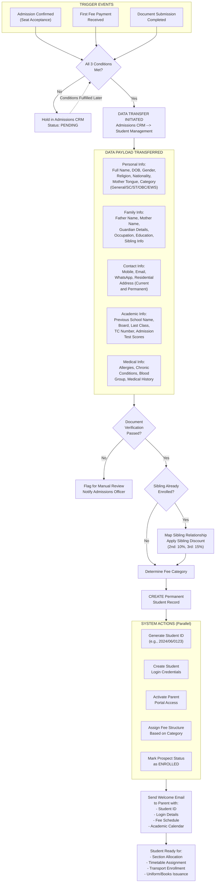

---

### 2. TO TIMETABLE & SCHEDULING MODULE

**WHY This Connection Exists:**
Timetable generation requires knowing exactly how many students are in each section, their elective subject choices, and any special scheduling needs (like IEP students needing resource room time).

**DATA FLOW:**

- Total Student Count per Grade
- Section Assignments (Student → Section mapping)
- Student Count per Section (for room capacity planning)
- Elective Subject Choices:
- Language Options (Hindi/Sanskrit/French)
- Optional Subjects (Computer Science/Physical Education)
- Stream Selection (Science/Commerce/Arts for Grades 11-12)
- Special Needs Requirements:
- IEP Students needing modified schedules
- Resource room time allocation
- Therapy session slots
- New Admissions During Academic Year (mid-year transfers)

**TRIGGER EVENT:**

- Annual Section Allocation (June/July)
- Elective Subject Selection Period (March-April)
- Mid-Year Admission
- Student Transfer Between Sections
- Student Withdrawal (reduces section count)

**IMPACT:**

- Determines Number of Parallel Sections Needed
- Example: 180 students in Grade 6 → Need 6 sections (30 students each)
- Room Capacity Requirements
- Example: Section with 35 students needs minimum 40-seater classroom
- Elective Subject Groups Created
- Example: 45 students chose French → Need 2 French periods simultaneously
- Teacher Workload Calculated
- Example: 6 sections × 5 periods = 30 periods of Math needed per week

**BUSINESS LOGIC:**

```
FOR each grade IN [1 to 12]:
 total_students = COUNT(students WHERE grade = grade AND status = "ACTIVE")
 sections_needed = CEILING(total_students / max_section_strength)

 FOR each subject WITH electives:
 group_students_by_choice()
 calculate_periods_needed()
 END FOR
END FOR
```

**EXAMPLE:**
Grade 9 has 150 students:

- 60 chose Hindi, 50 chose Sanskrit, 40 chose French
- Need 2 Hindi sections, 2 Sanskrit sections, 1.5 French sections (round up to 2)
- Timetable AI ensures no clashes: when Section A has Hindi Period 3, French/Sanskrit students have their language periods simultaneously


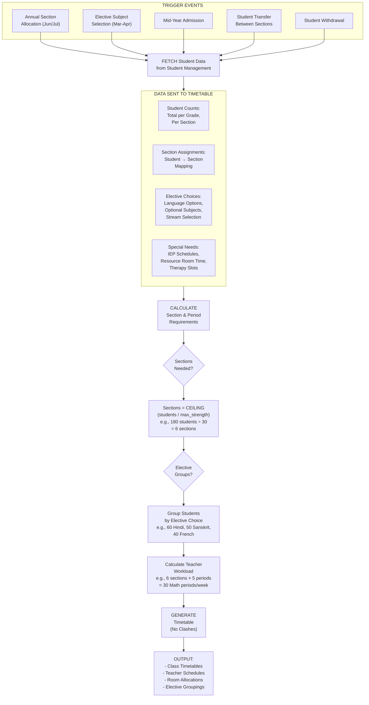

---

### 3. TO ATTENDANCE MANAGEMENT MODULE

**WHY This Connection Exists:**
Attendance can only be marked for currently enrolled, active students. The system needs to know which students are present in which sections and subjects to generate accurate attendance rosters.

**DATA FLOW:**

- Active Student List (Enrolled, Not Withdrawn)
- Section-wise Student Mapping
- Subject-wise Enrollment (especially for electives)
- Enrollment Status:
- ACTIVE (regular attendance required)
- SUSPENDED (temporary, no attendance)
- WITHDRAWN (removed from rosters)
- ON_LEAVE (medical/family emergency, extended absence)
- Leave Requests (Planned Absences):
- Medical Leave with doctor's certificate
- Family emergency leave
- Sports event participation (school-sanctioned)
- Student Photos (for biometric face recognition)

**TRIGGER EVENT:**

- Daily: Fresh attendance rosters generated
- Period-wise: Subject attendance windows opened
- Real-time: New admission adds student to rosters immediately
- Real-time: Withdrawal removes student from rosters
- Leave approval: Marks student as authorized absence

**IMPACT:**

- **Attendance Rosters Auto-Generated:**
- Class teacher gets Section A student list for day-wise attendance
- Subject teachers get period-wise lists based on timetable
- **Withdrawn Students Automatically Removed:**
- If student withdrew on March 15, attendance rosters from March 16 exclude them
- **Authorized Absences Pre-Marked:**
- Student on approved medical leave March 10-20 shows as "AL" (Authorized Leave) instead of requiring daily marking
- **Biometric System Updated:**
- Face recognition database synced with active student photos
- Withdrawn student faces removed from recognition

**BUSINESS LOGIC:**

```
FUNCTION generate_attendance_roster(date, section, period):
 roster = []
 students = GET students WHERE section = section AND status = "ACTIVE"

 FOR each student IN students:
 IF has_approved_leave(student, date):
 roster.add(student, status="AUTHORIZED_LEAVE")
 ELSE:
 roster.add(student, status="UNMARKED")
 END IF
 END FOR

 RETURN roster
END FUNCTION
```

**EXAMPLE:**

- Section 7A has 32 students
- Student Priya (Roll 15) has approved medical leave March 10-15
- Student Arjun (Roll 28) withdrew on March 8
- On March 12: Attendance roster shows 30 students unmarked, Priya as "AL", Arjun not in roster


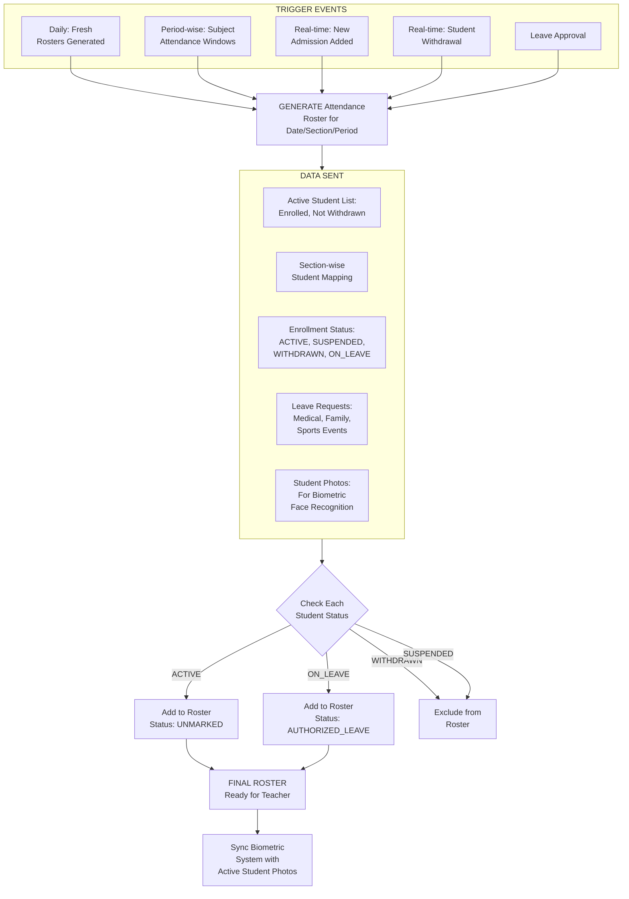

---

### 4. TO HEALTH & WELLNESS MODULE

**WHY This Connection Exists:**
Medical emergencies require instant access to student health history, allergies, blood group, and emergency contacts. School nurses/doctors need this information to make safe healthcare decisions.

**DATA FLOW:**

- **Medical History:**
- Chronic Conditions (Asthma, Diabetes, Epilepsy, Heart Conditions)
- Past Surgeries and Hospitalizations
- Known Allergies (Medications, Food, Environmental)
- Blood Group and Rh Factor
- Vaccination Records (MMR, Hepatitis B, COVID-19)
- **Emergency Contacts:**
- Primary: Father's mobile, Mother's mobile
- Secondary: Guardian, Grandparent
- Hospital Preference (nearest hospital, family doctor)
- **Ongoing Treatments:**
- Regular Medications (Insulin, Inhalers, Ritalin)
- Dietary Restrictions (Diabetic, Celiac, Lactose Intolerant)
- Physical Limitations (No running due to heart condition)
- **Insurance Information:**
- Policy Number, Provider, Coverage Amount
- Cashless Hospital Network
- **Current Health Status:**
- Recent Illnesses (COVID-19 positive, recovering from surgery)
- Medical Clearance for Sports

**TRIGGER EVENT:**

- **Infirmary Visit:** Student reports sick during school hours
- **Medical Emergency:** Injury on playground, sudden illness
- **Annual Health Checkup:** Routine medical examination
- **Sports Physical:** Clearance required for team sports
- **Medication Administration:** Nurse needs to verify prescription

**IMPACT:**

- **Immediate Access to Critical Information:**
- Student complains of breathing difficulty → System shows "Asthma patient, has inhaler in bag, Father: 98765xxxxx"
- **Allergy Alerts:**
- Before administering any medication, system shows red alert if student allergic
- **Emergency Contact Auto-Dial:**
- Serious injury → System displays emergency contacts in priority order
- **Medical History for Treatment Decisions:**
- Student has seizure → Medical history shows epilepsy diagnosis, medication details
- **Insurance Claims:**
- Hospitalization required → Insurance details readily available

**BUSINESS LOGIC:**

```
FUNCTION handle_medical_incident(student_id, symptoms):
 profile = GET student_medical_profile(student_id)

 // Display critical alerts
 IF profile.allergies NOT EMPTY:
 SHOW ALERT("ALLERGIES: " + profile.allergies)
 END IF

 IF profile.chronic_conditions NOT EMPTY:
 SHOW WARNING("CHRONIC: " + profile.chronic_conditions)
 END IF

 // Check medication interactions
 IF administering_medication:
 CHECK profile.current_medications FOR interactions
 END IF

 // Emergency contact
 IF severity = "HIGH":
 DISPLAY profile.emergency_contacts
 SEND SMS to parents("Your child in infirmary: " + symptoms)
 END IF
END FUNCTION
```

**EXAMPLE:**

- Student Ananya (Grade 4) falls in playground, complains of severe headache
- Nurse accesses health profile:
- Shows: No chronic conditions, No allergies, Blood Group: B+
- Emergency Contacts: Mother 98xxx (primary), Father 97xxx (secondary)
- Recent History: No recent illnesses
- Nurse gives paracetamol (safe, no allergies), calls mother, monitors for 30 minutes


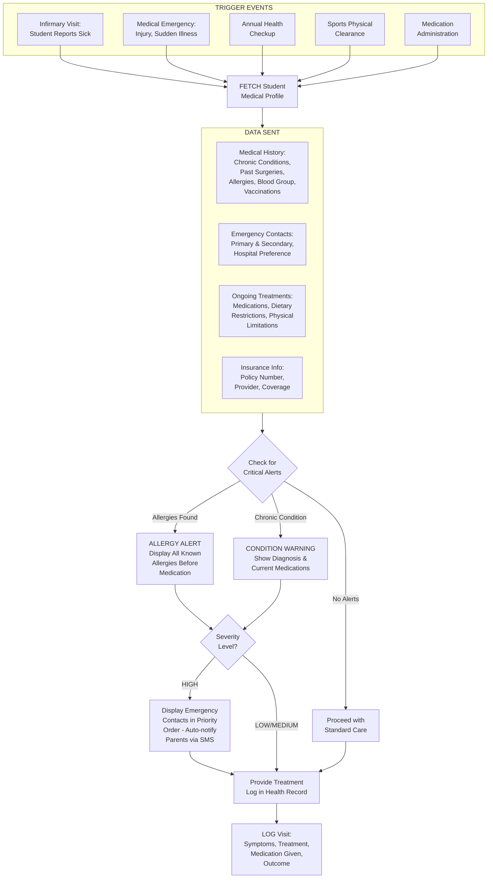

---

### 5. TO TRANSPORT MANAGEMENT MODULE

**WHY This Connection Exists:**
Bus routes need to be optimized based on where students live. Pickup/drop schedules depend on student addresses. GPS tracking alerts are sent to parents based on student-bus mapping.

**DATA FLOW:**

- **Residential Address:**
- Complete Address (House No., Street, Locality, Pincode)
- GPS Coordinates (Latitude, Longitude for route optimization)
- Landmark (Near XYZ Temple, Opposite ABC Mall)
- **Transport Enrollment Status:**
- ENROLLED (using school transport)
- NOT_ENROLLED (self-transport)
- TEMPORARY (occasional bus usage)
- **Route Preferences:**
- Preferred Pickup Point (if not home, then nearby safe location)
- Preferred Pickup Time (early/regular/late bus)
- Drop Point (home or alternate location like grandparent's house)
- **Parent Emergency Contact:**
- Mobile number for GPS tracking alerts
- WhatsApp number for bus notifications
- **Special Requirements:**
- Wheelchair accessibility needed
- Motion sickness (needs front seat)
- Younger sibling also on same bus

**TRIGGER EVENT:**

- **New Admission with Transport:** During admission, parent opts for transport
- **Address Change:** Family relocates to different area
- **Transport Enrollment Change:** Mid-year enrollment or withdrawal from transport
- **Route Optimization Cycle:** Annual (before new session) and quarterly

**IMPACT:**

- **Route Optimization:**
- Algorithm clusters students by geographic proximity
- Creates efficient routes minimizing travel time
- Example: 40 students in Sector 15-18 → Bus Route 5 created
- **Bus Capacity Planning:**
- Bus Route 5 has 48 students enrolled → Need 52-seater bus (buffer for new admissions)
- **Pickup/Drop Schedule:**
- Student Rohan at Address A (7:15 AM pickup) → Parent gets notification "Bus 10 mins away"
- **Parent GPS Tracking Access:**
- Parent app shows live bus location only for their child's bus
- **Boarding/Deboarding Alerts:**
- RFID scan when student boards → SMS to parent "Aarav boarded Bus 5 at 7:20 AM"
- RFID scan when student deboards → SMS "Aarav reached school at 8:05 AM"

**BUSINESS LOGIC:**

```
FUNCTION optimize_bus_routes():
 transport_students = GET students WHERE transport_enrolled = TRUE

 // Cluster by geographic location
 clusters = geographic_clustering(transport_students.addresses)

 FOR each cluster:
 students_in_cluster = filter_students(cluster)
 IF students_in_cluster.count > 40:
 split_into_multiple_routes()
 ELSE:
 route = create_route(students_in_cluster)
 assign_bus(route, capacity_needed)
 calculate_pickup_times(route)
 END IF
 END FOR

 // Notify parents of route assignment
 SEND route_details_to_parents()
END FUNCTION
```

**EXAMPLE:**

- 150 students enrolled for transport from Dwarka area
- System clusters into 4 geographic groups:
- Sector 10-12: 38 students → Bus Route A
- Sector 13-15: 42 students → Bus Route B
- Sector 16-18: 35 students → Bus Route C
- Sector 19-21: 35 students → Bus Route D
- Student Kavya lives in Sector 14, Pocket 2
- Assigned to Bus Route B
- Pickup Time: 7:25 AM (calculated based on distance to school)
- Parent receives: "Your child assigned to Bus Route B, Driver: Mr. Sharma (98xxx), Pickup: 7:25 AM"


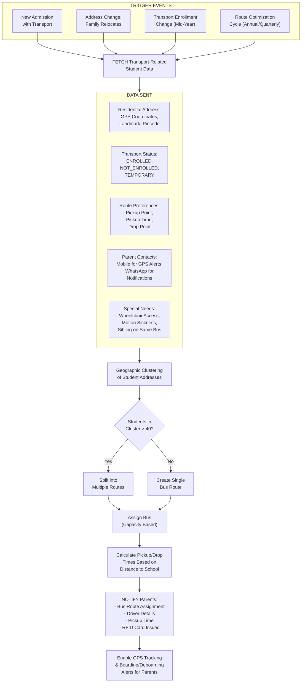

---

### 6. TO HOSTEL & MESS MANAGEMENT MODULE

**WHY This Connection Exists:**
Only boarding students need hostel room allocation and mess services. The system must identify who is a boarder, assign rooms based on grade/gender, and manage dietary preferences for mess.

**DATA FLOW:**

- **Boarding Status:**
- DAY_SCHOLAR (no hostel required)
- BOARDER (full-time resident)
- WEEKLY_BOARDER (Monday-Friday only)
- **Hostel Enrollment Date:** When student became boarder
- **Room Preferences:**
- Single Room / Shared Room
- Roommate Requests (wants to share with specific friend/sibling)
- Floor Preference (ground floor for medical reasons)
- **Dietary Information:**
- Food Preferences (Vegetarian/Non-Vegetarian/Vegan/Jain)
- Allergies (Nuts, Seafood, Gluten, Dairy)
- Religious Restrictions (Halal, No Pork, No Beef)
- Medical Diet (Diabetic, Low-Salt, Fat-Free)
- **Parent Consent:**
- Permission for overnight stays
- Approval for weekend outings
- Leave authorization rules
- **Guardian in City:** Local guardian details if parents in different city

**TRIGGER EVENT:**

- **New Boarding Admission:** Student enrolls as boarder
- **Day Scholar → Boarder Conversion:** Mid-year change
- **Room Change Request:** Student wants to change room
- **Dietary Change:** New allergy discovered or religious conversion
- **Hostel Leave:** Student going home for weekend/vacation

**IMPACT:**

- **Room Allocation:**
- Grade 6-8 boys: Allocated to Boys Hostel Block A, Floors 1-2
- Grade 9-10 boys: Block A, Floor 3
- Grade 11-12 boys: Block B (senior wing)
- Similar allocation for girls in separate hostel
- Example: Arjun (Grade 7, boarder) → Room 102, Bed 3, Roommates: Rohan, Karan
- **Mess Enrollment:**
- All boarders auto-enrolled in mess
- Dietary preferences tagged: "Vegetarian, No Onion-Garlic (Jain), Lactose Intolerant"
- **Warden Assignment:**
- Each floor has warden, students know their warden contact
- **Access Control:**
- Hostel entry/exit tracked, day scholars can't enter hostel blocks
- **Parent Notifications:**
- Student requests weekend home leave → Warden approves → Parent gets notification

**BUSINESS LOGIC:**

```
FUNCTION allocate_hostel_room(student):
 IF student.boarding_status != "BOARDER":
 RETURN "Not eligible for hostel"
 END IF

 // Find appropriate block based on grade and gender
 block = get_hostel_block(student.grade, student.gender)

 // Find available room matching preferences
 available_rooms = GET rooms WHERE block = block
 AND vacancy = TRUE
 AND capacity >= (current_occupants + 1)

 IF student.has_roommate_preference:
 room = find_room_with_preferred_roommate()
 ELSE:
 room = available_rooms[0] // First available
 END IF

 ASSIGN student TO room
 ENROLL student IN mess WITH dietary_preferences
 NOTIFY warden(new_student_assigned)
 SEND welcome_kit(student)
END FUNCTION
```

**EXAMPLE:**

- Student Priya (Grade 9, Girl) joins as boarder in July
- Preferences: Vegetarian, Allergic to peanuts, wants to room with friend Sneha
- System allocates:
- Girls Hostel, Block C, Room 305 (Sneha already in this room, has 1 vacant bed)
- Bed 2 assigned to Priya
- Mess Enrollment: Vegetarian meals, Peanut allergy flagged in kitchen
- Warden: Ms. Sharma (Floor 3 warden), Contact: 98xxx
- Parent receives: "Priya allocated Room 305, Roommates: Sneha, Divya. Warden: Ms. Sharma (98xxx)"


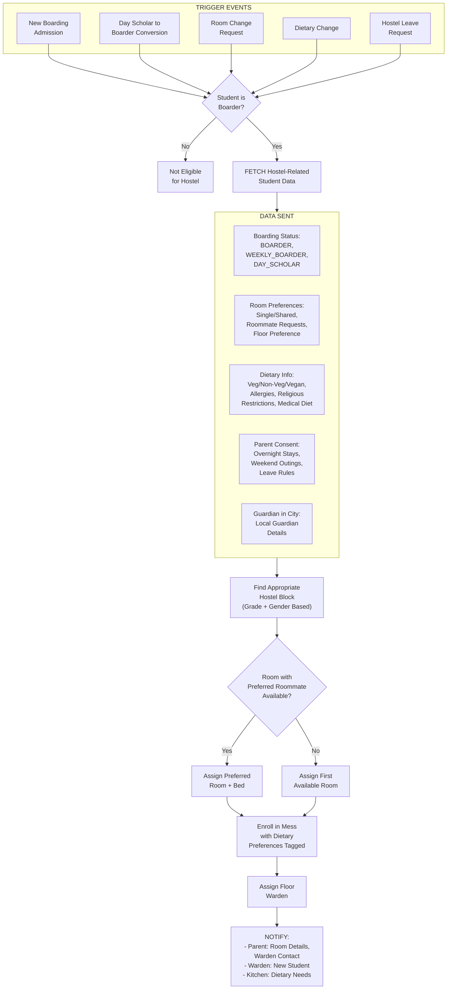

---

### 7. TO FEE MANAGEMENT MODULE

**WHY This Connection Exists:**
Fee structure varies by student category (grade, scholarship status, sibling in school, fee category). Every student needs individualized billing based on their profile.

**DATA FLOW:**

- **Grade/Class:** Determines base fee structure (Grade 1 fees ≠ Grade 12 fees)
- **Fee Category:**
- REGULAR (full fees)
- SCHOLARSHIP (merit-based discount %)
- STAFF_WARD (teacher's child, 50-100% discount)
- SIBLING_DISCOUNT (2nd child gets 10%, 3rd child gets 15%)
- EWS (Economically Weaker Section, government quota, reduced fees)
- NRI (higher fees for NRI students)
- SPORTS_QUOTA (athletic scholarship)
- **Sibling Mapping:**
- Student A and Student B are siblings → Both get sibling discount
- Eldest child pays full, subsequent children get incremental discounts
- **Scholarship Percentage:** 25%, 50%, 75%, 100% fee waiver
- **Concession Approvals:** Principal-approved special cases (financial hardship)
- **Enrollment Date:** Pro-rata fee calculation if admitted mid-term
- **Status Changes:**
- Grade promotion → Fee structure changes
- Scholarship awarded → Discount applied from specific month

**TRIGGER EVENT:**

- **Admission:** First fee invoice generated
- **Annual Grade Promotion:** Fee structure updated for new grade
- **Scholarship Award/Renewal:** Discount percentage updated
- **Sibling Admission:** Existing sibling's fee recalculated with discount
- **Mid-Year Admission:** Pro-rata fee calculated
- **Concession Request Approval:** Fee adjusted manually

**IMPACT:**

- **Individualized Fee Structure:**
- Student A: Grade 6, Regular, No siblings → ₹1,20,000/year
- Student B: Grade 6, Regular, 2nd sibling → ₹1,08,000/year (10% off)
- Student C: Grade 6, 50% scholarship → ₹60,000/year
- Student D: Grade 6, Staff ward (100% waiver) → ₹0/year
- **Invoice Generation:**
- Quarterly invoices auto-generated based on payment plan
- Late fees added if payment overdue
- **Payment History Tracking:**
- All payments linked to student, visible in fee ledger
- **Outstanding Dues:**
- Defaulters list generated, filtered by grade/section
- **Scholarship Compliance:**
- System ensures scholarship students maintain required attendance/grades
- Auto-revokes scholarship if criteria not met (needs manual approval)

**BUSINESS LOGIC:**

```
FUNCTION calculate_student_fees(student):
 // Get base fee for grade
 base_fee = get_base_fee(student.grade)

 // Apply scholarship discount
 IF student.scholarship_percentage > 0:
 base_fee = base_fee * (1 - student.scholarship_percentage/100)
 END IF

 // Apply sibling discount
 sibling_count = COUNT(siblings WHERE status = "ACTIVE")
 IF sibling_count = 1: // Student is 2nd child
 base_fee = base_fee * 0.90 // 10% discount
 ELSE IF sibling_count = 2: // Student is 3rd child
 base_fee = base_fee * 0.85 // 15% discount
 END IF

 // Apply category-specific rules
 IF student.category = "STAFF_WARD":
 base_fee = base_fee * 0.5 // 50% discount
 ELSE IF student.category = "NRI":
 base_fee = base_fee * 1.5 // 50% premium
 END IF

 // Pro-rata for mid-year admission
 IF student.admission_month > 4: // Admitted after April
 months_remaining = 12 - student.admission_month
 base_fee = (base_fee / 12) * months_remaining
 END IF

 RETURN base_fee
END FUNCTION
```

**EXAMPLE:**

- Sharma family has 3 children:
- Child 1: Aarav, Grade 10, Regular → ₹1,50,000/year (full)
- Child 2: Ananya, Grade 7, Regular → ₹1,08,000/year (10% sibling discount)
- Child 3: Arnav, Grade 4, Regular → ₹85,000/year (15% sibling discount)
- Total family fee: ₹3,43,000/year instead of ₹3,70,000 (saved ₹27,000)
- If Ananya wins 50% scholarship in next academic year:
- Her fee: ₹1,20,000 (Grade 8 base) _ 50% scholarship = ₹60,000 _ 90% (sibling discount) = ₹54,000/year


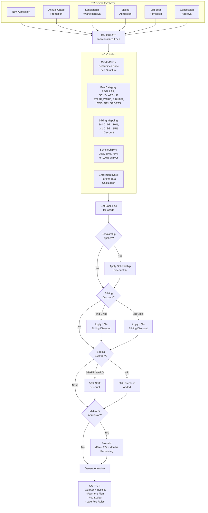

---

### 8. TO LMS (LEARNING MANAGEMENT SYSTEM)

**WHY This Connection Exists:**
Students need access to online courses based on their grade, section, and subject enrollment. The LMS must show only relevant courses to each student and track their progress individually.

**DATA FLOW:**

- **Section Assignment:** Determines which courses student can access
- **Enrolled Subjects:**
- Core Subjects (Math, Science, English, Social Studies)
- Elective Subjects (Hindi/Sanskrit/French, Computer/Physical Ed)
- Stream-specific (Physics/Chemistry/Biology for Science students)
- **Student Performance Level:**
- Advanced learners get enrichment modules
- Struggling students get remedial content
- **Learning Style Preferences:** Visual/Auditory/Kinesthetic (for personalized content)
- **Previous Academic Performance:** To customize AI Co-pilot recommendations

**TRIGGER EVENT:**

- **Course Enrollment:** At start of term or elective selection
- **Section Assignment:** When student assigned to section
- **Subject Choice Finalized:** Electives selected
- **Performance-Based Grouping:** Based on test scores, advanced/regular/remedial groups

**IMPACT:**

- **Personalized Course Dashboard:**
- Student logs in, sees only their 8-10 enrolled courses
- Grade 9 Science student sees: Math, Physics, Chemistry, Biology, English, Hindi, Social Studies, Computer Science
- Grade 9 Commerce student sees: Math, Accountancy, Business Studies, Economics, English, Hindi
- **AI Co-Pilot Customization:**
- Analyzes student's past performance
- Student weak in Algebra → Co-pilot suggests extra Algebra practice modules
- **Assignment Deadlines:**
- Aligned with student's timetable
- Math homework due next Math period, not random date
- **Progress Tracking:**
- Each student's course completion %, quiz scores tracked individually
- Teacher can see: "Rohan completed 60% of Chapter 5, scored 75% in quiz"

**BUSINESS LOGIC:**

```
FUNCTION get_student_courses(student):
 courses = []

 // Get core courses based on grade
 core_courses = GET courses WHERE grade = student.grade AND type = "CORE"
 courses.add(core_courses)

 // Get elective courses based on student's choices
 elective_choices = GET student_electives WHERE student_id = student.id
 FOR each elective IN elective_choices:
 course = GET course WHERE subject = elective.subject
 courses.add(course)
 END FOR

 // Add stream-specific courses (Grades 11-12)
 IF student.grade >= 11:
 stream_courses = GET courses WHERE stream = student.stream
 courses.add(stream_courses)
 END IF

 // Customize based on performance level
 IF student.performance_level = "ADVANCED":
 courses.add(enrichment_modules)
 ELSE IF student.performance_level = "REMEDIAL":
 courses.add(remedial_modules)
 END IF

 RETURN courses
END FUNCTION
```

**EXAMPLE:**

- Student Priya (Grade 9, Section B, Science stream)
- Enrolled Subjects: Math, Physics, Chemistry, Biology, English, Hindi, Computer Science, Social Studies
- LMS Dashboard shows 8 courses with:
- Current Progress: Math 75%, Physics 60%, Chemistry 80%...
- Pending Assignments: Math Homework Due Tomorrow, Physics Quiz on Friday
- AI Co-pilot Notice: "You're struggling with Chemical Bonding (scored 55% in quiz). Here are 3 recommended videos and practice exercises."
- When Priya opens Chemistry course:
- Sees Chapter 1-5 (completed), Chapter 6 (in progress 40%), Chapter 7-12 (locked until Chapter 6 done)
- Each chapter has: Video Lectures, Notes PDF, Practice Questions, Quiz


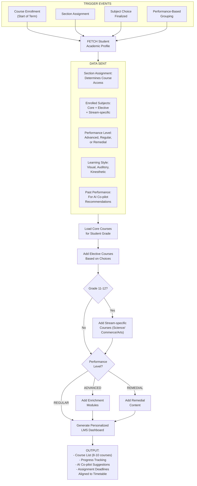

---

### 9. TO SPECIAL EDUCATION MODULE

**WHY This Connection Exists:**
Students with learning disabilities (dyslexia, ADHD, autism, etc.) need Individual Education Plans (IEPs) that modify curriculum, assessment, and support services. The system must identify these students and link their specialized support.

**DATA FLOW:**

- **Special Needs Flag:** Student marked as requiring IEP
- **Diagnosis/Assessment:**
- Type of Learning Disability (Dyslexia, Dyscalculia, ADHD, Autism Spectrum)
- Severity Level (Mild/Moderate/Severe)
- Psycho-educational Assessment Report
- IQ Test Results
- Behavioral Assessment
- **Parental Consent:**
- Permission for specialized testing
- Approval for IEP implementation
- Agreement to modified curriculum
- **Previous IEP Records:** From previous school if mid-year transfer
- **Support Team Assignment:**
- Special Education Teacher (Resource Teacher)
- Counselor
- Therapists (Speech, Occupational, Behavioral)

**TRIGGER EVENT:**

- **Screening Test:** All new admissions screened for learning difficulties
- **Teacher Referral:** Class teacher observes learning struggles
- **Parent Request:** Parent shares diagnosis from external psychologist
- **Annual IEP Review:** Yearly reassessment of IEP effectiveness

**IMPACT:**

- **Individual Education Plan Created:**
- Modified learning goals tailored to student's abilities
- Accommodations documented (extra time, reduced workload, alternative assessments)
- **Specialized Support Services:**
- Resource room time allocated (2-3 periods per week)
- Speech therapy sessions (if speech delay)
- Occupational therapy (for motor skill development)
- Behavioral therapy (for ADHD/Autism)
- **Alerts to Teachers:**
- All subject teachers notified: "Rohan has dyslexia, allow 1.5x time for reading tasks"
- **Progress Monitoring:**
- Regular assessments against IEP goals
- Quarterly progress reports to parents

**BUSINESS LOGIC:**

```
FUNCTION create_iep(student, diagnosis):
 iep = NEW IndividualEducationPlan

 iep.student = student
 iep.diagnosis = diagnosis
 iep.start_date = TODAY
 iep.review_date = TODAY + 365 days // Annual review

 // Set learning goals based on current level
 current_level = assess_current_academic_level(student)
 iep.goals = create_realistic_goals(current_level, diagnosis)

 // Determine accommodations
 IF diagnosis.type = "DYSLEXIA":
 iep.accommodations.add("1.5x time for reading tasks")
 iep.accommodations.add("Audiobook option for lengthy texts")
 iep.accommodations.add("Font: Dyslexie, Size: 14pt")
 ELSE IF diagnosis.type = "ADHD":
 iep.accommodations.add("Preferential seating (front row)")
 iep.accommodations.add("Frequent breaks during tests")
 iep.accommodations.add("Reduce homework quantity by 30%")
 END IF

 // Assign support team
 resource_teacher = GET available_special_ed_teacher()
 iep.team.add(resource_teacher)

 IF diagnosis.needs_therapy:
 therapist = GET available_therapist(diagnosis.therapy_type)
 schedule_therapy_sessions(student, therapist, frequency=2_per_week)
 END IF

 // Notify all stakeholders
 NOTIFY student.teachers("IEP created, review accommodations")
 NOTIFY student.parents("IEP plan ready for review")

 RETURN iep
END FUNCTION
```

**EXAMPLE:**

- Student Arjun (Grade 5) struggling with reading and spelling
- Parents get him assessed: Diagnosed with Moderate Dyslexia
- School creates IEP:
- **Goal 1:** Improve reading fluency from 60 words/min to 90 words/min by year-end
- **Goal 2:** Reduce spelling errors from 40% to 20% in written work
- **Accommodations:**
- Extra 30 minutes for all exams (1.5x time)
- Use of text-to-speech software for long passages
- Oral tests option for language subjects
- Dyslexia-friendly font in all study materials
- **Support Services:**
- Resource room: Monday & Wednesday, Period 6 (individualized reading instruction)
- Assistive technology training: Use of Grammarly, Read&Write software
- **Progress Monitoring:** Reading fluency tested monthly, spelling test biweekly
- All teachers receive alert: "Arjun has dyslexia, provide 1.5x time, use Dyslexie font"
- Exam department ensures Arjun gets separate room with extra 30 mins for all tests


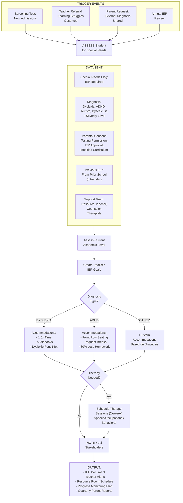

---

### 10. TO DISCIPLINE & BEHAVIOR MANAGEMENT MODULE

**WHY This Connection Exists:**
Every behavioral incident (fights, bullying, rule violations) must be linked to specific students for tracking patterns, counseling interventions, and disciplinary action history.

**DATA FLOW:**

- **Student Profile for Incident Assignment:**
- Student ID to link incident
- Photo for incident documentation
- Class/Section for context
- **Behavioral History:**
- Past incidents count
- Severity patterns (minor → major escalation)
- Type of incidents (academic dishonesty, violence, disrespect)
- **Parent Contact Information:**
- For incident notifications
- Parent conference scheduling
- **Counseling Records Access:**
- Previous counseling sessions
- Behavioral improvement plans
- **Peer Relationships:**
- Sibling in school (family context)
- Friend groups (for bullying investigation)

**TRIGGER EVENT:**

- **Incident Reported:** Teacher/staff reports behavioral issue
- **Automatic Detection:** AI flags patterns (e.g., attendance drop + grade decline = potential issue)
- **Parent Complaint:** Bullying reported by parent
- **Positive Behavior:** Merit points awarded for good behavior

**IMPACT:**

- **Incident Linked to Student Record:**
- Permanent behavioral history maintained
- Example: "Rohan involved in 3 incidents this term: 2 minor (late to class), 1 major (fight in playground)"
- **Pattern Detection:**
- AI identifies: "Student showing increasing aggression (3 fights in 2 months, previously none)"
- Triggers counselor intervention alert
- **Disciplinary Action Tracking:**
- Warning → Detention → Suspension → Expulsion pathway documented
- Parents notified at each escalation
- **Positive Behavior Rewards:**
- Merit points accumulated: "Priya has 45 merit points (helped classmates, perfect attendance, won debate)"
- Points redeemable for rewards (extra library time, canteen vouchers, no-homework pass)
- **Counseling Referrals:**
- Chronic behavioral issues → Automatic counselor assignment
- Progress monitoring: "3 counseling sessions completed, behavioral improvement noted"

**BUSINESS LOGIC:**

```
FUNCTION record_incident(student, incident_details):
 // Create incident record
 incident = NEW BehavioralIncident
 incident.student = student
 incident.type = incident_details.type // FIGHT, BULLYING, DISRESPECT, etc.
 incident.severity = incident_details.severity // MINOR, MODERATE, MAJOR
 incident.description = incident_details.description
 incident.reported_by = incident_details.teacher
 incident.date = TODAY

 // Check behavioral history
 past_incidents = GET incidents WHERE student = student AND date > (TODAY - 90 days)
 incident_count = past_incidents.count

 // Determine disciplinary action
 IF incident.severity = "MAJOR" OR incident_count >= 3:
 action = "PARENT_CONFERENCE_REQUIRED"
 NOTIFY parents("Serious behavioral incident, meeting required")
 ASSIGN counselor(student)
 ELSE IF incident.severity = "MODERATE":
 action = "DETENTION"
 SEND warning_letter(parents)
 ELSE:
 action = "VERBAL_WARNING"
 LOG warning(student)
 END IF

 // Pattern detection
 IF incident.type = "FIGHT" AND past_incidents.filter(type="FIGHT").count >= 2:
 ALERT("PATTERN DETECTED: Repeated aggressive behavior")
 TRIGGER anger_management_program(student)
 END IF

 // Update student behavioral score
 student.behavioral_score -= severity_points(incident.severity)

 RETURN incident
END FUNCTION
```

**EXAMPLE:**

- Student Rohan (Grade 8) gets into fight during lunch break
- Incident recorded:
- Type: Physical Fight
- Severity: Major
- Description: "Rohan punched classmate Arjun after verbal argument about cricket"
- Reported by: Mr. Sharma (lunch duty teacher)
- System checks history:
- Previous incidents: 2 (both verbal arguments, 1 month ago)
- Pattern detected: Escalating from verbal to physical aggression
- Automatic Actions:
- Parents notified immediately: "Rohan involved in physical fight, principal meeting scheduled tomorrow 10 AM"
- 2-day suspension imposed
- Counselor Ms. Gupta assigned for anger management sessions
- Merit points deducted: -20 points
- Behavioral score: 75/100 (was 95/100)
- Follow-up: 4 counseling sessions scheduled, parents must attend 1st session


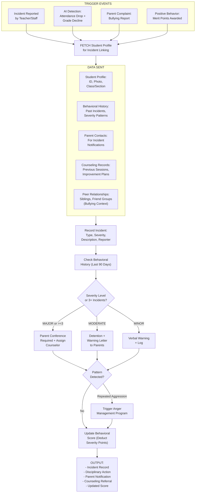

---

### 11. TO LIBRARY MANAGEMENT MODULE

**WHY This Connection Exists:**
Students need borrowing privileges based on enrollment status. Library fines and book reservations are linked to student accounts. Reading analytics track individual student reading habits.

**DATA FLOW:**

- Student ID for book checkout
- Enrollment Status (ACTIVE students can borrow, SUSPENDED/WITHDRAWN cannot)
- Grade Level (determines borrowing limits and age-appropriate content)
- Reading Level Assessment
- Subject Enrollment (for academic resource allocation)

**TRIGGER EVENT:**

- Book Checkout/Return
- Book Reservation
- Fine Generation (overdue books)
- Lost Book Report

**IMPACT:**

- Borrowing history tracked completely
- Reading analytics generated
- Fines added to student fee account
- AI book recommendations based on reading patterns

**BUSINESS LOGIC:**

```
FUNCTION checkout_book(student, book):
 IF student.status != "ACTIVE":
 RETURN "Error: Only active students can borrow"
 END IF

 current_books = COUNT borrowed WHERE student = student AND returned = FALSE
 IF current_books >= borrowing_limit(student.grade):
 RETURN "Error: Borrowing limit reached"
 END IF

 IF student.outstanding_fines > 100:
 RETURN "Error: Clear fines first"
 END IF

 CREATE checkout_record
 UPDATE reading_analytics
 SEND SMS(parent, "Book borrowed: {book.title}")
END FUNCTION
```

**EXAMPLE:**
Student Aarav (Grade 6) borrows "Harry Potter", due in 14 days. After 21 days, fine = ₹14 (₹2/day × 7 days overdue). Fine added to fee account, cannot borrow new books until cleared.


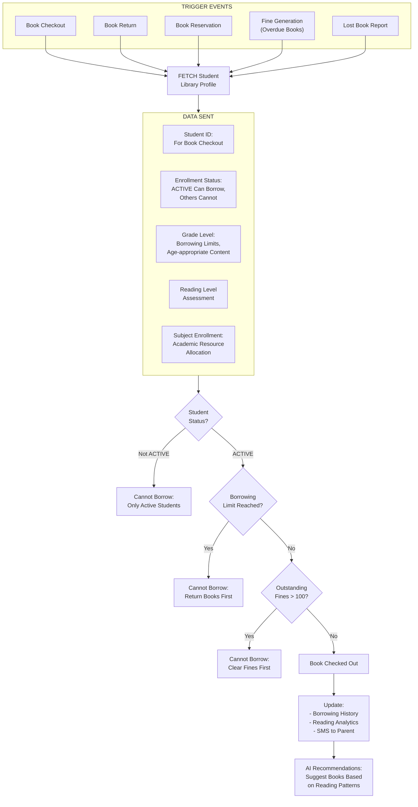

---

### 12. TO SECURITY & VISITOR MANAGEMENT MODULE

**WHY This Connection Exists:**
Student safety requires strict entry/exit control. Gate passes for early dismissal need student verification. Emergency evacuations need accurate headcount.

**DATA FLOW:**

- Student Photo (for visual identification, face recognition)
- Class, Section, Roll Number
- Parent Authorization (approved pickup persons)
- Timetable (normal dismissal time vs early exit)
- Transport Status (bus students can't leave with parents without approval)
- Hostel Status (boarders can't exit without warden approval)

**TRIGGER EVENT:**

- Daily Entry/Exit
- Early Dismissal Request
- Late Arrival
- Unauthorized Exit Attempt
- Emergency Evacuation

**IMPACT:**

- Entry/exit logs with photo capture
- Digital gate pass system with QR codes
- Unauthorized exit prevention with parent alerts
- Emergency headcount reconciliation

**BUSINESS LOGIC:**

```
FUNCTION generate_gate_pass(student, reason, requester):
 IF requester NOT IN student.authorized_pickup_persons:
 RETURN "Error: Unauthorized person"
 END IF

 gate_pass = CREATE with QR_code
 NOTIFY security, class_teacher
 SEND SMS(parent, QR_code)

 RETURN gate_pass
END FUNCTION
```

**EXAMPLE:**
Kavya has dentist appointment. Mother requests gate pass at 11 AM. Teacher approves. QR code sent to mother. At 1:45 PM, mother shows QR at gate, guard scans, verifies ID, Kavya exits. Logged: "Kavya exited 1:47 PM with mother for dental appointment."


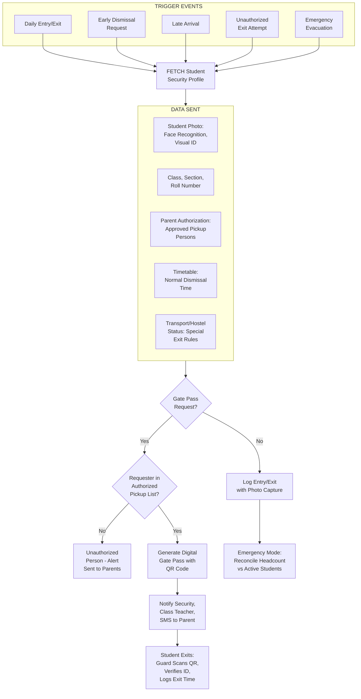

---

### 13. TO CONSENT & COMPLIANCE MODULE

**WHY This Connection Exists:**
Schools need explicit parental consent for activities (field trips, photo usage, medical procedures). Compliance with child protection laws requires documented consent.

**DATA FLOW:**

- Parent Contact (email, mobile for consent forms)
- Guardian Legal Status (who can give consent)
- Medical Information (for medical consent)
- Photo/Video Release preferences

**TRIGGER EVENT:**

- Field Trip Planned
- Medical Procedure Needed
- Photo/Video Usage
- Sports Event Participation
- Data Collection (privacy regulations)

**IMPACT:**

- Digital consent forms sent to parents
- Participation tracking (consented vs non-consented students)
- Audit trail for legal compliance
- Automated reminders for pending consents

**BUSINESS LOGIC:**

```
FUNCTION request_consent(activity, students):
 FOR each student:
 IF parent.legal_guardian = TRUE:
 SEND consent_request(email, SMS, app)
 SCHEDULE reminder(deadline - 2 days)
 END IF
 END FOR

 ON deadline:
 final_participants = students WHERE consent = "APPROVED"
 excluded = students WHERE consent != "APPROVED"
 ARRANGE alternate_supervision(excluded)
END FUNCTION
```

**EXAMPLE:**
Field trip to India Gate for 60 Grade 7 students. Deadline: March 20. By deadline: 52 approved, 3 denied, 5 no response. 52 students go on trip, 8 stay at school with alternate activity.


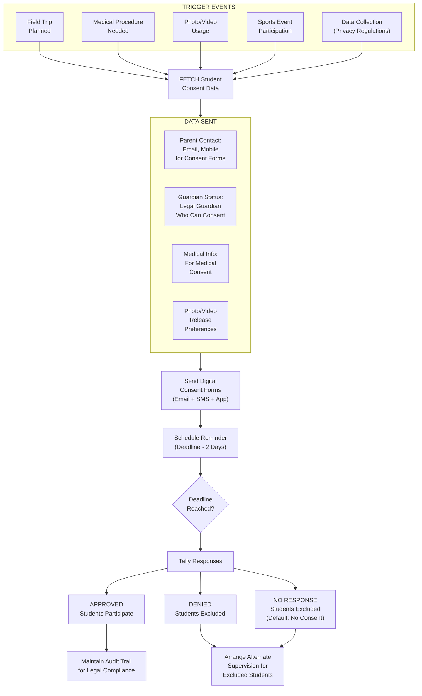

---

### 14. TO DOCUMENTS & CERTIFICATES MODULE

**WHY This Connection Exists:**
Students need various certificates (bonafide, transfer certificates, marksheets). All certificates must pull accurate student data from master record.

**DATA FLOW:**

- Personal Details (name, father/mother name, DOB, admission number)
- Academic Records (grades studied, current class, subjects)
- Attendance Data (total days, days present, percentage)
- Character Assessment (conduct rating, achievements)
- Reason for Leaving (for Transfer Certificate)

**TRIGGER EVENT:**

- Bonafide Certificate Request
- Transfer Certificate Request (student leaving)
- Character Certificate Request
- Marksheet/Report Card generation
- Course Completion Certificate

**IMPACT:**

- Automated certificate generation in minutes
- Bulk generation (150 certificates in 10 minutes)
- Blockchain credentials (tamper-proof, QR verification)
- Audit trail for every certificate issued

**BUSINESS LOGIC:**

```
FUNCTION generate_certificate(student, type):
 IF type = "TRANSFER_CERTIFICATE":
 IF student.status != "WITHDRAWN":
 RETURN "Error: TC only for withdrawn students"
 END IF
 IF student.has_outstanding_dues():
 RETURN "Error: Clear dues first"
 END IF
 END IF

 certificate = GENERATE with student_data
 ADD digital_signature, school_seal, QR_code
 STORE_ON_BLOCKCHAIN
 LOG issuance
 EMAIL to parent
END FUNCTION
```

**EXAMPLE:**
Riya needs TC as family relocating. System checks: ₹5,000 dues pending, 1 library book not returned. Blocks TC. After clearing, TC generated with all academic details, QR code for verification. Cannot issue duplicate.


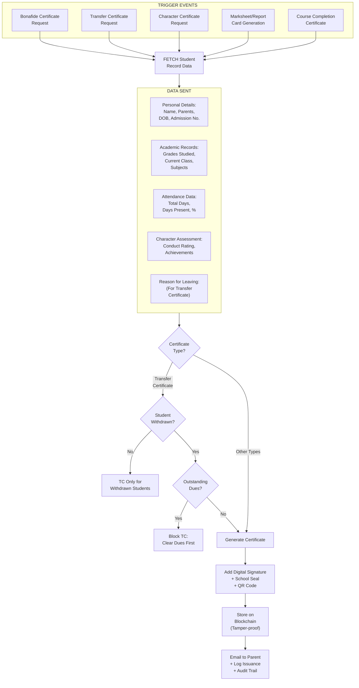

---

### 15. TO AI & PREDICTIVE ANALYTICS MODULE

**WHY This Connection Exists:**
ML models need comprehensive student data to predict dropout risk, forecast academic performance, and identify students needing intervention.

**DATA FLOW:**

- Demographic Features (age, gender, socioeconomic status, parent education)
- Admission Data (admission test scores, previous school grades)
- Enrollment History (grade repetition, frequent school changes)
- Current Academic Standing (current grade, stream, performance level)

**TRIGGER EVENT:**

- Continuous Data Feed (real-time updates)
- Weekly Risk Assessment
- Term-End Analysis
- Intervention Alerts (when risk scores exceed thresholds)

**IMPACT:**

- Dropout prediction with risk scores
- Performance forecasting for next term
- Cohort analysis (low-income students 2.3x more likely to dropout)
- Behavioral risk identification

**BUSINESS LOGIC:**

```
FUNCTION calculate_dropout_risk(student):
 features = EXTRACT demographic, academic, behavioral, financial
 dropout_probability = ML_MODEL.predict(features)
 risk_level = CATEGORIZE(probability)

 IF risk_level = "CRITICAL":
 ALERT counselor
 SCHEDULE parent_meeting(urgency="HIGH")
 ASSIGN mentor_teacher
 END IF

 RETURN {probability, risk_level, top_risk_factors}
END FUNCTION
```

**EXAMPLE:**
Rohan (Grade 9): Attendance dropped 85%→68%, grades declining, fee delays, 3 disciplinary incidents. AI: 78% dropout risk (CRITICAL). Auto-triggers: counselor assigned, parent meeting, remedial classes, fee waiver application, transport subsidy. After 2 months: risk reduced to 35%.


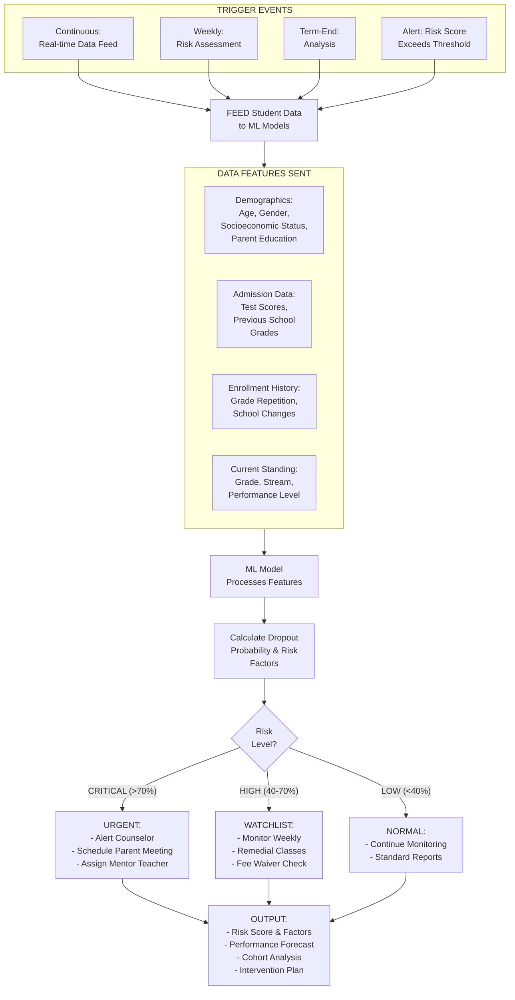

---

### 16. TO PARENT ENGAGEMENT PORTAL

**WHY This Connection Exists:**
Parents need real-time access to child's information - academic progress, attendance, fee status, and school communication.

**DATA FLOW:**

- Student Profile (name, class, roll, photo)
- Academic History (report cards, current term progress, teacher comments)
- Attendance Summary (monthly, subject-wise)
- Achievement Repository (certificates, competition results)
- Behavioral Reports (merit points, incidents)
- Timetable (weekly schedule, exam dates)

**TRIGGER EVENT:**

- Parent Login (daily access)
- New Update (report card published, achievement added)
- Action Required (consent pending, fee due)
- Emergency (incident notification, health alert)

**IMPACT:**

- 24/7 access to child's information
- Real-time academic monitoring
- Digital report cards (instant download)
- Fee transparency with online payment
- Parent-teacher in-app messaging

**BUSINESS LOGIC:**

```
FUNCTION parent_portal_login(parent):
 children = GET students WHERE parent_id = parent.id

 FOR each child:
 dashboard.add({
 quick_stats: attendance, latest_grade, next_exam, fees, pending_actions,
 alerts: recent_notifications(7_days)
 })
 END FOR

 RETURN dashboard
END FUNCTION
```

**EXAMPLE:**
Mr. Sharma logs in at 8 PM. Sees Aarav (Grade 6): Today present , Math test 82/100, Field trip consent pending, ₹12,000 dues. Ananya (Grade 9): 100% attendance, Selected for debate competition. Approves consent, pays fee online, messages English teacher for book recommendations.


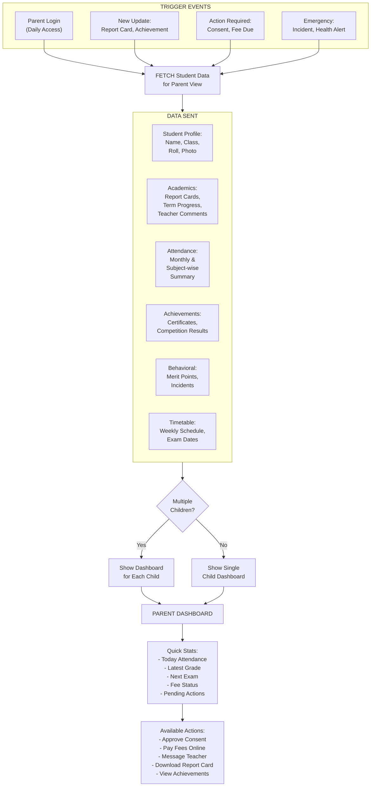

---

### 17. TO CAREER GUIDANCE & UNIVERSITY COUNSELING

**WHY This Connection Exists:**
High school students (Grades 9-12) need career guidance based on interests, aptitudes, and academic performance. University applications require comprehensive student profiles.

**DATA FLOW:**

- Academic Profile (grade-wise marks, stream, subjects, class rank)
- Aptitude & Interest Data (career tests, interest inventory)
- Extra-curricular Profile (sports, leadership, community service)
- Projects & Research (science fair, independent study)

**TRIGGER EVENT:**

- Grade 9 Entry (career exploration begins)
- Grade 10 Completion (stream selection)
- Grade 11 Start (college planning)
- Grade 12 (intensive application support)

**IMPACT:**

- Personalized career pathways
- University match-making (reach/target/safety)
- Application tracking (12 universities, deadlines)
- Recommendation letter management
- Scholarship database (47 eligible scholarships)

**BUSINESS LOGIC:**

```
FUNCTION career_counseling_profile(student):
 IF student.grade < 9:
 RETURN "Career counseling starts from Grade 9"
 END IF

 profile = {academic, tests, aptitude, extracurricular, preferences}
 recommendations = AI_MATCH_UNIVERSITIES(profile)
 career_paths = AI_SUGGEST_CAREERS(profile)

 RETURN {profile, recommendations, career_paths}
END FUNCTION
```

**EXAMPLE:**
Kavya (Grade 11, PCB, aspiring doctor): Profile shows 96% marks, Biology Olympiad winner, 200 hospital volunteer hours. System recommends: AIIMS, Johns Hopkins, Oxford Medicine. Grade 12: Applies to 11 universities. Tracker shows deadlines, recommendation letters status. Result: Accepted to Johns Hopkins with $15,000 scholarship.


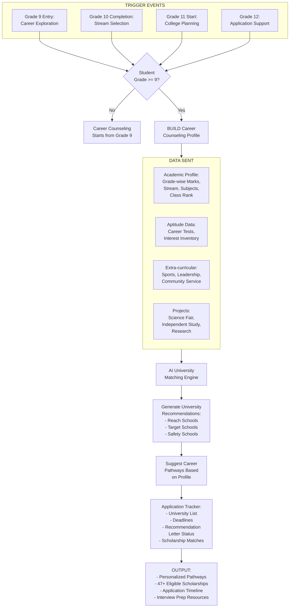

---

### 18. TO ALUMNI MODULE

**WHY This Connection Exists:**
When students graduate (Grade 12), they transition from "current students" to "alumni." School maintains lifelong relationships for networking, mentorship, donations.

**DATA FLOW:**

- Graduation Details (pass-out year, final grade, stream, awards)
- University/Career Path (university admitted, course, employer, profession)
- Contact Information (personal email, mobile, LinkedIn)
- Family Legacy (if alumni's children enroll)
- Engagement Level (donation history, event attendance, mentorship)

**TRIGGER EVENT:**

- Grade 12 Completion (automatic conversion)
- University Admission (alumni updates profile)
- Career Milestone (new job, promotion)
- Reunion Year (5-year, 10-year reunions)
- Child Admission (legacy student)

**IMPACT:**

- Lifelong connection with alumni email
- Mentorship program (Google engineer mentors CS students)
- Donation tracking with recognition
- Career network (searchable by profession, company)
- Legacy admissions (10% bonus for alumni children)

**BUSINESS LOGIC:**

```
FUNCTION convert_to_alumni(student):
 IF student.grade != 12 OR result != "PASSED":
 RETURN "Error: Only Grade 12 pass students"
 END IF

 alumni = CREATE with student_data, batch_year
 alumni_email = GENERATE alumni.email
 CREATE portal_access
 student.status = "ALUMNI"
 ADD_TO_GROUP("Batch of {year}")

 SEND welcome_email
END FUNCTION
```

**EXAMPLE:**
Priya completes Grade 12 (92%), admitted to IIT Delhi. Converted to alumni: Batch 2025, alumni email created. 2029: Joins Google. 2030: Mentors 10 CS students. 2035: 10-year reunion, donates ₹25,000. 2045: Daughter applies, gets legacy preference, admitted.


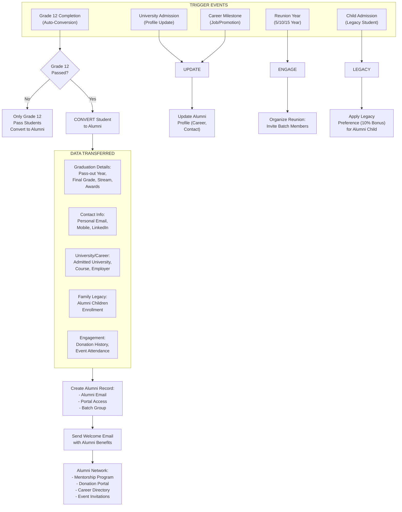

---

### 19. TO ASSESSMENT & EXAMS MODULE

**WHY This Connection Exists:**
Exams and assessments are conducted for enrolled students. Results must be stored back in student records for transcripts and academic history.

**DATA FLOW:**

- Student Enrollment (who takes which exams)
- Section/Subject Mapping (exam schedules per section)
- Special Accommodations (IEP students get extra time)
- Exam Hall Seat Allocation (based on roll number)

**TRIGGER EVENT:**

- Exam Schedule Creation
- Result Publication
- Admit Card Generation
- Revaluation Request

**IMPACT:**

- Exam rosters auto-generated
- Seat allocation optimized
- Results linked to student records
- Transcripts generated automatically

**BUSINESS LOGIC:**

```
FUNCTION generate_exam_roster(exam, section):
 students = GET WHERE section = section AND status = "ACTIVE"

 FOR each student:
 IF student.has_IEP:
 ALLOCATE separate_room, extra_time
 END IF
 IF student.outstanding_fees > threshold:
 BLOCK admit_card
 END IF
 END FOR
END FUNCTION
```

**EXAMPLE:**
Mid-term exams for Grade 9A (35 students). System generates roster, allocates Hall 1 Seats 1-35. Arjun (dyslexia) gets Hall 2 with extra 30 mins. Rohan (₹50,000 dues) blocked from exam until fee paid.


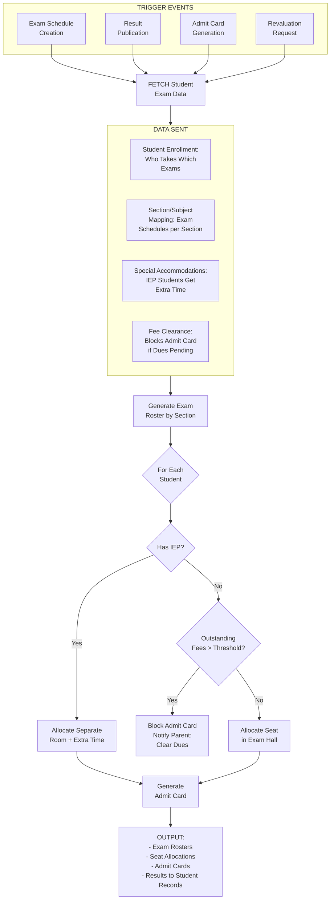

---

### 20. TO EVENTS & ACTIVITIES MODULE

**WHY This Connection Exists:**
Student participation in events (sports day, cultural fest, competitions) must be tracked. Achievements are added to student portfolios.

**DATA FLOW:**

- Student Registration for Events
- Participation Records
- Awards & Achievements
- Certificates Earned

**TRIGGER EVENT:**

- Event Registration Opens
- Event Completion
- Awards Announced
- Certificate Issuance

**IMPACT:**

- Digital portfolio of all achievements
- Participation tracking for college applications
- House points calculation (for house system)
- Parent notifications of achievements

**BUSINESS LOGIC:**

```
FUNCTION register_for_event(student, event):
 IF event.requires_consent AND NOT student.has_consent:
 RETURN "Error: Parent consent required"
 END IF

 IF event.capacity_full:
 ADD_TO_WAITLIST
 ELSE:
 REGISTER student
 NOTIFY parent
 END IF
END FUNCTION
```

**EXAMPLE:**
Annual Sports Day: 200 students register for 15 events. Priya wins 100m race (Gold), 200m (Silver). Achievements added to portfolio. House points: Red House +20. Certificate auto-generated. Parent receives: "Priya won Gold in 100m race!"


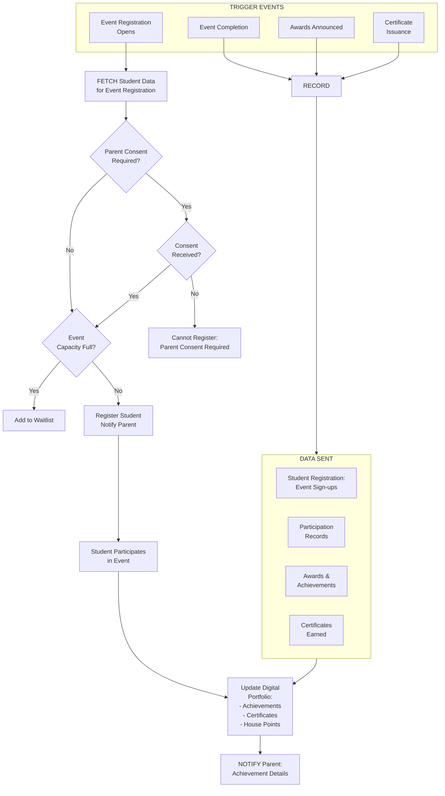

---

### 21. TO CANTEEN & MEAL MANAGEMENT MODULE

**WHY This Connection Exists:**
Students use canteen services. Meal plans for day scholars, mess for boarders. Dietary restrictions must be enforced.

**DATA FLOW:**

- Student ID (for meal card/RFID)
- Dietary Restrictions (allergies, religious, medical)
- Meal Plan Enrollment (daily lunch, snacks)
- Boarding Status (boarders auto-enrolled in mess)

**TRIGGER EVENT:**

- Meal Plan Purchase
- Daily Meal Consumption
- Dietary Restriction Update
- Canteen Credit Top-up

**IMPACT:**

- Cashless canteen with RFID cards
- Dietary restrictions enforced (no peanuts for allergic students)
- Meal consumption tracking
- Parent monitoring of canteen spending

**BUSINESS LOGIC:**

```
FUNCTION process_meal_purchase(student, item):
 IF item.contains_allergen IN student.allergies:
 RETURN "Error: Allergen detected - {allergen}"
 END IF

 IF student.canteen_balance < item.price:
 RETURN "Error: Insufficient balance"
 END IF

 DEDUCT balance
 LOG purchase
 NOTIFY parent(daily_summary)
END FUNCTION
```

**EXAMPLE:**
Aarav (peanut allergy) tries to buy peanut butter sandwich. System blocks: "Contains peanuts - allergen detected." Aarav buys veggie sandwich instead. Daily summary to parent: "Canteen spending: ₹85 (sandwich ₹40, juice ₹25, snacks ₹20)."


```mermaid
flowchart TD
    subgraph TRIGGERS["TRIGGER EVENTS"]
        T1["Meal Plan\nPurchase"]
        T2["Daily Meal\nConsumption"]
        T3["Dietary Restriction\nUpdate"]
        T4["Canteen Credit\nTop-up"]
    end

    T1 --> FETCH
    T2 --> FETCH
    T3 --> FETCH
    T4 --> FETCH

    FETCH["FETCH Student\nCanteen Profile"]

    subgraph DATA["DATA SENT"]
        direction LR
        D1["Student ID:\nFor RFID\nMeal Card"]
        D2["Dietary Restrictions:\nAllergies, Religious,\nMedical Diets"]
        D3["Meal Plan:\nDaily Lunch,\nSnacks Enrollment"]
        D4["Boarding Status:\nBoarders Auto-enrolled\nin Mess"]
    end

    FETCH --> DATA

    DATA --> PURCHASE{"Student\nPurchasing?"}

    PURCHASE --> ALLERGEN{"Item Contains\nStudent Allergen?"}

    ALLERGEN -- Yes --> BLOCK["BLOCKED:\nAllergen Detected!\n(e.g., Peanuts)"]
    ALLERGEN -- No --> BALANCE{"Sufficient\nBalance?"}

    BALANCE -- No --> INSUFFICIENT["Insufficient\nBalance: Top-up\nRequired"]
    BALANCE -- Yes --> APPROVE["Purchase Approved\nDeduct Balance"]

    APPROVE --> LOG["Log Purchase:\nItem, Price, Time"]

    LOG --> SUMMARY["Daily Summary\nto Parent:\nItems Purchased,\nTotal Spending"]
```

---

### 22. TO SPORTS & ATHLETICS MODULE

**WHY This Connection Exists:**
Students participate in sports teams, tournaments, and physical education. Medical clearance required for competitive sports.

**DATA FLOW:**

- Sports Enrollment (which sports student plays)
- Medical Clearance Status
- Physical Fitness Data
- Tournament Participation
- Sports Achievements

**TRIGGER EVENT:**

- Sports Team Selection
- Tournament Registration
- Medical Clearance Submission
- Achievement Recording

**IMPACT:**

- Team rosters managed
- Medical clearance enforced (no participation without clearance)
- Sports achievements tracked for college applications
- Injury tracking linked to health module

**BUSINESS LOGIC:**

```
FUNCTION enroll_in_sports(student, sport):
 IF sport.competitive AND NOT student.medical_clearance:
 RETURN "Error: Medical clearance required"
 END IF

 IF student.has_medical_restriction(sport):
 RETURN "Error: Medical restriction - {condition}"
 END IF

 ENROLL student
 ADD to team_roster
 NOTIFY coach, parent
END FUNCTION
```

**EXAMPLE:**
Rohan wants to join basketball team. System checks: Medical clearance valid until Dec 2024 , No heart conditions . Enrolled in team. Tournament registration: Inter-school championship. Rohan scores 25 points, team wins. Achievement added: "Basketball Champion 2024."


```mermaid
flowchart TD
    subgraph TRIGGERS["TRIGGER EVENTS"]
        T1["Sports Team\nSelection"]
        T2["Tournament\nRegistration"]
        T3["Medical Clearance\nSubmission"]
        T4["Achievement\nRecording"]
    end

    T1 --> FETCH
    T2 --> FETCH
    T3 --> FETCH
    T4 --> FETCH

    FETCH["FETCH Student\nSports Profile"]

    subgraph DATA["DATA SENT"]
        direction LR
        D1["Sports Enrollment:\nWhich Sports\nStudent Plays"]
        D2["Medical Clearance:\nStatus & Expiry"]
        D3["Physical Fitness\nData"]
        D4["Tournament\nParticipation\nHistory"]
        D5["Sports\nAchievements"]
    end

    FETCH --> DATA

    DATA --> COMPETITIVE{"Competitive\nSport?"}

    COMPETITIVE -- Yes --> CLEARANCE{"Medical\nClearance\nValid?"}
    COMPETITIVE -- No --> RESTRICTION{"Medical\nRestriction?"}

    CLEARANCE -- No --> BLOCK["Cannot Participate:\nMedical Clearance\nRequired"]
    CLEARANCE -- Yes --> RESTRICTION

    RESTRICTION -- Yes --> DENY["Medical Restriction:\nCondition Prevents\nParticipation"]
    RESTRICTION -- No --> ENROLL["Enroll in Sport\nAdd to Team Roster"]

    ENROLL --> NOTIFY["Notify Coach\n& Parent"]

    NOTIFY --> TRACK["Track:\n- Tournament Results\n- Achievements\n- Injuries to Health Module"]

    TRACK --> PORTFOLIO["Add to Student\nPortfolio for\nCollege Applications"]
```

---

### 23. TO COUNSELING & MENTAL HEALTH MODULE

**WHY This Connection Exists:**
Students may need counseling for academic stress, behavioral issues, family problems, or mental health concerns.

**DATA FLOW:**

- Counseling Referrals (teacher/parent/self-referral)
- Session History
- Mental Health Assessments
- Crisis Alerts (suicide risk, severe depression)

**TRIGGER EVENT:**

- Counseling Request
- Teacher/Parent Referral
- Behavioral Incident (triggers automatic referral)
- Crisis Situation

**IMPACT:**

- Confidential counseling records
- Progress tracking across sessions
- Crisis intervention protocols
- Parent notifications (with student consent for non-crisis)

**BUSINESS LOGIC:**

```
FUNCTION create_counseling_referral(student, reason, referred_by):
 referral = CREATE with priority_level

 IF reason = "CRISIS" OR keywords_detected(suicide, self_harm):
 priority = "URGENT"
 ALERT counselor, principal, parent IMMEDIATELY
 SCHEDULE session(within_24_hours)
 ELSE:
 priority = "ROUTINE"
 SCHEDULE session(within_1_week)
 END IF

 RETURN referral
END FUNCTION
```

**EXAMPLE:**
Priya (Grade 10) shows signs of exam stress: crying in class, grades dropping. Teacher refers to counselor. 5 sessions scheduled. Counselor teaches stress management techniques. After 2 months: grades improve, stress levels normal. Parent informed (with Priya's consent).


```mermaid
flowchart TD
    subgraph TRIGGERS["TRIGGER EVENTS"]
        T1["Counseling Request\n(Self-Referral)"]
        T2["Teacher/Parent\nReferral"]
        T3["Behavioral Incident\n(Auto-Referral)"]
        T4["Crisis Situation"]
    end

    T1 --> FETCH
    T2 --> FETCH
    T3 --> FETCH
    T4 --> FETCH

    FETCH["FETCH Student\nCounseling Data"]

    subgraph DATA["DATA SENT"]
        direction LR
        D1["Counseling\nReferrals:\nTeacher/Parent/\nSelf-Referral"]
        D2["Session\nHistory"]
        D3["Mental Health\nAssessments"]
        D4["Crisis Alerts:\nSuicide Risk,\nSevere Depression"]
    end

    FETCH --> DATA

    DATA --> ASSESS{"Crisis\nKeywords\nDetected?"}

    ASSESS -- "Yes: suicide,\nself-harm" --> URGENT["URGENT PRIORITY\nAlert Counselor +\nPrincipal + Parent\nIMMEDIATELY"]
    ASSESS -- No --> ROUTINE["ROUTINE PRIORITY\nSchedule Session\nWithin 1 Week"]

    URGENT --> SESSION24["Schedule Session\nWithin 24 Hours"]

    SESSION24 --> SESSIONS["Counseling Sessions\n(Confidential)"]
    ROUTINE --> SESSIONS

    SESSIONS --> PROGRESS["Track Progress\nAcross Sessions"]

    PROGRESS --> CONSENT{"Non-Crisis:\nStudent Consent\nto Inform Parent?"}

    CONSENT -- Yes --> PARENTNOTIFY["Notify Parent\nof Progress"]
    CONSENT -- No --> CONFIDENTIAL["Keep Records\nConfidential"]

    PARENTNOTIFY --> RECORD["Maintain Confidential\nCounseling Records\n+ Intervention Outcomes"]
    CONFIDENTIAL --> RECORD
```

---

### 24. TO COMMUNICATION & NOTIFICATION MODULE

**WHY This Connection Exists:**
School needs to send targeted communications to students/parents based on grade, section, or individual student.

**DATA FLOW:**

- Student Contact Details (parent email, mobile, WhatsApp)
- Segmentation Data (grade, section, transport route, hostel block)
- Communication Preferences (email, SMS, app notifications)

**TRIGGER EVENT:**

- School-wide Announcement
- Grade/Section-specific Notice
- Individual Student Alert
- Emergency Broadcast

**IMPACT:**

- Targeted messaging (only Grade 12 parents get college fair invite)
- Multi-channel delivery (email + SMS + app)
- Delivery tracking (read receipts)
- Emergency broadcasts (school closure, security threat)

**BUSINESS LOGIC:**

```
FUNCTION send_communication(message, target_group):
 IF target_group = "ALL":
 recipients = ALL students.parents
 ELSE IF target_group = "GRADE_10":
 recipients = students WHERE grade = 10
 ELSE IF target_group = "BUS_ROUTE_5":
 recipients = students WHERE transport_route = 5
 END IF

 FOR each recipient:
 SEND via preferred_channels(email, SMS, app)
 TRACK delivery_status
 END FOR
END FUNCTION
```

**EXAMPLE:**
School announces: "Parent-Teacher Meeting on March 15." Sent to all parents via email + SMS + app. Grade 12 parents get additional message: "College Counseling Fair on March 20." Bus Route 5 parents: "Bus delayed 30 mins due to traffic."


```mermaid
flowchart TD
    subgraph TRIGGERS["TRIGGER EVENTS"]
        T1["School-wide\nAnnouncement"]
        T2["Grade/Section\nSpecific Notice"]
        T3["Individual\nStudent Alert"]
        T4["Emergency\nBroadcast"]
    end

    T1 --> FETCH
    T2 --> FETCH
    T3 --> FETCH
    T4 --> FETCH

    FETCH["FETCH Student\nContact &\nSegmentation Data"]

    subgraph DATA["DATA SENT"]
        direction LR
        D1["Contact Details:\nParent Email,\nMobile, WhatsApp"]
        D2["Segmentation:\nGrade, Section,\nTransport Route,\nHostel Block"]
        D3["Communication\nPreferences:\nEmail, SMS,\nApp Notifications"]
    end

    FETCH --> DATA

    DATA --> TARGET{"Target\nGroup?"}

    TARGET -- "ALL" --> ALL["All Students\nParents"]
    TARGET -- "GRADE" --> GRADE["Filter by\nSpecific Grade"]
    TARGET -- "SECTION" --> SECTION["Filter by\nSpecific Section"]
    TARGET -- "BUS_ROUTE" --> BUS["Filter by\nTransport Route"]
    TARGET -- "INDIVIDUAL" --> INDIVIDUAL["Single Student\nParents"]

    ALL --> SEND["SEND via Preferred\nChannels:\nEmail + SMS + App"]
    GRADE --> SEND
    SECTION --> SEND
    BUS --> SEND
    INDIVIDUAL --> SEND

    SEND --> TRACK["Track Delivery:\n- Sent\n- Delivered\n- Read\n- Failed (Retry)"]
```

---

### 25. TO EXAM HALL & SEATING MODULE

**WHY This Connection Exists:**
Exam seating must be allocated based on student enrollment, roll numbers, and special accommodations.

**DATA FLOW:**

- Student Enrollment in Subjects
- Roll Numbers (for seating order)
- Special Accommodations (IEP students, medical needs)
- Fee Clearance Status (blocks admit card if dues pending)

**TRIGGER EVENT:**

- Exam Schedule Finalized
- Seating Plan Generation
- Admit Card Printing
- Last-minute Accommodation Request

**IMPACT:**

- Automated seating allocation (alphabetical, roll number-based)
- Special rooms for IEP students
- Admit cards with seat numbers
- Fee defaulters blocked from exams

**BUSINESS LOGIC:**

```
FUNCTION allocate_exam_seats(exam):
 students = GET enrolled_in_subjects(exam) WHERE status = "ACTIVE"

 regular_students = []
 special_accommodation = []

 FOR each student:
 IF student.outstanding_fees > fee_threshold:
 BLOCK admit_card
 NOTIFY parent("Clear dues to receive admit card")
 ELSE IF student.has_IEP:
 special_accommodation.add(student)
 ELSE:
 regular_students.add(student)
 END IF
 END FOR

 ALLOCATE regular_students TO main_halls(by_roll_number)
 ALLOCATE special_accommodation TO separate_rooms(with_extra_time)

 GENERATE admit_cards
END FUNCTION
```

**EXAMPLE:**
Grade 10 Math exam: 180 students. System allocates: Hall 1 (60 students, Roll 1-60), Hall 2 (60, Roll 61-120), Hall 3 (55, Roll 121-175). 5 IEP students → Hall 4 (separate, extra 30 mins). 3 students with ₹50,000+ dues → Admit cards blocked.


```mermaid
flowchart TD
    subgraph TRIGGERS["TRIGGER EVENTS"]
        T1["Exam Schedule\nFinalized"]
        T2["Seating Plan\nGeneration"]
        T3["Admit Card\nPrinting"]
        T4["Last-minute\nAccommodation Request"]
    end

    T1 --> FETCH
    T2 --> FETCH
    T3 --> FETCH
    T4 --> FETCH

    FETCH["FETCH Student\nExam Enrollment Data"]

    subgraph DATA["DATA SENT"]
        direction LR
        D1["Subject Enrollment:\nWho Takes\nWhich Exam"]
        D2["Roll Numbers:\nFor Seating\nOrder"]
        D3["Special Accommodations:\nIEP, Medical\nNeeds"]
        D4["Fee Clearance:\nBlocks Admit Card\nif Dues Pending"]
    end

    FETCH --> DATA

    DATA --> PROCESS["Process Each\nStudent"]

    PROCESS --> FEES{"Outstanding\nFees > Threshold?"}

    FEES -- Yes --> BLOCKADMIT["Block Admit Card\nNotify Parent:\nClear Dues to Get\nAdmit Card"]
    FEES -- No --> IEP{"Has IEP /\nMedical Needs?"}

    IEP -- Yes --> SPECIAL["Allocate Separate\nRoom with:\n- Extra Time\n- Special Seating\n- Assistive Tools"]
    IEP -- No --> REGULAR["Allocate Main Hall\nSeat (By Roll Number)"]

    SPECIAL --> ADMIT["Generate Admit Card\nwith Seat Number"]
    REGULAR --> ADMIT

    ADMIT --> OUTPUT["OUTPUT:\n- Hall-wise Seating Plans\n- Admit Cards with QR\n- Special Room List\n- Fee Defaulters Report"]
```

---

## INBOUND CONNECTIONS (Other Modules → Student Management)

### FROM ASSESSMENT & EXAMS MODULE

**WHY:** Exam results must be permanently stored in student records for transcripts and academic history.

**DATA RECEIVED:**

- Term marks, final grades, rank, percentile
- Promotion/detention status
- Subject-wise performance

**IMPACT:**

- Academic transcripts updated
- Report cards generated
- Promotion to next grade recorded
- Historical performance available for analytics

**TRIGGER:** Result publication, annual promotion


```mermaid
flowchart TD
    subgraph SOURCE["ASSESSMENT & EXAMS MODULE"]
        S1["Result Publication"]
        S2["Annual Promotion"]
    end

    S1 --> SEND
    S2 --> SEND

    SEND["SEND Results to\nStudent Management"]

    subgraph DATA["DATA RECEIVED"]
        direction LR
        D1["Term Marks &\nFinal Grades"]
        D2["Rank &\nPercentile"]
        D3["Promotion/\nDetention Status"]
        D4["Subject-wise\nPerformance"]
    end

    SEND --> DATA

    DATA --> UPDATE["UPDATE Student\nAcademic Record"]

    UPDATE --> TRANSCRIPT["Update Academic\nTranscripts"]

    TRANSCRIPT --> REPORT["Generate Report\nCards"]

    REPORT --> PROMOTE{"Promoted?"}

    PROMOTE -- Yes --> NEXT["Record Promotion\nto Next Grade"]
    PROMOTE -- No --> DETAIN["Record Detention\nin Current Grade"]

    NEXT --> HISTORY["Historical Performance\nAvailable for\nAnalytics & Reports"]
    DETAIN --> HISTORY
```

---

### FROM EVENTS & ACTIVITIES MODULE

**WHY:** Student achievements and participation must be tracked in their permanent portfolio.

**DATA RECEIVED:**

- Awards won, competition ranks
- Participation certificates
- House points earned
- Leadership roles

**IMPACT:**

- Digital portfolio enriched
- College application materials ready
- Merit points added
- Achievement notifications to parents

**TRIGGER:** Event completion, awards announced


```mermaid
flowchart TD
    subgraph SOURCE["EVENTS & ACTIVITIES MODULE"]
        S1["Event Completion"]
        S2["Awards Announced"]
    end

    S1 --> SEND
    S2 --> SEND

    SEND["SEND Achievement Data\nto Student Management"]

    subgraph DATA["DATA RECEIVED"]
        direction LR
        D1["Awards Won &\nCompetition Ranks"]
        D2["Participation\nCertificates"]
        D3["House Points\nEarned"]
        D4["Leadership\nRoles"]
    end

    SEND --> DATA

    DATA --> PORTFOLIO["Enrich Digital\nPortfolio"]

    PORTFOLIO --> MERIT["Add Merit Points\nto Student Record"]

    MERIT --> COLLEGE["Update College\nApplication Materials"]

    COLLEGE --> NOTIFY["Achievement\nNotification\nto Parents"]
```

---

### FROM FEE MANAGEMENT MODULE

**WHY:** Fee clearance status affects student services (TC issuance, exam admit cards, certificate generation).

**DATA RECEIVED:**

- Payment status (paid/pending/overdue)
- Outstanding dues amount
- Payment history
- Scholarship status changes

**IMPACT:**

- TC issuance blocked if dues pending
- Exam admit cards blocked for defaulters
- Services restricted until fee clearance
- Scholarship discounts applied to student profile

**TRIGGER:** Payment made/defaulted, scholarship awarded


```mermaid
flowchart TD
    subgraph SOURCE["FEE MANAGEMENT MODULE"]
        S1["Payment Made/\nDefaulted"]
        S2["Scholarship\nAwarded"]
    end

    S1 --> SEND
    S2 --> SEND

    SEND["SEND Fee Status\nto Student Management"]

    subgraph DATA["DATA RECEIVED"]
        direction LR
        D1["Payment Status:\nPaid/Pending/\nOverdue"]
        D2["Outstanding\nDues Amount"]
        D3["Payment\nHistory"]
        D4["Scholarship\nStatus Changes"]
    end

    SEND --> DATA

    DATA --> UPDATE["UPDATE Student\nFee Profile"]

    UPDATE --> CHECK{"Dues\nPending?"}

    CHECK -- Yes --> RESTRICT["Restrict Services:\n- Block TC Issuance\n- Block Admit Card\n- Flag in System"]
    CHECK -- No --> CLEAR["All Services\nAvailable"]

    CLEAR --> SCHOLARSHIP{"Scholarship\nChange?"}
    RESTRICT --> SCHOLARSHIP

    SCHOLARSHIP -- Yes --> APPLY["Apply Scholarship\nDiscount to\nStudent Profile"]
    SCHOLARSHIP -- No --> DONE["Fee Status\nUpdated"]

    APPLY --> DONE
```

---

### FROM DISCIPLINE & BEHAVIOR MODULE

**WHY:** Behavioral incidents and merit points must be part of student's permanent record.

**DATA RECEIVED:**

- Incident reports
- Disciplinary actions taken
- Merit points awarded/deducted
- Behavioral score updates

**IMPACT:**

- Character certificates reflect conduct
- Transfer certificates include behavioral remarks
- Counseling referrals triggered
- Pattern detection for interventions

**TRIGGER:** Incident reported, merit points awarded


```mermaid
flowchart TD
    subgraph SOURCE["DISCIPLINE & BEHAVIOR MODULE"]
        S1["Incident Reported"]
        S2["Merit Points\nAwarded"]
    end

    S1 --> SEND
    S2 --> SEND

    SEND["SEND Behavioral Data\nto Student Management"]

    subgraph DATA["DATA RECEIVED"]
        direction LR
        D1["Incident\nReports"]
        D2["Disciplinary\nActions Taken"]
        D3["Merit Points\nAwarded/Deducted"]
        D4["Behavioral Score\nUpdates"]
    end

    SEND --> DATA

    DATA --> RECORD["UPDATE Student\nPermanent Record"]

    RECORD --> CERT["Character Certificates\nReflect Conduct"]

    CERT --> TC["Transfer Certificates\nInclude Behavioral\nRemarks"]

    TC --> PATTERN{"Pattern\nDetected?"}

    PATTERN -- Yes --> COUNSEL["Trigger Counseling\nReferral"]
    PATTERN -- No --> DONE["Behavioral Record\nUpdated"]

    COUNSEL --> DONE
```

---

### FROM HEALTH & WELLNESS MODULE

**WHY:** Medical incidents and health updates must be recorded in student health history.

**DATA RECEIVED:**

- Infirmary visits
- Injuries/illnesses
- Medication administered
- Medical clearance updates
- Vaccination records

**IMPACT:**

- Health history maintained
- Sports participation clearance updated
- Emergency contact information verified
- Chronic condition alerts updated

**TRIGGER:** Medical incident, health checkup, vaccination


```mermaid
flowchart TD
    subgraph SOURCE["HEALTH & WELLNESS MODULE"]
        S1["Medical Incident"]
        S2["Health Checkup"]
        S3["Vaccination"]
    end

    S1 --> SEND
    S2 --> SEND
    S3 --> SEND

    SEND["SEND Health Data\nto Student Management"]

    subgraph DATA["DATA RECEIVED"]
        direction LR
        D1["Infirmary\nVisits"]
        D2["Injuries &\nIllnesses"]
        D3["Medication\nAdministered"]
        D4["Medical Clearance\nUpdates"]
        D5["Vaccination\nRecords"]
    end

    SEND --> DATA

    DATA --> UPDATE["UPDATE Student\nHealth History"]

    UPDATE --> SPORTS["Update Sports\nParticipation\nClearance"]

    SPORTS --> EMERGENCY["Verify Emergency\nContact Information"]

    EMERGENCY --> CHRONIC["Update Chronic\nCondition Alerts"]

    CHRONIC --> PROFILE["Holistic Health\nProfile Maintained"]
```

---

### FROM LIBRARY MANAGEMENT MODULE

**WHY:** Borrowing history and library fines are part of student record.

**DATA RECEIVED:**

- Books borrowed/returned
- Overdue fines
- Lost book charges
- Reading analytics

**IMPACT:**

- TC issuance blocked if books not returned
- Fines added to fee account
- Reading habits tracked
- Book recommendations personalized

**TRIGGER:** Book checkout/return, fine generated


```mermaid
flowchart TD
    subgraph SOURCE["LIBRARY MANAGEMENT MODULE"]
        S1["Book Checkout/\nReturn"]
        S2["Fine Generated"]
    end

    S1 --> SEND
    S2 --> SEND

    SEND["SEND Library Data\nto Student Management"]

    subgraph DATA["DATA RECEIVED"]
        direction LR
        D1["Books Borrowed\n& Returned"]
        D2["Overdue\nFines"]
        D3["Lost Book\nCharges"]
        D4["Reading\nAnalytics"]
    end

    SEND --> DATA

    DATA --> UPDATE["UPDATE Student\nLibrary Record"]

    UPDATE --> TCCHECK{"Books Not\nReturned?"}

    TCCHECK -- Yes --> BLOCK["Block TC Issuance\nUntil Books Returned"]
    TCCHECK -- No --> FINES{"Fines\nPending?"}

    FINES -- Yes --> ADDFEE["Add Fines to\nStudent Fee Account"]
    FINES -- No --> READING["Update Reading\nHabits & Analytics"]

    BLOCK --> READING
    ADDFEE --> READING

    READING --> RECOMMEND["Personalized Book\nRecommendations"]
```

---

### FROM TRANSPORT MANAGEMENT MODULE

**WHY:** Transport enrollment changes and route assignments must update student profile.

**DATA RECEIVED:**

- Route assignment changes
- Boarding/deboarding logs
- Transport fee status
- GPS tracking consent

**IMPACT:**

- Transport status updated
- Parent notifications configured
- Emergency contact verification
- Route optimization data refreshed

**TRIGGER:** Route change, enrollment/withdrawal from transport


```mermaid
flowchart TD
    subgraph SOURCE["TRANSPORT MANAGEMENT MODULE"]
        S1["Route Change"]
        S2["Enrollment/Withdrawal\nfrom Transport"]
    end

    S1 --> SEND
    S2 --> SEND

    SEND["SEND Transport Data\nto Student Management"]

    subgraph DATA["DATA RECEIVED"]
        direction LR
        D1["Route Assignment\nChanges"]
        D2["Boarding/Deboarding\nLogs"]
        D3["Transport Fee\nStatus"]
        D4["GPS Tracking\nConsent"]
    end

    SEND --> DATA

    DATA --> UPDATE["UPDATE Student\nTransport Profile"]

    UPDATE --> STATUS["Update Transport\nStatus in Record"]

    STATUS --> NOTIFY["Configure Parent\nNotifications for\nNew Route"]

    NOTIFY --> VERIFY["Verify Emergency\nContact Information"]

    VERIFY --> OPTIMIZE["Route Optimization\nData Refreshed"]
```

---

### FROM HOSTEL & MESS MANAGEMENT MODULE

**WHY:** Hostel room changes and mess enrollment must sync with student profile.

**DATA RECEIVED:**

- Room allocation changes
- Mess enrollment status
- Dietary preference updates
- Hostel leave records

**IMPACT:**

- Boarding status updated
- Dietary restrictions synced
- Emergency contact for hostel verified
- Weekend leave patterns tracked

**TRIGGER:** Room change, dietary update, leave request


```mermaid
flowchart TD
    subgraph SOURCE["HOSTEL & MESS MODULE"]
        S1["Room Change"]
        S2["Dietary Update"]
        S3["Leave Request"]
    end

    S1 --> SEND
    S2 --> SEND
    S3 --> SEND

    SEND["SEND Hostel Data\nto Student Management"]

    subgraph DATA["DATA RECEIVED"]
        direction LR
        D1["Room Allocation\nChanges"]
        D2["Mess Enrollment\nStatus"]
        D3["Dietary Preference\nUpdates"]
        D4["Hostel Leave\nRecords"]
    end

    SEND --> DATA

    DATA --> UPDATE["UPDATE Student\nBoarding Profile"]

    UPDATE --> BOARDING["Update Boarding\nStatus in Record"]

    BOARDING --> DIETARY["Sync Dietary\nRestrictions"]

    DIETARY --> EMERGENCY["Verify Hostel\nEmergency Contact"]

    EMERGENCY --> LEAVE["Track Weekend\nLeave Patterns"]
```

---

### FROM COUNSELING MODULE

**WHY:** Counseling sessions and mental health interventions must be confidentially recorded.

**DATA RECEIVED:**

- Session attendance
- Progress notes (confidential)
- Intervention outcomes
- Referral completions

**IMPACT:**

- Support services tracked
- Progress monitoring enabled
- Crisis interventions documented
- Holistic student profile maintained

**TRIGGER:** Counseling session completed, crisis intervention


```mermaid
flowchart TD
    subgraph SOURCE["COUNSELING MODULE"]
        S1["Session Completed"]
        S2["Crisis Intervention"]
    end

    S1 --> SEND
    S2 --> SEND

    SEND["SEND Counseling Data\nto Student Management\n(CONFIDENTIAL)"]

    subgraph DATA["DATA RECEIVED"]
        direction LR
        D1["Session\nAttendance"]
        D2["Progress Notes\n(Confidential)"]
        D3["Intervention\nOutcomes"]
        D4["Referral\nCompletions"]
    end

    SEND --> DATA

    DATA --> UPDATE["UPDATE Student\nSupport Services\nRecord"]

    UPDATE --> PROGRESS["Track Progress\nAcross Sessions"]

    PROGRESS --> CRISIS["Document Crisis\nInterventions"]

    CRISIS --> HOLISTIC["Maintain Holistic\nStudent Profile\n(Confidential)"]
```

---

### FROM ALUMNI MODULE

**WHY:** Alumni who return as parents (legacy admissions) need their alumni status linked.

**DATA RECEIVED:**

- Alumni parent identification
- Legacy student flag
- Alumni engagement history

**IMPACT:**

- Legacy preference applied in admissions
- Alumni-student relationship mapped
- Sibling discounts combined with legacy benefits

**TRIGGER:** Alumni's child applies/enrolls


```mermaid
flowchart TD
    subgraph SOURCE["ALUMNI MODULE"]
        S1["Alumni Child\nApplies/Enrolls"]
    end

    S1 --> SEND

    SEND["SEND Alumni Data\nto Student Management"]

    subgraph DATA["DATA RECEIVED"]
        direction LR
        D1["Alumni Parent\nIdentification"]
        D2["Legacy Student\nFlag"]
        D3["Alumni Engagement\nHistory"]
    end

    SEND --> DATA

    DATA --> CHECK{"Alumni Parent\nVerified?"}

    CHECK -- Yes --> LEGACY["Apply Legacy\nPreference in\nAdmissions"]
    CHECK -- No --> STANDARD["Standard\nAdmission Process"]

    LEGACY --> MAP["Map Alumni-Student\nRelationship"]

    MAP --> BENEFITS{"Sibling\nDiscounts\nApplicable?"}

    BENEFITS -- Yes --> COMBINE["Combine Sibling\nDiscounts with\nLegacy Benefits"]
    BENEFITS -- No --> RECORD["Record Legacy\nStatus"]

    COMBINE --> RECORD
```

---

## SUMMARY

**Student Management Module connects to 35+ modules**

**Critical Dependencies (Data flows OUT):**

1. Timetable (section assignments)
2. Attendance (active student rosters)
3. Fee (student category for billing)
4. LMS (course enrollment)
5. Health (medical history)
6. Transport (address for routes)

**Two-way Sync:**

- Assessment (results stored back in student records)
- Discipline (incidents linked, behavioral score updated)
- Library (borrowing history tracked)

**Lifecycle Flows:**

- **Entry:** Admissions → Student Management
- **During:** All operational modules reference student data
- **Exit:** Student Management → Alumni

**Data Freshness:**

- Real-time: Attendance, health incidents, gate passes
- Daily: Fee updates, library transactions
- Weekly: Analytics, risk scores
- Term-based: Assessment results, report cards
- Annual: Grade promotion, alumni conversion

This module is truly the **"heart"** of the ERP - nearly every other module either feeds data into it or pulls data from it.

---

# Submodule Breakdown

# STUDENT MANAGEMENT MODULE - SUBMODULE OVERVIEW

**Module Code:** STD-MGMT-001
**Category:** Core Foundation
**Priority:** Critical (P0)
**Owner:** Academic Administration Team

## Submodule Breakdown

This module is divided into **19 submodules**, each handling a specific aspect of student lifecycle management:

### 1. Student Registration & Admission

**Code:** STD-REG-001
**File:** `01_registration_admission.md`
**Purpose:** Convert prospective students into enrolled students
**Key Features:** Profile creation, unique identifiers, family info, admission test records, biometric enrollment, emergency evacuation plan

### 2. Document Vault & KYC

**Code:** STD-DOC-002
**File:** `02_document_vault_kyc.md`
**Purpose:** Centralized repository for all student documents
**Key Features:** Mandatory docs, academic records, consent forms, version control

### 3. Medical & Health Profile

**Code:** STD-HEALTH-003
**File:** `03_medical_health_profile.md`
**Purpose:** Comprehensive health tracking for student safety
**Key Features:** Physical details, chronic conditions, allergies, vaccinations, mental health, insurance details, blood donation eligibility

### 4. Section & Class Allocation

**Code:** STD-SECTION-004
**File:** `04_section_class_allocation.md`
**Purpose:** Organize students into classes and sections
**Key Features:** Grade assignment, section allocation, roll numbers, classroom assignment

### 5. Elective & Subject Enrollment

**Code:** STD-ELECTIVE-005
**File:** `05_elective_subject_enrollment.md`
**Purpose:** Manage student subject choices
**Key Features:** Core subjects, electives, subject groups, change requests

### 6. Status & Lifecycle Management

**Code:** STD-STATUS-006
**File:** `06_status_lifecycle_management.md`
**Purpose:** Track enrollment status changes
**Key Features:** Active/leave/suspended/withdrawn/transferred/expelled/alumni, promotion, detention, withdrawal, re-admission

### 7. Attendance & Leave Tracking

**Code:** STD-ATTENDANCE-007
**File:** `07_attendance_leave_tracking.md`
**Purpose:** Monitor student presence and absence
**Key Features:** Daily attendance, leave management, absence alerts, patterns

### 8. Fee Category & Concessions

**Code:** STD-FEE-008
**File:** `08_fee_category_concessions.md`
**Purpose:** Define fee structure and discounts
**Key Features:** Fee categories, scholarships, sibling discounts, payment plans

### 9. Digital Portfolio & Achievements

**Code:** STD-PORTFOLIO-009
**File:** `09_digital_portfolio_achievements.md`
**Purpose:** Lifelong repository of accomplishments
**Key Features:** Academic, sports, cultural, community service, certifications, work experience, internships, entrepreneurship

### 10. Special Needs & Accommodations

**Code:** STD-SPECIALNEEDS-010
**File:** `10_special_needs_accommodations.md`
**Purpose:** Support for students with learning differences
**Key Features:** IEP, accommodations, therapy services

### 11. Behavior & Discipline Tracking

**Code:** STD-BEHAVIOR-011
**File:** `11_behavior_discipline_tracking.md`
**Purpose:** Monitor student conduct
**Key Features:** Merit points, disciplinary incidents, conduct rating, peer feedback, social-emotional learning (SEL) scores

### 12. Transport & Bus Enrollment

**Code:** STD-TRANSPORT-012
**File:** `12_transport_bus_enrollment.md`
**Purpose:** Link student to school transport
**Key Features:** Bus route, pickup/drop points, RFID tracking

### 13. Hostel & Boarding Status

**Code:** STD-HOSTEL-013
**File:** `13_hostel_boarding_status.md`
**Purpose:** Track boarding students
**Key Features:** Day scholar vs boarder, room assignment, mess enrollment

### 14. Alumni Conversion

**Code:** STD-ALUMNI-014
**File:** `14_alumni_conversion.md`
**Purpose:** Transition graduating students to alumni
**Key Features:** Graduation details, post-school plans, alumni portal access

### 15. Reports & Analytics

**Code:** STD-REPORTS-015
**File:** `15_reports_analytics.md`
**Purpose:** Generate insights from student data
**Key Features:** Profile reports, performance trends, attendance analytics

### 16. Communication Preferences & Consent

**Code:** STD-COMM-016
**File:** `16_communication_preferences.md`
**Purpose:** Manage communication channels and consent
**Key Features:** Channel preferences, quiet hours, marketing consent, GDPR compliance

### 17. Student Transfers & Migration

**Code:** STD-TRANSFER-017
**File:** `17_student_transfers_migration.md`
**Purpose:** Handle inter-school transfers, campus changes, and international migrations
**Key Features:** Transfer certificate (TC) generation, migration certificate issuance, inter-campus transfer workflow, transfer-in document verification, academic record portability, transfer approval workflow, clearance from all departments (library, fees, hostel, transport)

### 18. Student Groups & Peer Networks

**Code:** STD-GROUPS-018
**File:** `18_student_groups_peer_networks.md`
**Purpose:** Manage student cohorts, house systems, peer mentoring, and study groups
**Key Features:** House system allocation (Gryffindor, Ravenclaw, Hufflepuff, Slytherin), peer mentoring assignments (senior-junior buddy system), study groups and project teams, student council/prefect assignments, class representatives, student committees (discipline, sports, cultural, academic), leadership roles

### 19. Student Login & Portal Access

**Code:** STD-PORTAL-019
**File:** `19_student_login_portal_access.md`
**Purpose:** Manage student authentication, portal access, and digital identity
**Key Features:** Student login credentials, password management & reset, multi-factor authentication (MFA), session management, access logs and security audit, portal permissions (LMS, fee portal, library portal), Single Sign-On (SSO) integration, device management (registered devices), biometric authentication integration

## Integration Points

Student Management connects to **25+ modules:**

1. Admissions & CRM
2. Fee Management
3. Attendance
4. Assessment & Exams
5. Timetable
6. Advanced LMS
7. Transport
8. Hostel
9. Library
10. Health & Wellness
11. Discipline
12. Special Education
13. Sports & Athletics
14. Events & Activities
15. Career Guidance
16. Alumni
17. Parent Portal
18. Communication
19. Analytics
20. Document & Certificate
21. Visitor & Security
22. Procurement
23. Canteen
24. Consent & Compliance
25. Gamification

## Development Priority

**Phase 1 (Critical):** Submodules 1, 2, 3, 4, 6, 7, 19
**Phase 2 (High):** Submodules 5, 8, 9, 11, 17
**Phase 3 (Medium):** Submodules 10, 12, 13, 15, 16, 18
**Phase 4 (Low):** Submodule 14

---

**Status:** Submodule breakdown complete
**Last Updated:** January 15, 2026
