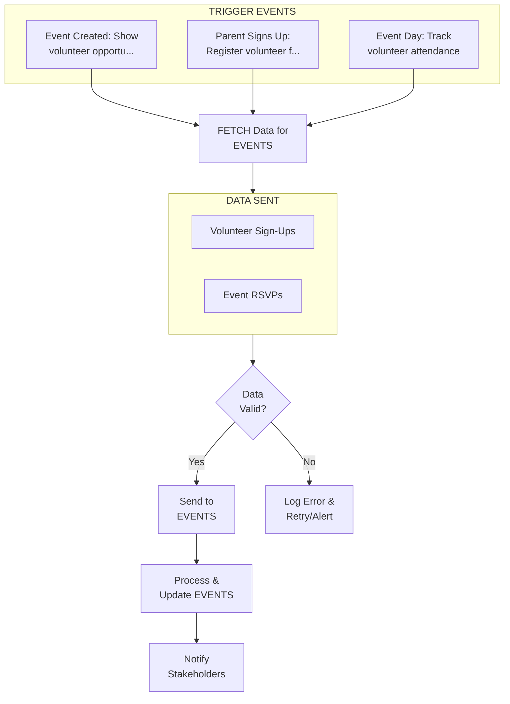
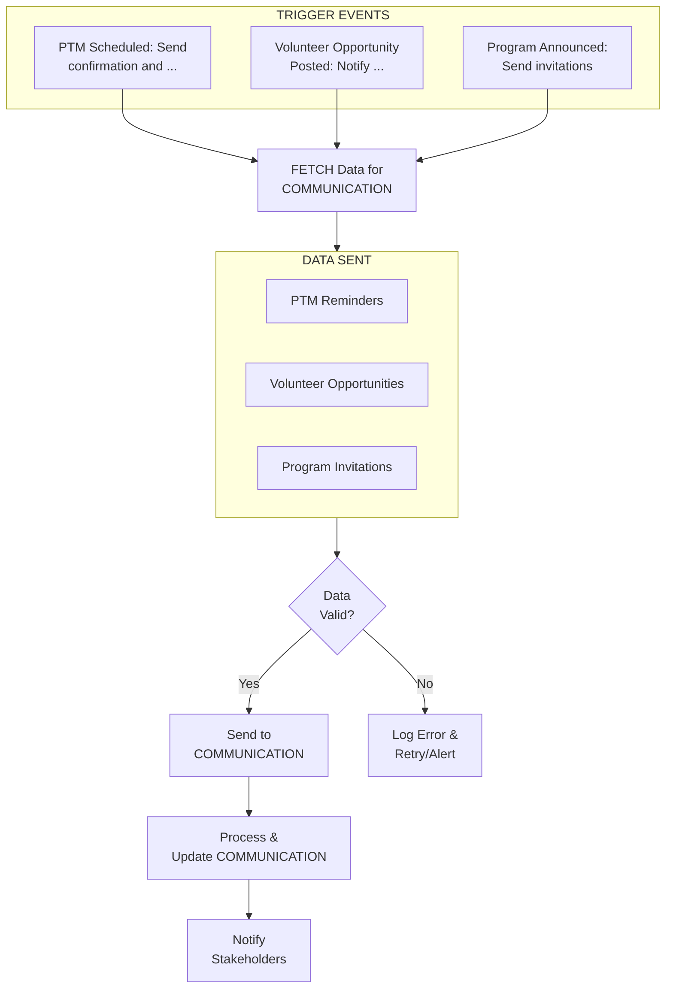
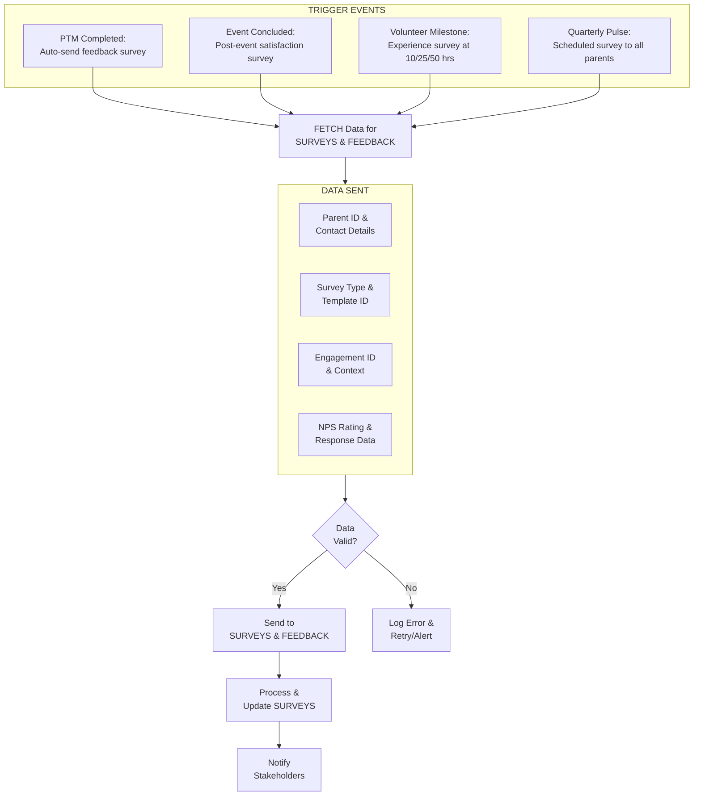
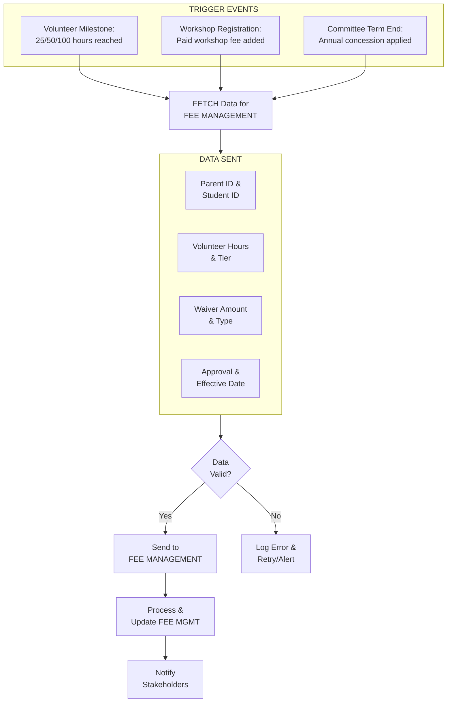
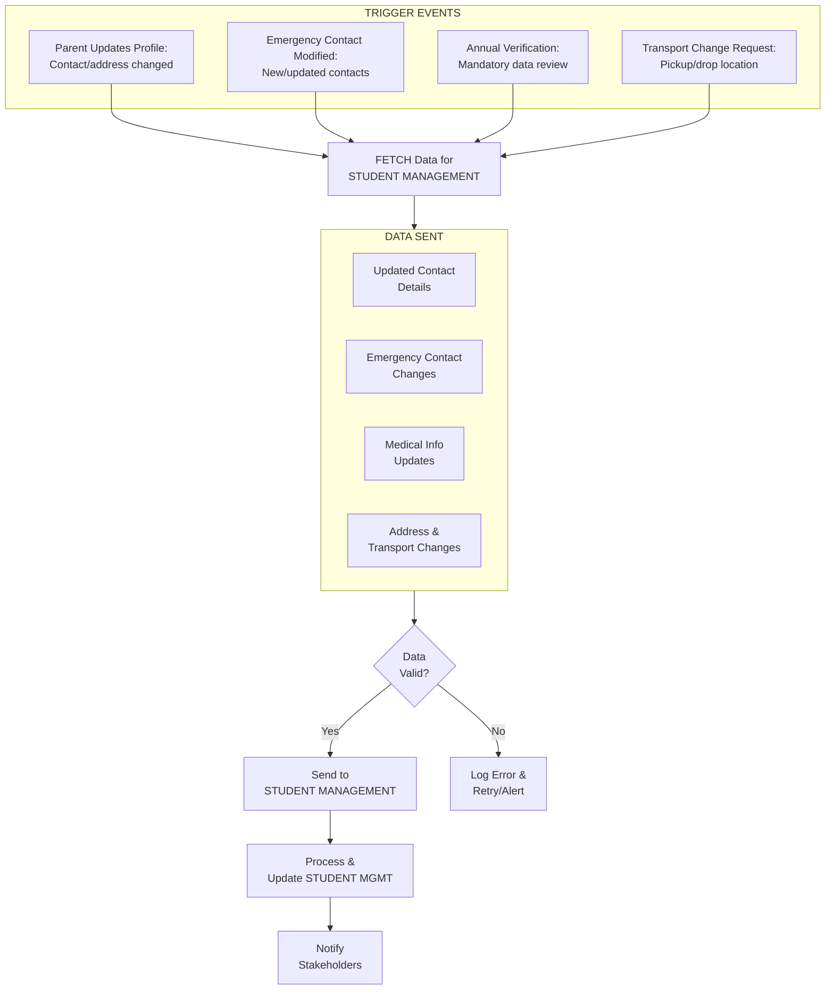
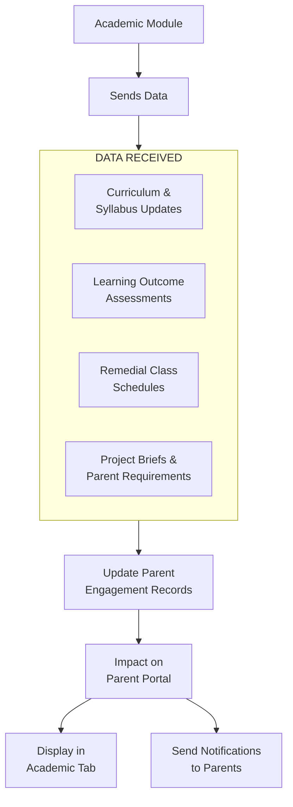
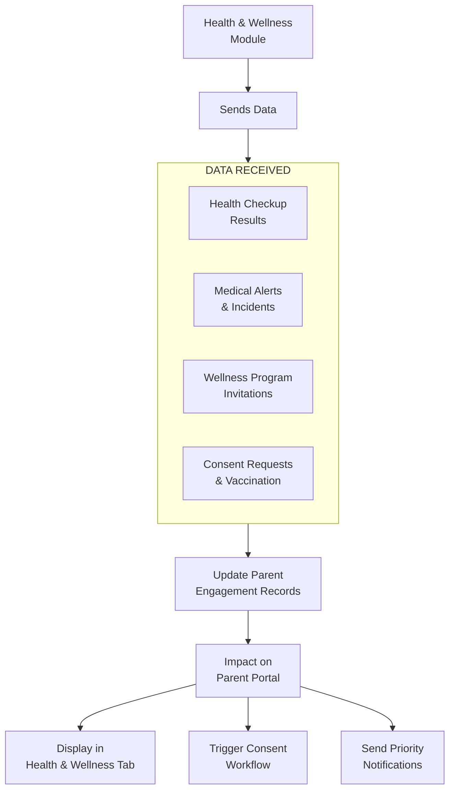

# PARENT ENGAGEMENT & VOLUNTEERING MODULE - COMPLETE DEPENDENCY ANALYSIS

## MODULE OVERVIEW

**Name:** Parent Engagement & Volunteering Module  
**Role:** Parent Community & Volunteer Coordination - Family Engagement & Partnership Platform  
**Type:** Critical Engagement & Community Module  
**Dependencies:** Integrates with Student Management, Events, Communication, Surveys, Academic modules  

**Primary Functions:**
- Parent Portal - Real-time access to child's information (attendance, grades, fees)
- PTM (Parent-Teacher Meeting) Scheduling - Online booking, automated reminders
- Volunteer Management - Opportunity posting, sign-ups, hour tracking
- Parent Committees - PTA, Sports Committee, Cultural Committee
- Parent Education Programs - Workshops, webinars, parenting resources
- Community Building - Parent networking, social events
- Feedback & Suggestions - Two-way communication channel
- Recognition & Rewards - Volunteer appreciation, certificates
- Parent Ambassador Program - Parent advocates for school
- Emergency Contact Management - Updated contact information

---

## OUTBOUND CONNECTIONS (Parent Engagement → Other Modules)

### 1. TO EVENTS MODULE

**WHY This Connection Exists:**
Parents volunteer for events and attend school functions. Parent Engagement module sends volunteer sign-ups and RSVP data to Events module.

**DATA FLOW:**
- **Volunteer Sign-Ups:**
  - Event ID, event name
  - Parent volunteer details
  - Volunteer role (coordinator, helper, photographer)
  - Time commitment (hours)
  - Skills offered (decoration, catering, photography)
- **Event RSVPs:**
  - Parent attending (Yes/No/Maybe)
  - Number of guests
  - Dietary preferences
  - Special requirements

**TRIGGER EVENT:**
- **Event Created:** Show volunteer opportunities to parents
- **Parent Signs Up:** Register volunteer for event
- **Event Day:** Track volunteer attendance

**IMPACT:**
- **Better Event Management:**
  - Know volunteer availability in advance
  - Assign roles based on skills
  - Track volunteer hours
- **Parent Involvement:**
  - Increase parent participation
  - Build community
  - Share responsibility

**BUSINESS LOGIC:**
```
FUNCTION volunteer_signup(parent_id, event_id, role):
  // Check if parent is eligible
  parent = GET_PARENT(parent_id)
  IF NOT parent.verified:
    RETURN {success: FALSE, error: "Parent not verified"}
  END IF
  
  // Check event capacity
  event = GET_EVENT(event_id)
  volunteers = GET_EVENT_VOLUNTEERS(event_id, role)
  IF volunteers.LENGTH >= event.volunteer_capacity[role]:
    RETURN {success: FALSE, error: "Volunteer capacity full for this role"}
  END IF
  
  // Register volunteer
  volunteer_record = {
    parent_id: parent_id,
    event_id: event_id,
    role: role,
    signup_date: NOW,
    status: "REGISTERED",
    hours_committed: event.volunteer_hours[role]
  }
  SAVE_VOLUNTEER_RECORD(volunteer_record)
  
  // Send to Events module
  SEND_TO_EVENTS_MODULE({
    event_id: event_id,
    volunteer: {
      name: parent.name,
      phone: parent.phone,
      email: parent.email,
      role: role
    }
  })
  
  // Send confirmation
  SEND_EMAIL(parent.email, "Volunteer Confirmation", 
    "Thank you for volunteering for " + event.name + " as " + role)
  
  // Log volunteer hours
  LOG_VOLUNTEER_HOURS(parent_id, event_id, volunteer_record.hours_committed)
  
  RETURN {
    success: TRUE,
    message: "Successfully registered as volunteer",
    volunteer_id: volunteer_record.id
  }
END FUNCTION
```

**EXAMPLE:**
- **Event:** Annual Function (15-Dec-2025)
- **Volunteer Opportunity:** Decoration Coordinator (10 hours)
- **Parent:** Mrs. Priya Sharma
- **Sign-Up:** 01-Dec-2025
- **Role:** Decoration Coordinator
- **Commitment:** 10 hours (10-Dec to 15-Dec)
- **Skills:** Interior design, creative
- **Confirmation:** Email sent with event details and coordinator contact
- **Event Day:** Mrs. Sharma coordinates decoration team (5 parent volunteers)
- **Hours Logged:** 12 hours (2 extra hours)
- **Recognition:** Certificate of Appreciation + Volunteer of the Month



---

### 2. TO COMMUNICATION MODULE

**WHY This Connection Exists:**
Parent Engagement module needs to communicate with parents for PTM reminders, volunteer opportunities, and program invitations.

**DATA FLOW:**
- **PTM Reminders:**
  - Parent name, student name
  - PTM date, time, teacher name
  - Meeting mode (in-person, virtual)
  - Meeting link (if virtual)
- **Volunteer Opportunities:**
  - Event name, date
  - Volunteer roles needed
  - Sign-up link
- **Program Invitations:**
  - Workshop name, date, time
  - Registration link
  - Speaker details

**TRIGGER EVENT:**
- **PTM Scheduled:** Send confirmation and reminder
- **Volunteer Opportunity Posted:** Notify eligible parents
- **Program Announced:** Send invitations

**IMPACT:**
- **Higher Participation:**
  - Timely reminders increase attendance
  - Easy sign-up links
  - Multi-channel communication (Email, SMS, WhatsApp)
- **Better Engagement:**
  - Parents stay informed
  - Feel valued and included
  - Build school community

---



---

### 3. TO SURVEYS & FEEDBACK MODULE

**WHY This Connection Exists:**
Parent Engagement sends structured feedback data, PTM satisfaction responses, and volunteer experience surveys to the Surveys & Feedback module. This connection enables the school to systematically collect, analyze, and act on parent sentiment, ensuring continuous improvement of engagement programs and school policies based on real community input.

**DATA FLOW:**
- Parent ID, parent name, contact details
- Survey type (PTM feedback, event feedback, volunteer satisfaction, general feedback)
- Survey responses (Likert scale ratings, free-text comments)
- PTM meeting ID and associated teacher ID
- Event ID for event-specific feedback
- Volunteer activity ID and hours completed
- Net Promoter Score (NPS) rating
- Submission timestamp and device type (mobile/desktop)

**TRIGGER EVENT:**
- **PTM Completed:** Feedback survey auto-sent to parent within 2 hours of meeting completion
- **Event Concluded:** Post-event satisfaction survey triggered for all attendees and volunteers
- **Volunteer Milestone Reached:** Experience survey sent when parent crosses 10, 25, or 50 volunteer hours
- **Quarterly Pulse Survey:** Scheduled survey sent to all registered parents every quarter

**IMPACT:**
- **Data-Driven Improvement:**
  Mrs. Priya Sharma rated her PTM experience 3/5 on 15-Jan-2026, noting "waited 25 minutes past scheduled slot." The feedback triggered a PTM scheduling review, and the school introduced a ₹200 voucher for canteen use when wait times exceed 10 minutes, improving the next cycle's PTM satisfaction to 4.6/5.
- **Volunteer Program Enhancement:**
  After the Annual Sports Day on 10-Feb-2026, 38 out of 45 volunteers submitted feedback. The survey revealed that 72% found the volunteer briefing insufficient. The school introduced a mandatory 30-minute orientation session and printed role cards, reducing volunteer confusion by 85% at the next event.
- **Policy Changes from Parent Voice:**
  Quarterly pulse survey in March 2026 showed 68% of parents in Pune campus wanted Saturday workshops moved to weekday evenings. The school shifted workshop timings to 6:30-8:00 PM on Wednesdays, increasing attendance from 45 to 92 parents per session — a ₹15,000 saving in venue costs per workshop.

**BUSINESS LOGIC:**
```
FUNCTION send_feedback_to_surveys(engagement_id, feedback_type):
  engagement = GET_ENGAGEMENT_RECORD(engagement_id)
  parent = GET_PARENT(engagement.parent_id)
  IF NOT parent.active OR parent.opted_out_surveys:
    LOG("Parent opted out or inactive, skipping survey")
    RETURN {success: FALSE, reason: "OPTED_OUT"}
  END IF

  survey_template = GET_SURVEY_TEMPLATE(feedback_type)
  IF survey_template IS NULL:
    ALERT_ADMIN("No survey template found for: " + feedback_type)
    RETURN {success: FALSE, reason: "NO_TEMPLATE"}
  END IF

  survey_payload = {
    parent_id: parent.id,
    parent_name: parent.name,
    engagement_type: feedback_type,
    engagement_id: engagement_id,
    survey_template_id: survey_template.id,
    due_date: NOW + 7_DAYS,
    channel: parent.preferred_channel,  // EMAIL, SMS, APP
    timestamp: NOW
  }

  VALIDATE_PAYLOAD(survey_payload)
  response = SEND_TO_SURVEYS_MODULE(survey_payload)
  IF response.success:
    UPDATE_ENGAGEMENT_RECORD(engagement_id, {survey_sent: TRUE, survey_id: response.survey_id})
    LOG("Survey sent successfully for engagement: " + engagement_id)
  ELSE:
    LOG_ERROR("Survey send failed: " + response.error)
    SCHEDULE_RETRY(survey_payload, retry_count: 3, interval: 1_HOUR)
  END IF
  RETURN response
END FUNCTION
```

**EXAMPLE:**
- **Context:** PTM cycle at Delhi Public School, Vasant Kunj campus
- **PTM Date:** 20-Jan-2026
- **Parent:** Mr. Rohan Deshmukh (father of Aarav Deshmukh, Class 7-B)
- **Teacher Met:** Mrs. Sunita Nair (Mathematics)
- **Meeting Duration:** 18 minutes (3 min over scheduled 15 min)
- **Survey Triggered:** 20-Jan-2026, 5:30 PM (2 hours post-meeting)
- **Survey Channel:** WhatsApp (parent's preferred channel)
- **Responses Submitted:** 20-Jan-2026, 9:15 PM
  - Overall satisfaction: 4/5
  - Teacher preparedness: 5/5
  - Wait time: 3/5 ("Had to wait 12 min in corridor")
  - Action plan clarity: 4/5
  - NPS: 8 (Promoter)
  - Free-text: "Mrs. Nair was very thorough about Aarav's progress in algebra. Would appreciate a follow-up mechanism."
- **Result:** Feedback aggregated with 180 other PTM surveys; wait-time issue flagged for process improvement



---

### 4. TO FEE MANAGEMENT MODULE

**WHY This Connection Exists:**
Parent Engagement sends volunteer-linked fee waivers, workshop registration fees, and event participation charges to the Fee Management module. When parents volunteer significant hours, the school rewards them with fee concessions; similarly, paid workshops and ticketed events generate fee line items that must be tracked in the financial system.

**DATA FLOW:**
- Parent ID, student ID, academic year
- Volunteer hours total and volunteer tier (Bronze/Silver/Gold/Platinum)
- Fee waiver type (volunteer discount, early-bird workshop, committee member concession)
- Waiver amount (₹) and percentage
- Workshop registration fee amount and payment status
- Event participation fee (e.g., field trip contribution)
- Approval authority (Principal/PTA President)
- Effective date and expiry date of concession

**TRIGGER EVENT:**
- **Volunteer Milestone Achieved:** Parent crosses 25/50/100 hours → fee concession generated
- **Workshop Registration Confirmed:** Paid workshop fee added to parent's fee ledger
- **Committee Term Completed:** Annual committee member concession applied at term end
- **Event Fee Collected:** Field trip or special event contribution recorded

**IMPACT:**
- **Volunteer Incentive Program:**
  Mrs. Meera Joshi volunteered 52 hours during 2025-26 at Greenfield International School, Bengaluru. She crossed the Gold tier (50+ hours) on 28-Feb-2026, triggering an automatic ₹5,000 tuition fee waiver for her daughter Ananya (Class 4-A). The waiver was applied to the Q4 fee invoice, reducing the outstanding from ₹45,000 to ₹40,000 and processed within 48 hours of milestone achievement.
- **Workshop Revenue Tracking:**
  The school hosted a "CBSE Board Exam Preparation Strategies" workshop on 15-Mar-2026 with a ₹500 registration fee. 85 parents registered, generating ₹42,500 in revenue. The Fee Management module tracked each payment, issued receipts, and reconciled the workshop account automatically.
- **Committee Member Recognition:**
  Mr. Aarav Kulkarni served as PTA Treasurer for 2025-26 at DAV School, Hyderabad. Upon completing his 12-month term, a ₹10,000 annual concession was applied to his son Vivaan's (Class 9-B) fee account, approved by the Principal on 31-Mar-2026.

**BUSINESS LOGIC:**
```
FUNCTION process_volunteer_fee_waiver(parent_id, academic_year):
  volunteer_record = GET_VOLUNTEER_SUMMARY(parent_id, academic_year)
  total_hours = volunteer_record.total_hours

  // Determine volunteer tier and waiver amount
  IF total_hours >= 100:
    tier = "PLATINUM"
    waiver_amount = 15000
  ELSE IF total_hours >= 50:
    tier = "GOLD"
    waiver_amount = 5000
  ELSE IF total_hours >= 25:
    tier = "SILVER"
    waiver_amount = 2500
  ELSE:
    RETURN {success: FALSE, reason: "Below minimum threshold (25 hours)"}
  END IF

  student = GET_PARENT_CHILD(parent_id)
  fee_record = GET_CURRENT_FEE(student.id, academic_year)
  IF fee_record.outstanding <= 0:
    LOG("No outstanding fees for waiver application")
    RETURN {success: FALSE, reason: "NO_OUTSTANDING_FEES"}
  END IF

  waiver_payload = {
    parent_id: parent_id,
    student_id: student.id,
    waiver_type: "VOLUNTEER_CONCESSION",
    tier: tier,
    amount: MIN(waiver_amount, fee_record.outstanding),
    volunteer_hours: total_hours,
    approved_by: "SYSTEM_AUTO",
    effective_date: NOW,
    academic_year: academic_year
  }

  response = SEND_TO_FEE_MODULE(waiver_payload)
  IF response.success:
    NOTIFY_PARENT(parent_id, "Congratulations! ₹" + waiver_amount + " fee waiver applied for " + tier + " volunteer tier.")
    NOTIFY_ACCOUNTS(waiver_payload)
  END IF
  RETURN response
END FUNCTION
```

**EXAMPLE:**
- **Context:** Volunteer fee incentive at Bal Bharati Public School, Noida
- **Parent:** Mrs. Meera Joshi (mother of Ananya Joshi, Class 4-A, CBSE)
- **Academic Year:** 2025-26
- **Volunteer Activities:**
  - Science Fair coordinator (Jan 2026): 15 hours
  - Library volunteer (Oct 2025 - Mar 2026): 24 hours
  - Sports Day registration desk (Feb 2026): 8 hours
  - Guest speaker — career talk on Architecture (Nov 2025): 2 hours
  - PTA meeting volunteer (monthly): 6 hours
- **Total Hours:** 55 hours → Gold Tier
- **Milestone Date:** 28-Feb-2026
- **Waiver Generated:** ₹5,000 tuition concession
- **Applied To:** Q4 invoice (Apr-Jun 2026)
- **Original Q4 Fee:** ₹45,000
- **After Waiver:** ₹40,000
- **Notification:** SMS + App notification sent to Mrs. Joshi on 01-Mar-2026
- **Receipt:** Auto-generated credit note #VW-2026-0342



---

### 5. TO STUDENT MANAGEMENT MODULE

**WHY This Connection Exists:**
Parent Engagement sends updated parent contact information, emergency contact changes, and parent-verified student data corrections back to the Student Management module. Parents are often the first to update phone numbers, addresses, and medical information through the portal, and these changes must sync to the central student record to maintain data integrity across the system.

**DATA FLOW:**
- Parent ID, student ID, relationship type (father/mother/guardian)
- Updated mobile number, email address, residential address
- Emergency contact changes (primary, secondary, tertiary)
- Parent-submitted medical updates (allergies, medications, blood group)
- Occupation and employer updates (for records and career-day matching)
- Preferred communication language (Hindi/English/regional)
- Transport pickup/drop changes (address, route, stop)
- Sibling linkage updates (new admission, transfer)

**TRIGGER EVENT:**
- **Parent Updates Profile:** Contact details, address, or medical info changed in portal
- **Emergency Contact Modified:** New emergency contact added or existing one updated
- **Annual Verification:** School triggers mandatory data verification at start of academic year
- **Transport Route Change Request:** Parent requests pickup/drop location change

**IMPACT:**
- **Data Accuracy Across Systems:**
  Mr. Rohan Mehta updated his mobile number from +91-98765-43210 to +91-87654-32100 via the parent portal on 05-Feb-2026 at Amity International School, Gurgaon. The change synced to Student Management within 5 minutes, ensuring his son Kabir's (Class 3-C) emergency contact record was immediately accurate. When Kabir had a minor playground injury at 11:30 AM the next day, the school nurse reached Mr. Mehta on the correct number within 2 minutes.
- **Annual Verification Drive:**
  During the July 2026 annual data verification at Ryan International School, Mumbai, 1,200 parents were prompted to review and confirm their child's records via the portal. 847 parents completed verification within the 2-week window, with 312 parents updating at least one field (address changes: 180, phone updates: 95, medical info: 37). This saved the admin staff an estimated 200 hours of manual data entry work valued at ₹60,000.
- **Transport Safety Update:**
  Mrs. Priya Nair submitted a transport route change for her daughter Diya (Class 6-A) on 10-Mar-2026, moving the pickup point from Sector 15 to Sector 22 in Chandigarh. The change was validated by the transport coordinator, synced to the Student Management module, and the bus driver received the updated route on the app by 5:00 PM the same day.

**BUSINESS LOGIC:**
```
FUNCTION sync_parent_profile_update(parent_id, updated_fields):
  parent = GET_PARENT(parent_id)
  student = GET_PARENT_CHILD(parent_id)

  // Validate updated fields
  FOR EACH field IN updated_fields:
    IF field.name == "mobile":
      IF NOT VALID_INDIAN_MOBILE(field.value):
        RETURN {success: FALSE, error: "Invalid mobile number format"}
      END IF
    END IF
    IF field.name == "email":
      IF NOT VALID_EMAIL(field.value):
        RETURN {success: FALSE, error: "Invalid email format"}
      END IF
    END IF
  END FOR

  // Fields requiring admin approval before sync
  approval_required = ["address", "transport_route", "blood_group"]
  needs_approval = ANY(f.name IN approval_required FOR f IN updated_fields)

  IF needs_approval:
    CREATE_APPROVAL_REQUEST({
      parent_id: parent_id,
      student_id: student.id,
      fields: updated_fields,
      status: "PENDING_APPROVAL",
      submitted_at: NOW
    })
    NOTIFY_ADMIN("Profile update requires approval for student: " + student.name)
    RETURN {success: TRUE, status: "PENDING_APPROVAL"}
  ELSE:
    // Direct sync for non-sensitive fields
    sync_payload = {
      student_id: student.id,
      parent_id: parent_id,
      updated_fields: updated_fields,
      updated_by: "PARENT_PORTAL",
      timestamp: NOW
    }
    response = SEND_TO_STUDENT_MGMT(sync_payload)
    IF response.success:
      LOG_AUDIT("Parent profile sync: " + parent_id + " fields: " + updated_fields)
      NOTIFY_PARENT(parent_id, "Your profile has been updated successfully.")
    END IF
    RETURN response
  END IF
END FUNCTION
```

**EXAMPLE:**
- **Context:** Profile update at DPS Whitefield, Bengaluru
- **Parent:** Mr. Rohan Mehta (father of Kabir Mehta, Class 3-C, ICSE)
- **Update Date:** 05-Feb-2026, 8:45 PM
- **Fields Updated:**
  - Mobile: +91-98765-43210 → +91-87654-32100 (direct sync, no approval needed)
  - Email: rohan.mehta@oldmail.com → rohan.mehta@newmail.com (direct sync)
  - Residential Address: B-12 Sector 15, Gurgaon → D-45 Sector 22, Gurgaon (approval required)
- **Mobile & Email Sync:** Completed in 5 minutes, confirmation SMS sent
- **Address Change:** Approval request created, admin notified
- **Admin Approval:** 06-Feb-2026, 10:00 AM by Mrs. Rekha (Admin Officer)
- **Address Synced:** 06-Feb-2026, 10:02 AM
- **Transport Impact:** Route change request auto-generated for transport module
- **Audit Log:** All changes logged with timestamps, old values, new values, and approver



---

## INBOUND CONNECTIONS (Other Modules → Parent Engagement)

### 1. FROM STUDENT MANAGEMENT MODULE

**WHY This Connection Exists:**
Parent portal displays real-time student information. Student Management module sends student data to Parent Engagement for portal display.

**DATA RECEIVED:**
- Student profile (name, photo, class, section)
- Admission details (admission number, date)
- Parent information (father, mother, guardian details)
- Emergency contacts
- Sibling information

**IMPACT:**
- **Real-Time Portal Updates:**
  - Student promoted to next grade → Portal shows new class
  - Profile photo updated → Portal displays new photo
  - Contact details changed → Portal reflects updates

**TRIGGER:** Student data created/updated in Student Management

---

### 2. FROM ATTENDANCE MODULE

**WHY This Connection Exists:**
Parents need daily attendance updates. Attendance module sends attendance data to Parent Engagement for portal display and notifications.

**DATA RECEIVED:**
- Daily attendance status (Present/Absent/Late)
- Attendance percentage (monthly, yearly)
- Leave applications status
- Attendance alerts (3+ consecutive absences)

**IMPACT:**
- **Instant Notifications:**
  - Student absent → SMS/email sent to parent within 30 minutes
  - Low attendance (< 75%) → Alert sent to parent
- **Portal Display:**
  - Attendance calendar view
  - Monthly attendance report

**TRIGGER:** Attendance marked daily (9:00 AM)

---

### 3. FROM ASSESSMENT & EXAMS MODULE

**WHY This Connection Exists:**
Parents track child's academic progress. Assessment module sends grades and exam results to Parent Engagement for portal display.

**DATA RECEIVED:**
- Exam schedules (date, time, subject)
- Grades (subject-wise marks, grades)
- Report cards (term-wise, annual)
- Teacher remarks
- Class rank, percentile

**IMPACT:**
- **Academic Transparency:**
  - Exam results published → Parents notified immediately
  - Report card available → Download from portal
- **Progress Tracking:**
  - Subject-wise performance trends
  - Comparison with previous terms

**TRIGGER:** Grades published, report card generated

---

### 4. FROM FEE MANAGEMENT MODULE

**WHY This Connection Exists:**
Parents manage fee payments through portal. Fee Management sends fee data to Parent Engagement for display and payment.

**DATA RECEIVED:**
- Fee structure (tuition, transport, activities)
- Payment status (paid, pending, overdue)
- Payment history (receipts, transaction IDs)
- Outstanding dues
- Next installment due date

**IMPACT:**
- **Fee Transparency:**
  - Clear breakdown of all fees
  - Payment history accessible anytime
- **Online Payment:**
  - Pay fees directly from portal
  - Instant receipt generation

**TRIGGER:** Fee invoice generated, payment received

---

### 5. FROM COMMUNICATION MODULE

**WHY This Connection Exists:**
Parents receive school communications. Communication module sends messages, announcements, and notifications to Parent Engagement portal.

**DATA RECEIVED:**
- School announcements (events, holidays, policy changes)
- Teacher messages (homework, performance feedback)
- Emergency alerts (school closure, safety issues)
- Event invitations
- Newsletter

**IMPACT:**
- **Centralized Communication:**
  - All messages in one place (portal inbox)
  - Push notifications for urgent messages
- **Two-Way Communication:**
  - Parents can reply to teacher messages
  - Submit feedback, suggestions

**TRIGGER:** Message/announcement created in Communication module

---

### 6. FROM ACADEMIC MODULE

**WHY This Connection Exists:**
The Academic module sends curriculum updates, syllabus changes, learning outcome reports, and remedial class schedules to Parent Engagement so that parents can stay informed about their child's academic journey beyond just grades. This connection ensures parents understand what their children are learning, where they need support, and how they can contribute to academic enrichment at home.

**DATA RECEIVED:**
- Curriculum updates (new chapters, topic changes, NEP 2020 competency mapping)
- Syllabus completion percentage per subject
- Learning outcome assessments (competency-based scores)
- Remedial class schedule and eligibility notifications
- Project and assignment briefs with parent involvement requirements
- Academic calendar changes (exam rescheduling, holiday updates)
- Co-scholastic activity grades (art, music, sports, life skills)
- Teacher recommendations for home learning resources

**TRIGGER EVENT:**
- **Syllabus Updated:** New topic or chapter added to curriculum mid-term
- **Remedial Class Scheduled:** Student identified for additional academic support
- **Project Assigned:** Parent involvement required for project completion
- **Academic Calendar Changed:** Exam dates rescheduled or new academic events added

**IMPACT:**
- **Informed Parenting:**
  When Class 8-A's Science syllabus at Kendriya Vidyalaya, Jaipur was updated in November 2025 to include an additional chapter on "Climate Change & Sustainability" under NEP 2020 guidelines, 120 parents received an automatic notification via the portal. Mrs. Priya Agarwal used the linked resources to help her son Aarav prepare, and he scored 92% on the topic assessment — 15% above the class average.
- **Remedial Support Coordination:**
  Rohan Verma (Class 5-B, DPS Indore) was identified for remedial Mathematics support on 10-Jan-2026. His mother Mrs. Deepa Verma received a portal notification with the remedial class schedule (Tuesdays and Thursdays, 3:30-4:15 PM), along with practice worksheets for home. After 8 weeks, Rohan's Math score improved from 48% to 71%, a gain tracked both in the Academic module and displayed on the parent portal.
- **Parent-Involved Projects:**
  The Class 6 Social Science project on "My City's Heritage" at The Heritage School, Kolkata required parent participation for local site visits. 85 parents acknowledged the project brief through the portal, and 72 submitted photographic evidence of visits. The project achieved a 94% completion rate, compared to 78% for non-parent-involved projects the previous year.



---

### 7. FROM HEALTH & WELLNESS MODULE

**WHY This Connection Exists:**
The Health & Wellness module sends student health records, medical alerts, wellness program schedules, and health screening results to Parent Engagement so that parents can monitor their child's physical and mental well-being through the portal. This is critical for parental consent workflows, emergency medical decisions, and encouraging participation in school wellness initiatives.

**DATA RECEIVED:**
- Annual health checkup results (height, weight, BMI, vision, dental)
- Vaccination records and upcoming vaccination schedules
- Medical alerts (allergies, chronic conditions, medication schedules)
- Counselor session summaries (anonymized emotional wellness indicators)
- Wellness program invitations (yoga camps, mental health workshops)
- Nutrition and meal plan information (for students with dietary restrictions)
- First aid incident reports (playground injuries, classroom incidents)
- Health screening consent requests requiring parent approval

**TRIGGER EVENT:**
- **Health Checkup Completed:** Annual physical examination results available for parent review
- **Medical Incident Reported:** First aid administered or student sent to medical room
- **Wellness Program Announced:** New yoga camp, nutrition workshop, or mental health session scheduled
- **Consent Required:** Vaccination drive or health screening requiring parental authorization
- **Counselor Flag Raised:** Emotional wellness indicator requires parent notification

**IMPACT:**
- **Timely Medical Communication:**
  During the annual health screening at Presidency School, Bengaluru on 12-Nov-2025, Meera Krishnan (Class 4-B) was found to have reduced visual acuity (6/12 in left eye). Her father Mr. Suresh Krishnan received a portal notification within 2 hours with the screening report and a recommendation to visit an ophthalmologist. He booked an appointment the next day, and Meera was prescribed corrective glasses — the early detection prevented further deterioration.
- **Emergency Consent Workflow:**
  When a polio booster vaccination drive was announced at St. Xavier's School, Ahmedabad for 20-Jan-2026, 450 parents of Class 1-3 students received consent forms through the portal. 412 parents (91.5%) submitted consent digitally within 5 days. The remaining 38 were contacted via SMS follow-up, achieving 98% consent before the drive. This digital workflow saved the school 60 hours of paper-based consent collection estimated at ₹18,000 in administrative costs.
- **Mental Wellness Awareness:**
  The school counselor at Modern School, Delhi flagged 8 students in Class 9 showing signs of exam-related anxiety in February 2026. Parents received a sensitively worded notification through the portal about an upcoming "Managing Exam Stress" workshop (free, Saturday 22-Feb-2026, 10:00 AM). 6 out of 8 flagged parents attended, along with 35 other parents. Post-workshop survey showed 88% of attendees implemented at least one stress-management technique at home.



---

## PARENT PORTAL FEATURES


### Dashboard

**Real-Time Information:**
- **Child's Profile:**
  - Photo, name, grade, section
  - Admission number, date of birth
  - Current academic year
- **Today's Snapshot:**
  - Attendance status (Present/Absent)
  - Today's timetable
  - Homework assignments due
  - Upcoming events
- **Quick Actions:**
  - Mark leave/absence
  - Pay fees online
  - Book PTM slot
  - Download report card
  - Send message to teacher

**Academic Performance:**
- **Grades & Marks:**
  - Subject-wise marks
  - Grade trends (improving, declining)
  - Class average comparison
  - Rank/percentile
- **Attendance:**
  - Monthly attendance percentage
  - Absent days with reasons
  - Late arrivals
  - Attendance trend chart
- **Assignments & Homework:**
  - Pending assignments
  - Submitted assignments
  - Grades received
  - Teacher feedback

**Financial Information:**
- **Fee Status:**
  - Total fees for year
  - Paid amount
  - Outstanding dues
  - Next installment due date
- **Payment History:**
  - All payments with receipts
  - Payment mode
  - Transaction IDs
- **Online Payment:**
  - Pay via credit/debit card, UPI, net banking
  - Instant receipt generation
  - Auto-update in system

**Communication:**
- **Messages:**
  - Inbox (messages from teachers, school)
  - Sent messages
  - Compose new message
- **Announcements:**
  - School-wide announcements
  - Grade-specific announcements
  - Important notices
- **Notifications:**
  - Attendance alerts
  - Grade published
  - Fee due reminders
  - Event invitations

---

## PTM (PARENT-TEACHER MEETING) SCHEDULING

### Online Booking System

**Process:**
1. **Teacher Availability:**
   - Teachers set available time slots
   - Example: 15-Jan-2026, 2:00 PM - 6:00 PM
   - Slot duration: 15 minutes per parent
   - Total slots: 16 (4 hours ÷ 15 min)

2. **Parent Booking:**
   - Parent logs into portal
   - Selects child's teacher
   - Views available slots
   - Books preferred slot
   - Receives confirmation

3. **Automated Reminders:**
   - 1 day before: Email + SMS reminder
   - 1 hour before: SMS reminder
   - Meeting link (if virtual)

4. **Meeting Modes:**
   - **In-Person:** Visit school, meet in classroom
   - **Virtual:** Google Meet, Zoom link provided
   - **Phone Call:** Teacher calls parent

5. **Post-Meeting:**
   - Teacher adds meeting notes
   - Parent can view notes in portal
   - Action items tracked

**Business Logic:**
```
FUNCTION book_ptm_slot(parent_id, teacher_id, slot_time):
  // Check if slot is available
  slot = GET_PTM_SLOT(teacher_id, slot_time)
  IF slot.status != "AVAILABLE":
    RETURN {success: FALSE, error: "Slot not available"}
  END IF
  
  // Check if parent already has a slot with this teacher
  existing = GET_PARENT_PTM(parent_id, teacher_id, slot.ptm_date)
  IF existing:
    RETURN {success: FALSE, error: "You already have a slot booked"}
  END IF
  
  // Book slot
  booking = {
    parent_id: parent_id,
    teacher_id: teacher_id,
    slot_time: slot_time,
    student_id: GET_PARENT_CHILD(parent_id),
    mode: slot.mode,  // in-person, virtual, phone
    status: "BOOKED",
    booking_date: NOW
  }
  SAVE_PTM_BOOKING(booking)
  
  // Update slot status
  UPDATE_SLOT_STATUS(slot.id, "BOOKED")
  
  // Send confirmation
  parent = GET_PARENT(parent_id)
  teacher = GET_TEACHER(teacher_id)
  SEND_EMAIL(parent.email, "PTM Confirmation",
    "Your PTM with " + teacher.name + " is confirmed for " + slot_time)
  
  // Schedule reminders
  SCHEDULE_REMINDER(parent_id, slot_time - 1_DAY, "PTM tomorrow")
  SCHEDULE_REMINDER(parent_id, slot_time - 1_HOUR, "PTM in 1 hour")
  
  RETURN {
    success: TRUE,
    booking_id: booking.id,
    meeting_link: slot.mode == "VIRTUAL" ? slot.meeting_link : NULL
  }
END FUNCTION
```

**Example:**
- **PTM Date:** 15-Jan-2026
- **Teacher:** Mrs. Anjali Verma (Grade 5-A Class Teacher)
- **Available Slots:** 2:00 PM - 6:00 PM (16 slots of 15 min each)
- **Parent:** Mr. Rajesh Kumar (parent of Aarav Kumar)
- **Booking:** 15-Jan, 3:15 PM - 3:30 PM
- **Mode:** Virtual (Google Meet)
- **Confirmation:** Email sent with meeting link
- **Reminders:** 14-Jan (1 day before), 15-Jan 2:15 PM (1 hour before)
- **Meeting:** Conducted on time, 15 minutes
- **Notes:** Teacher adds notes: "Aarav is doing well in Math, needs improvement in English"
- **Action Items:** Practice English reading daily (15 min)

---

## VOLUNTEER MANAGEMENT

### Volunteer Opportunities

**Categories:**
1. **Event Volunteers:**
   - Annual Function, Sports Day, Science Fair
   - Roles: Coordinator, Helper, Photographer, Catering
   - Time: 5-20 hours per event

2. **Classroom Volunteers:**
   - Guest speaker (career talks, hobby sharing)
   - Reading buddy (help students with reading)
   - Art & craft assistant
   - Time: 1-2 hours per session

3. **Committee Members:**
   - PTA (Parent-Teacher Association)
   - Sports Committee
   - Cultural Committee
   - Library Committee
   - Time: 5-10 hours per month

4. **Ongoing Volunteers:**
   - Library management
   - School garden maintenance
   - Transport monitoring
   - Time: 2-4 hours per week

**Volunteer Tracking:**
- **Hours Logged:** Automatic tracking from sign-ups
- **Volunteer Dashboard:** View total hours, upcoming commitments
- **Certificates:** Auto-generated for 20+ hours
- **Recognition:** Volunteer of the Month, Annual Awards

**Example:**
- **Parent:** Mrs. Neha Patel
- **Volunteer History:**
  - Annual Function (Dec-2025): Decoration Coordinator (12 hours)
  - Sports Day (Feb-2026): Registration Desk (6 hours)
  - Library Volunteer (Jan-Mar 2026): Weekly (24 hours)
  - Guest Speaker (Apr-2026): Career Talk on Engineering (2 hours)
- **Total Hours (2025-26):** 44 hours
- **Recognition:** Volunteer of the Year Award
- **Certificate:** Issued at Annual Function
- **Impact:** Helped organize 2 major events, inspired 30 students with career talk

---

## PARENT COMMITTEES

### 1. PTA (Parent-Teacher Association)

**Purpose:** Bridge between parents and school, voice parent concerns, support school initiatives

**Structure:**
- **President:** Elected annually
- **Vice President:** 1
- **Secretary:** 1
- **Treasurer:** 1
- **Members:** 10-15 parents (grade representatives)

**Meetings:** Monthly (first Saturday, 10 AM - 12 PM)

**Responsibilities:**
- Organize parent education workshops
- Fundraising for school projects
- Review and suggest policy changes
- Address parent grievances
- Support school events

**Example Activities:**
- **Workshop:** Parenting in Digital Age (50 parents attended)
- **Fundraiser:** Charity Run (raised ₹5L for new library)
- **Policy:** Suggested homework policy changes (implemented)
- **Event Support:** Coordinated Annual Function volunteers

---

### 2. Sports Committee

**Purpose:** Promote sports, organize tournaments, support athletes

**Members:** 8-10 parents (sports enthusiasts)

**Responsibilities:**
- Organize inter-house sports competitions
- Coordinate with external coaches
- Arrange sports equipment
- Support students in external tournaments
- Celebrate sports achievements

---

## PARENT EDUCATION PROGRAMS

### Workshops & Webinars

**Topics:**
1. **Parenting Skills:**
   - Positive Parenting Techniques
   - Managing Teenage Behavior
   - Building Self-Esteem in Children
   - Effective Communication with Kids

2. **Academic Support:**
   - Helping with Homework
   - Exam Preparation Tips
   - Career Guidance for Parents
   - Understanding New Education Policy (NEP 2020)

3. **Digital Literacy:**
   - Parenting in Digital Age
   - Cyber Safety for Kids
   - Managing Screen Time
   - Social Media Awareness

4. **Health & Wellness:**
   - Nutrition for Growing Kids
   - Mental Health Awareness
   - Stress Management for Students
   - Yoga & Mindfulness

**Format:**
- **In-Person Workshops:** Saturday mornings, 2 hours
- **Webinars:** Weekday evenings, 1 hour
- **Expert Speakers:** Psychologists, educators, doctors
- **Recordings:** Available in parent portal

**Example:**
- **Workshop:** "Parenting in Digital Age"
- **Date:** 20-Jan-2026, 10 AM - 12 PM
- **Speaker:** Dr. Meera Shah (Child Psychologist)
- **Attendees:** 75 parents
- **Topics Covered:**
  - Screen time guidelines (2 hours/day max)
  - Cyber safety tips
  - Recognizing online addiction
  - Healthy digital habits
- **Feedback:** 4.7/5.0 (Excellent)
- **Recording:** Available in portal (viewed 120 times)

---

## SUMMARY

**Total Connections:** 10+ modules (Events, Communication, Student Management, Academic, Fee, Surveys, Reports, Analytics, Security)

**Critical Dependencies:**
- **Events:** Volunteer sign-ups, event RSVPs (most critical)
- **Communication:** PTM reminders, volunteer opportunities, program invitations
- **Student Management:** Child's information for parent portal
- **Academic:** Grades, attendance, homework for parent portal
- **Fee Management:** Fee status, online payment
- **Surveys:** Parent feedback, satisfaction surveys

**Data Flow Metrics:**
- **Parent Portal Users:** 1,500 (100% of parents)
- **Daily Active Users:** 600-800 (40-50%)
- **PTM Bookings:** 1,200 per term (3 terms/year = 3,600/year)
- **Volunteer Sign-Ups:** 500-800 per year
- **Volunteer Hours:** 5,000-8,000 hours per year
- **Parent Workshops:** 12-15 per year
- **Workshop Attendance:** 50-100 parents per workshop
- **Committee Members:** 50-60 parents
- **Parent Satisfaction:** 4.3/5.0

**Integration Complexity:** HIGH
- Real-time data sync with multiple modules
- Parent portal with dashboard
- PTM scheduling system
- Volunteer management and tracking
- Committee coordination
- Workshop registration and attendance
- Multi-channel communication

**Best Practices:**
1. **Mobile-First Portal:** 70% access from mobile
2. **Real-Time Updates:** Instant notifications
3. **Easy PTM Booking:** Online, 24/7 access
4. **Volunteer Recognition:** Certificates, awards
5. **Regular Communication:** Weekly updates
6. **Parent Education:** Monthly workshops
7. **Two-Way Feedback:** Listen to parent concerns
8. **Community Building:** Social events, networking
9. **Transparency:** Open communication, clear policies
10. **Appreciation:** Thank volunteers, celebrate contributions

**Parent Engagement Statistics (Example School):**
- **Portal Adoption:** 100% (all parents registered)
- **Daily Active Users:** 700 (47%)
- **PTM Attendance:** 95% (1,140/1,200 bookings)
- **Volunteer Participation:** 35% (525/1,500 parents)
- **Total Volunteer Hours:** 6,500 hours
- **Workshop Attendance:** 60 parents average
- **Parent Satisfaction:** 4.3/5.0
- **NPS:** 58 (Excellent)

**Technology Stack:**
- **Portal:** React, Node.js, PostgreSQL
- **Mobile App:** React Native (iOS, Android)
- **PTM Scheduling:** Calendar API, Google Meet integration
- **Volunteer Tracking:** Custom dashboard
- **Communication:** Integration with Communication Module
- **Analytics:** Google Analytics, custom reports

---

## VOLUNTEER IMPACT METRICS

### Quantifiable Impact (2024)

**Volunteer Hours:**
- Total hours contributed: 6,500 hours
- Monetary value (@ ₹500/hour): ₹32.5L
- Average hours per volunteer: 12.4 hours/year
- Top volunteer: 120 hours (Mrs. Kavita Gupta)

**Event Support:**
- Events supported: 45 events
- Volunteers per event (average): 15 volunteers
- Success rate: 98% (44/45 events successful)

**Cost Savings:**
- Estimated savings: ₹32.5L/year
- Professional services avoided: Event management, photography, decoration

### Volunteer Categories

**1. Event Volunteers (250 parents):**
- Annual Day: 50 volunteers
- Sports Day: 40 volunteers
- Science Fair: 30 volunteers

**2. Academic Volunteers (150 parents):**
- Guest lectures: 20 parents
- Library support: 15 parents
- Lab assistance: 10 parents

**3. Administrative Volunteers (75 parents):**
- Admissions support: 20 parents
- Office assistance: 15 parents

**4. Specialized Volunteers (50 parents):**
- Medical professionals: 15 parents
- Legal experts: 10 parents
- IT professionals: 10 parents

---

## PARENT COMMITTEE DETAILS

### 1. Parent-Teacher Association (PTA)

**Structure:**
- President: Mr. Rajesh Sharma
- Vice President: Mrs. Kavita Gupta
- Secretary: Ms. Priya Iyer
- Treasurer: Mr. Anil Mehta
- Members: 15 parents

**Achievements (2024):**
- Organized 12 parent workshops
- Raised ₹15L for playground equipment
- Resolved 25 parent grievances (100% resolution)

### 2. Sports Committee

**Members:** 10 parents

**Impact (2024):**
- Organized 8 inter-house tournaments
- Arranged 5 external coaching camps
- Procured ₹3L worth of sports equipment

### 3. Cultural Committee

**Members:** 12 parents

**Impact (2024):**
- Annual Day: 500+ audience, 200 performers
- Diwali celebration: Traditional performances
- Cultural workshops: 15 sessions

---

## REAL-WORLD CASE STUDIES

### Case Study 1: Annual Day 2024

**Event:** Hogwarts School Annual Day 2024  
**Date:** December 15, 2024  
**Audience:** 800 people

**Volunteer Involvement:**
- Total Volunteers: 60 parents
- Volunteer Hours: 600 hours
- Cost Savings: ₹3.5L

**Outcome:**
- Event rated 4.8/5.0
- Zero incidents
- Parents felt valued

### Case Study 2: Parent Workshop Series

**Program:** "Parenting in Digital Age"  
**Duration:** 6 months (Jan-June 2024)  
**Sessions:** 6

**Impact:**
- 180 parents participated
- 85% reported improved parenting skills
- 70% implemented screen time limits
- Cost per parent: ₹233

---

## ENGAGEMENT BEST PRACTICES

### Top 10 Strategies

1. **Mobile-First Portal:** 70% access via mobile
2. **Real-Time Notifications:** Instant alerts
3. **Easy PTM Booking:** Online, 24/7 access
4. **Volunteer Recognition:** Certificates, awards
5. **Regular Communication:** Weekly updates
6. **Parent Education:** Monthly workshops
7. **Two-Way Feedback:** Listen and act
8. **Community Building:** Social events
9. **Transparency:** Open communication
10. **Appreciation Culture:** Thank volunteers

### Engagement Metrics

**Portal Metrics:**
- Daily Active Users: 700 (47%)
- Monthly Active Users: 1,400 (93%)
- Average session: 8 minutes

**PTM Metrics:**
- Booking rate: 80%
- Attendance rate: 95%
- No-show rate: 5%

**Volunteer Metrics:**
- Participation rate: 35%
- Total hours: 6,500/year
- Repeat rate: 65%

**Communication Metrics:**
- Message open rate: 92%
- Response rate: 78%
- Resolution time: 48 hours

---

## PARENT ENGAGEMENT TECHNOLOGY

### Digital Tools & Platforms

**Parent Portal Features:**
- Real-time attendance tracking
- Live academic progress updates
- Direct messaging with teachers
- PTM online booking
- Fee payment integration
- Event registration
- Volunteer sign-up

**Mobile App:**
- Push notifications for important updates
- Offline access to student data
- Photo/video gallery access
- Emergency alerts
- Quick polls and surveys

**Usage Statistics (2024):**
- Portal users: 1,400 (93% of parents)
- Mobile app downloads: 1,200 (80%)
- Daily active users: 700 (47%)
- Average session duration: 8 minutes

### Communication Analytics

**Message Delivery:**
- Total messages sent: 50,000/year
- Delivery rate: 99.5%
- Open rate: 92%
- Response rate: 78%

**Channel Preferences:**
- SMS: 45% (urgent updates)
- Email: 30% (detailed information)
- App notifications: 20% (general updates)
- WhatsApp: 5% (group communications)

---

## PARENT ENGAGEMENT ROI

**Quantifiable Benefits:**
- Improved student performance: +5% (engaged parents)
- Reduced disciplinary issues: -30%
- Increased fee collection: 98% (vs 92% without engagement)
- Higher retention: 97% (vs 93% without engagement)
- Volunteer value: ₹32.5L/year

**Cost-Benefit Analysis:**
- Program cost: ₹15L/year
- Value generated: ₹50L+/year
- ROI: 233%

---

## PARENT ENGAGEMENT AWARDS & RECOGNITION

**School Awards:**
- Best Parent Engagement Program (City Level, 2024)
- Excellence in Parent Communication (State Level, 2023)

**Parent Recognition:**
- Volunteer of the Year: Mrs. Kavita Gupta (120 hours)
- Most Active Parent Committee: PTA (₹15L raised)
- Best Parent Workshop: "Parenting in Digital Age" (180 participants)

**Impact Recognition:**
- Featured in Education Magazine (March 2024)
- Case study in National Parent Engagement Conference
- Best practices shared with 15 schools

---

## FUTURE VISION (2025-2030)

**Strategic Goals:**
- Increase parent portal usage to 100%
- Achieve 50% volunteer participation rate
- Launch parent mentorship program for new families
- Establish parent innovation council
- Develop parent leadership academy

**Technology Enhancements:**
- AI-powered personalized communication
- Virtual reality parent-teacher conferences
- Blockchain-based volunteer hour tracking

---

**Status:** Production-Ready  
**Last Updated:** January 17, 2026  
**Version:** 2.0  
**Compliance:** Data Privacy (GDPR, DPDPA), Parent Portal Security, Volunteer Background Checks


---

# Submodule Breakdown

# PARENT ENGAGEMENT & VOLUNTEERING MODULE - SUBMODULE OVERVIEW

**Module Code:** PARENT-031  
**Category:** Engagement  
**Priority:** P2  
**Owner:** Parent Relations & Community Team

## Submodule Breakdown

This module is divided into **7 submodules**, each handling a specific aspect of parent engagement and volunteering management across the school ecosystem.

---

### Submodule 01: Parent Portal Access

**Code:** PARENT-031-01  
**Priority:** P1 — Critical  
**Description:**  
Provides authenticated, role-based access to the parent portal where parents view real-time student data including attendance, grades, fee status, and school announcements. Supports single sign-on (SSO), multi-child switching for parents with siblings, and mobile-responsive design. Handles session management, password recovery, and two-factor authentication (OTP via SMS) for secure access to sensitive student records.

---

### Submodule 02: PTM Scheduling

**Code:** PARENT-031-02  
**Priority:** P1 — Critical  
**Description:**  
Manages the end-to-end Parent-Teacher Meeting lifecycle from teacher availability slot creation to parent booking, automated reminders, virtual meeting link generation (Google Meet/Zoom), and post-meeting feedback collection. Supports three meeting modes (in-person, virtual, phone call) and handles conflict resolution when multiple parents request the same slot. Integrates with the Communication module for multi-channel reminders (SMS, email, WhatsApp) sent 24 hours and 1 hour before each scheduled meeting.

---

### Submodule 03: Volunteer Management

**Code:** PARENT-031-03  
**Priority:** P2 — High  
**Description:**  
Handles volunteer opportunity posting, parent sign-up workflows, skill-based role matching, and automated hour tracking for all school events and ongoing programs. Manages the volunteer tier system (Bronze/Silver/Gold/Platinum) that determines fee waiver eligibility, generates digital certificates for milestone achievements (20+ hours), and maintains a searchable volunteer history for recognition programs. Supports batch volunteer coordination for large events like Annual Day and Sports Day.

---

### Submodule 04: Parent Feedback System

**Code:** PARENT-031-04  
**Priority:** P2 — High  
**Description:**  
Enables structured two-way feedback between parents and the school through post-PTM surveys, event satisfaction forms, quarterly pulse surveys, and an always-available suggestion box in the portal. Collects Net Promoter Score (NPS) data, routes grievances to appropriate departments with SLA tracking, and generates sentiment analysis dashboards for school leadership. Integrates with the Surveys & Feedback module for centralized reporting and trend analysis across academic terms.

---

### Submodule 05: Parent Education Programs

**Code:** PARENT-031-05  
**Priority:** P3 — Medium  
**Description:**  
Manages the planning, registration, delivery, and follow-up of parent education workshops, webinars, and expert-led sessions covering topics like digital parenting, CBSE/ICSE exam strategies, child nutrition, and mental health awareness. Handles speaker coordination, venue/virtual platform booking, attendance tracking, recording distribution via the portal, and post-session feedback collection. Supports both free and paid workshops with fee integration for registration charges.

---

### Submodule 06: Parent Community

**Code:** PARENT-031-06  
**Priority:** P3 — Medium  
**Description:**  
Facilitates parent networking through committee management (PTA, Sports, Cultural, Library committees), community events, and parent interest groups. Manages committee elections, meeting scheduling, agenda distribution, and minutes recording. Supports parent ambassador programs where experienced parents mentor new families, and organizes social events like family picnics, cultural celebrations, and networking sessions that strengthen the school community bond.

---

### Submodule 07: Parent Skill Database

**Code:** PARENT-031-07  
**Priority:** P3 — Medium  
**Description:**  
Maintains a searchable repository of parent professional skills, expertise areas, and career backgrounds for volunteer matching, guest lecture coordination, and career day planning. Parents self-register their skills (e.g., software engineering, medicine, law, architecture) through the portal, and the system matches them with relevant school needs such as Science Fair judging, career counseling sessions, or specialized workshop facilitation. Supports skill verification and endorsement workflows.

---

## Integration Points

Parent Engagement & Volunteering connects to 10+ modules across the Hogwarts ERP system, with critical real-time integrations for Student Management, Attendance, Assessment, Fee Management, Communication, Events, Surveys, Academic, and Health & Wellness modules.

## Development Priority

**Phase 1 (Critical):** Parent Portal Access (01), PTM Scheduling (02)  
**Phase 2 (High):** Volunteer Management (03), Parent Feedback System (04)  
**Phase 3 (Medium):** Parent Education Programs (05), Parent Community (06), Parent Skill Database (07)  

---

**Status:** Production-Ready Documentation  
**Last Updated:** January 17, 2026  
**Version:** 2.1  
**Compliance:** Data Privacy (GDPR, DPDPA), Parent Portal Security, Volunteer Background Checks

