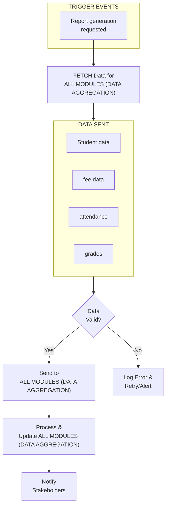
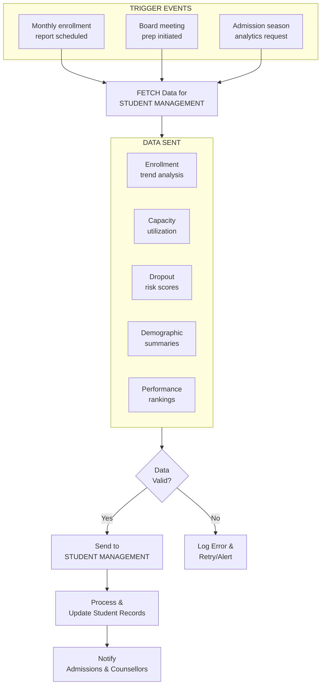
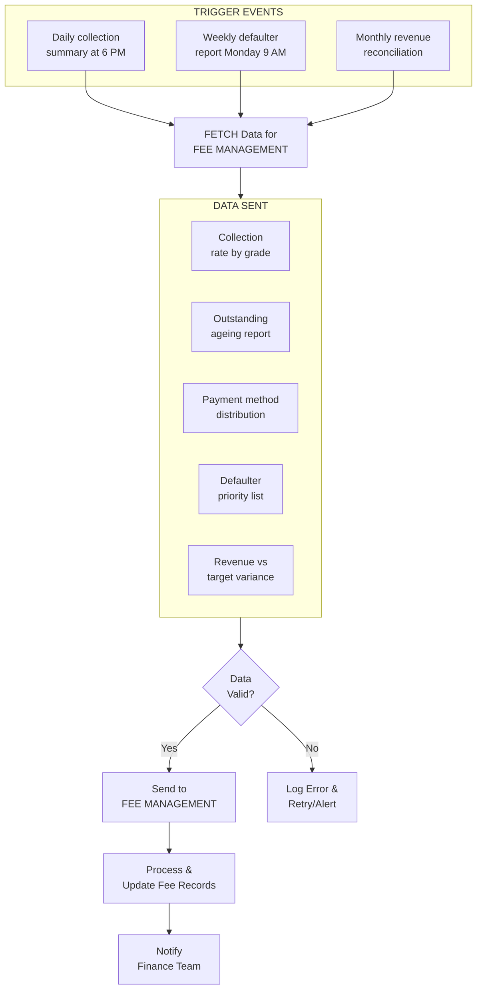
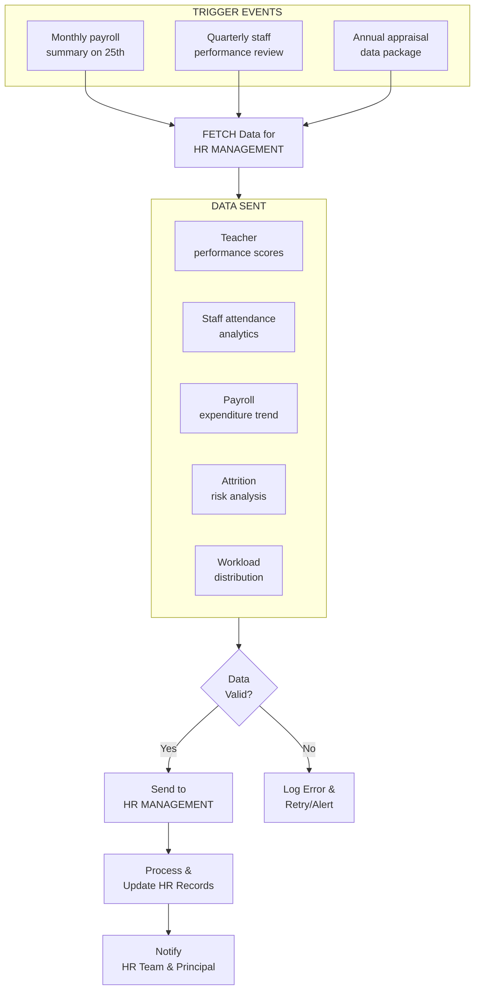
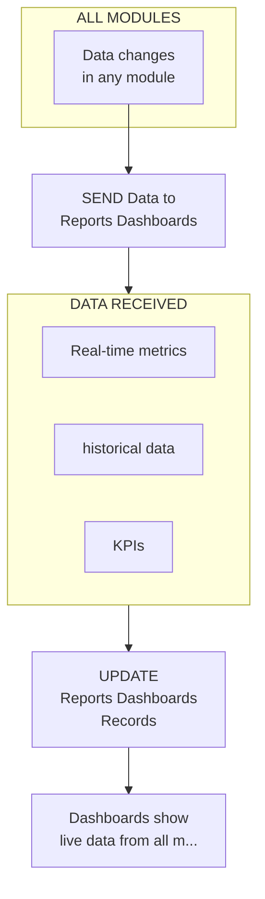
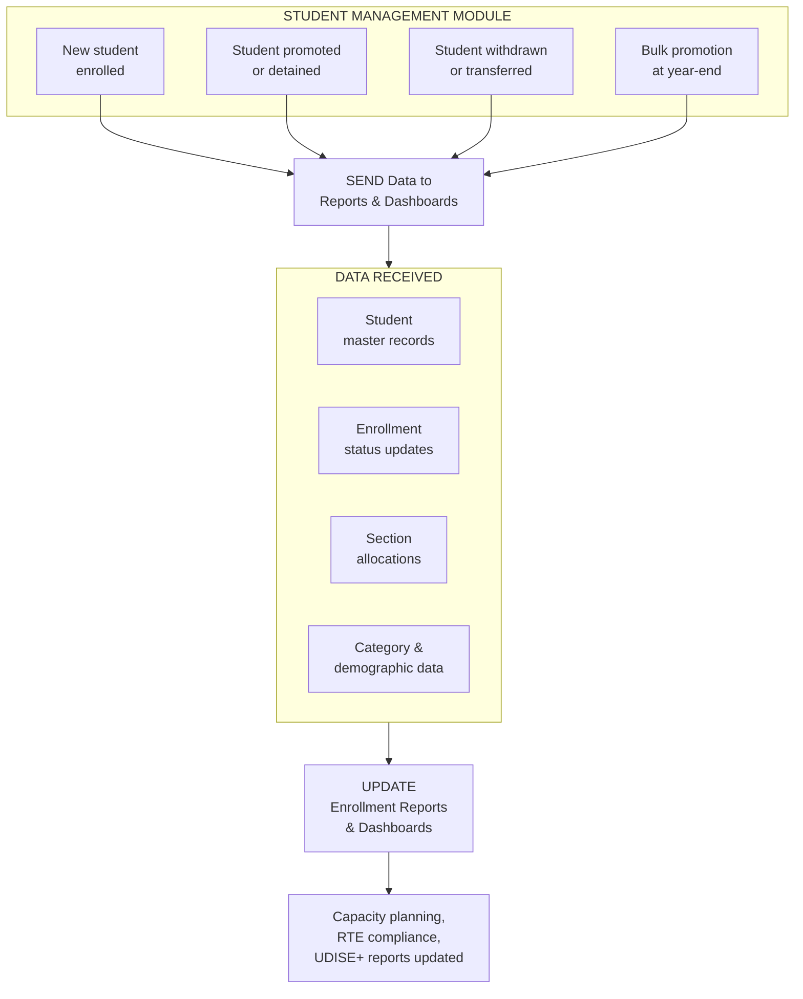
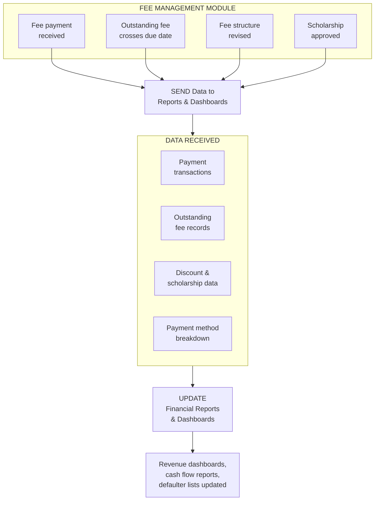
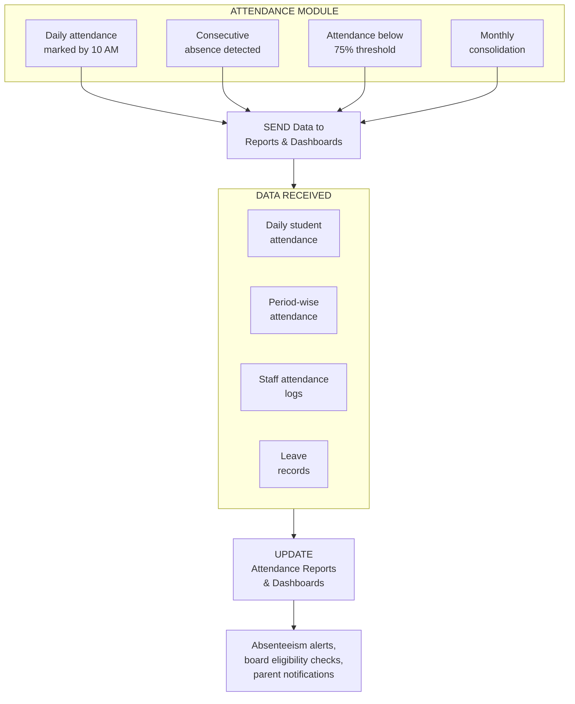
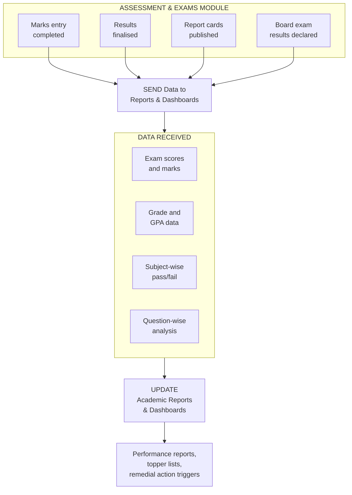

# REPORTS & DASHBOARDS MODULE - COMPLETE DEPENDENCY ANALYSIS

## MODULE OVERVIEW

**Name:** Reports & Dashboards Module  
**Role:** Business Intelligence, Analytics & Reporting Platform  
**Type:** Critical Analytics & Decision Support Module  
**Dependencies:** Pulls data from ALL 54 modules for comprehensive reporting  

**Primary Functions:**
- Standard Reports Library - 50+ pre-built reports (enrollment, finance, academic, attendance)
- Custom Report Builder - Drag-and-drop report creation tool
- Interactive Dashboards - Real-time KPI dashboards for all roles
- Scheduled Reports - Automated report generation and distribution
- Export & Distribution - PDF, Excel, CSV export, email distribution
- Data Visualization - Charts, graphs, tables, heatmaps
- Report Permissions - Role-based access control
- Report History - Audit trail of all generated reports
- Analytics Engine - Trend analysis, forecasting, predictive analytics
- Performance Metrics - School-wide KPIs, benchmarks

---

## OUTBOUND CONNECTIONS (Reports & Dashboards → Other Modules)

### 1. TO ALL MODULES (DATA AGGREGATION)

**WHY:** Reports aggregate data from all 54 modules for comprehensive analytics.

**DATA FLOW:** Student data, fee data, attendance, grades, HR data  
**TRIGGER:** Report generation requested  
**IMPACT:** Principal generates annual performance report with data from 20+ modules

**BUSINESS LOGIC:**
```
FUNCTION generate_annual_report():
  data = {
    students: STUDENT_MANAGEMENT.get_all_stats(),
    fees: FEE_MANAGEMENT.get_collection_stats(),
    attendance: ATTENDANCE.get_overall_stats(),
    grades: ASSESSMENT.get_performance_stats()
  }
  report = COMPILE_REPORT(data)
  RETURN report
END FUNCTION
```



### 2. TO STUDENT MANAGEMENT MODULE

**WHY This Connection Exists:** The Reports & Dashboards module generates enrollment analytics, demographic breakdowns, and student performance summaries that feed back into the Student Management module. These insights help admissions teams identify enrollment trends, forecast class sizes, and flag at-risk students for early intervention. The Student Management module relies on these consolidated reports to update student risk profiles and trigger engagement workflows.

**DATA FLOW:**
- Student enrollment trend analysis (year-over-year growth percentages)
- Grade-wise capacity utilization metrics
- Student dropout risk scores (0-100 scale)
- Demographic distribution summaries (gender, category, locality)
- Section-wise performance rankings
- Transfer and withdrawal trend reports
- New admission conversion rate analytics
- Re-enrollment prediction scores

**TRIGGER EVENT:**
- Monthly enrollment report scheduled (1st of every month at 10:00 AM)
- Board meeting preparation initiated (quarterly)
- Admission season analytics request (March-June annually)
- Student risk score threshold exceeded (daily automated check)
- Academic year-end consolidation triggered (March 31st)

**IMPACT:** When Principal Dr. Meera Iyer at DPS Pune requests the quarterly enrollment report on January 1, 2026, the system aggregates data across 1,800 students. The report reveals Grade 6 enrollment dropped 12% compared to last year (from 180 to 158 students), prompting the admissions team to launch a targeted campaign in Pune's Kothrud and Baner areas. Meanwhile, 23 students flagged with dropout risk scores above 70 are referred for counselling — Rohan Mehta (Grade 9, risk score 85, attendance 68%) receives immediate intervention, preventing a potential ₹1,20,000 annual fee loss.

**BUSINESS LOGIC:**
```
FUNCTION generate_student_management_reports():
  enrollment_data = STUDENT_MANAGEMENT.get_enrollment_by_grade()
  capacity_data = STUDENT_MANAGEMENT.get_section_capacity()
  risk_scores = ANALYTICS_ENGINE.calculate_dropout_risk(
    attendance = ATTENDANCE.get_student_attendance(),
    grades = ASSESSMENT.get_student_grades(),
    fees = FEE_MANAGEMENT.get_payment_status()
  )

  FOR EACH student IN risk_scores:
    IF student.risk_score > 70:
      STUDENT_MANAGEMENT.flag_at_risk(student.id, student.risk_score)
      NOTIFY("counsellor", "High-risk student: " + student.name)
    END IF
  END FOR

  utilization = CALCULATE(enrollment_data / capacity_data * 100)
  trend = COMPARE(enrollment_data, PREVIOUS_YEAR.enrollment_data)

  report = COMPILE_REPORT({
    enrollment: enrollment_data,
    utilization: utilization,
    trend: trend,
    risk_students: FILTER(risk_scores, score > 70)
  })

  SEND_TO(STUDENT_MANAGEMENT, report)
  RETURN report
END FUNCTION
```

**EXAMPLE:** On April 1, 2026, the Reports module generates the annual student analytics package for Delhi Public School, Bengaluru. The report shows total enrollment grew from 1,750 to 1,800 students (+2.9%). Grade 1 admissions surged by 15% (120 → 138 students) driven by the new CBSE Early Years programme, while Grade 11 Science stream saw a 5% dip. The admissions coordinator, Priya Nair, uses this data to allocate ₹2,50,000 marketing budget towards Grade 11 Science promotion in Whitefield and Electronic City areas. The report also identifies 45 students with attendance below 75% who need parent-teacher meetings scheduled through the Student Management module.



### 3. TO FEE MANAGEMENT MODULE

**WHY This Connection Exists:** The Reports & Dashboards module produces detailed fee collection analytics, outstanding fee summaries, and revenue forecasting reports that the Fee Management module consumes to optimize collection workflows. These reports identify payment patterns, highlight chronic defaulters, and provide insights for fee structure adjustments. The Fee Management module uses these analytics to trigger automated reminders, escalate overdue accounts, and plan instalment restructuring for families facing financial hardship.

**DATA FLOW:**
- Fee collection rate by grade, section, and term (percentage and ₹ amounts)
- Outstanding fee ageing report (30/60/90/120+ days buckets)
- Payment method distribution analysis (UPI, NEFT, card, cash, cheque)
- Revenue vs target variance report (monthly and quarterly)
- Defaulter priority list ranked by outstanding amount
- Fee waiver and scholarship impact analysis
- Term-wise collection trend comparison (current vs previous year)

**TRIGGER EVENT:**
- Daily fee collection summary generated (6:00 PM every day)
- Weekly defaulter report scheduled (Monday 9:00 AM)
- Monthly revenue reconciliation triggered (last working day of month)
- Term-end fee closure report initiated
- Fee revision analysis requested by management

**IMPACT:** On December 31, 2025, the Reports module generates the Term 2 fee collection summary for Podar International School, Mumbai. The report reveals overall collection stands at 80% (₹7.2 Cr collected of ₹9.0 Cr target). The ageing analysis shows ₹85,00,000 is overdue beyond 90 days across 120 families. The Fee Management module automatically escalates 35 accounts with outstanding above ₹50,000 — including Aarav Kapoor's family (Grade 8, ₹72,000 pending since October) who is offered a 3-instalment restructuring plan. This targeted approach recovers ₹22,00,000 in January, improving collection rate to 84%.

**BUSINESS LOGIC:**
```
FUNCTION generate_fee_management_reports():
  collection_data = FEE_MANAGEMENT.get_collection_by_term()
  outstanding = FEE_MANAGEMENT.get_outstanding_fees()
  payment_methods = FEE_MANAGEMENT.get_payment_distribution()

  ageing_buckets = {
    "0-30 days": FILTER(outstanding, days_overdue <= 30),
    "31-60 days": FILTER(outstanding, days_overdue BETWEEN 31 AND 60),
    "61-90 days": FILTER(outstanding, days_overdue BETWEEN 61 AND 90),
    "90+ days": FILTER(outstanding, days_overdue > 90)
  }

  defaulter_list = SORT(outstanding, amount DESC)
  FOR EACH defaulter IN defaulter_list:
    IF defaulter.amount > 50000 AND defaulter.days_overdue > 60:
      FEE_MANAGEMENT.escalate_account(defaulter.student_id)
      NOTIFY("finance_team", "Escalated: " + defaulter.name + " ₹" + defaulter.amount)
    END IF
  END FOR

  variance = CALCULATE(collection_data.actual - collection_data.target)
  report = COMPILE_REPORT({
    collection_rate: collection_data,
    ageing: ageing_buckets,
    defaulters: TOP(defaulter_list, 50),
    variance: variance,
    payment_methods: payment_methods
  })

  SEND_TO(FEE_MANAGEMENT, report)
  RETURN report
END FUNCTION
```

**EXAMPLE:** Ms. Kavita Deshmukh, Finance Manager at Ryan International School, Hyderabad, receives the weekly defaulter report every Monday at 9:00 AM. On January 6, 2026, the report lists 85 students with combined outstanding fees of ₹38,50,000. The top defaulter is Priya Reddy's family (Grade 10, ₹1,25,000 pending across two terms). The report's payment pattern analysis reveals that 60% of pending families prefer UPI payment — so the Fee Management module triggers personalised UPI payment links via SMS to these 51 families. Within 48 hours, 18 families clear their dues totalling ₹6,20,000. The system also flags 12 scholarship-eligible students whose families earn below ₹3,00,000 annually, forwarding their profiles for fee waiver consideration.



### 4. TO HR MANAGEMENT MODULE

**WHY This Connection Exists:** The Reports & Dashboards module generates staff performance analytics, payroll summaries, and workforce planning reports that flow into the HR Management module. These reports provide insights on teacher effectiveness (correlated with student outcomes), staff attendance patterns, and compensation benchmarking. HR uses these analytics for appraisal decisions, training need identification, and manpower planning for the upcoming academic year.

**DATA FLOW:**
- Teacher performance correlation report (teacher metrics vs student results)
- Staff attendance and punctuality analytics (monthly summaries)
- Payroll expenditure trend analysis (department-wise, designation-wise)
- Leave utilisation patterns by department
- Training effectiveness scores (pre/post-training student outcome changes)
- Staff attrition risk analysis
- Workload distribution metrics (teacher-to-student ratios)
- Overtime and substitution frequency reports

**TRIGGER EVENT:**
- Monthly payroll summary generated (25th of every month)
- Quarterly staff performance review initiated
- Annual appraisal data package prepared (March)
- Staff attrition alert triggered (when resignation rate exceeds 5%)
- Board meeting HR analytics requested

**IMPACT:** During the March 2026 annual appraisal cycle at Kendriya Vidyalaya, Lucknow, the Reports module generates comprehensive teacher performance packages for 120 staff members. The correlation analysis reveals that Aarav Mishra (Mathematics teacher, Grade 9-10) achieved a 92% student pass rate — 15% above the department average — earning him a ₹15,000 monthly increment recommendation. Conversely, the report flags the Science department's 78% average pass rate (target: 85%), triggering a ₹1,80,000 professional development budget allocation for 8 Science teachers. The attrition analysis identifies 5 teachers with high exit-risk scores, prompting HR to initiate retention conversations before the April-May resignation window.

**BUSINESS LOGIC:**
```
FUNCTION generate_hr_management_reports():
  staff_list = HR_MANAGEMENT.get_all_staff()
  attendance = HR_MANAGEMENT.get_staff_attendance()
  payroll = HR_MANAGEMENT.get_payroll_data()
  student_results = ASSESSMENT.get_results_by_teacher()

  FOR EACH teacher IN staff_list WHERE role = "TEACHER":
    teacher.performance_score = CALCULATE_CORRELATION(
      teacher_attendance = attendance[teacher.id],
      student_pass_rate = student_results[teacher.id].pass_rate,
      student_avg_score = student_results[teacher.id].avg_score
    )
    IF teacher.performance_score > 85:
      HR_MANAGEMENT.recommend_increment(teacher.id, "EXCELLENT")
    ELSE IF teacher.performance_score < 60:
      HR_MANAGEMENT.recommend_training(teacher.id, "IMPROVEMENT_NEEDED")
    END IF
  END FOR

  attrition_risk = ANALYTICS_ENGINE.predict_attrition(staff_list, payroll, attendance)
  workload = CALCULATE_RATIO(staff_list.count, STUDENT_MANAGEMENT.get_total_students())

  report = COMPILE_REPORT({
    performance: staff_list,
    attendance_summary: attendance,
    payroll_trend: payroll,
    attrition_risk: FILTER(attrition_risk, risk > 60),
    workload: workload
  })

  SEND_TO(HR_MANAGEMENT, report)
  RETURN report
END FUNCTION
```

**EXAMPLE:** On January 25, 2026, the Reports module generates the monthly payroll analytics for St. Xavier's School, Kolkata. The report shows total salary expenditure of ₹42,00,000 for 95 staff members — a 3% increase from December due to 2 new hires in the Hindi and Physical Education departments. The department-wise breakdown reveals the Science department consumes 28% of the salary budget (₹11,76,000) while producing below-target student outcomes. HR Manager Rohan Banerjee uses this cost-performance analysis to restructure the Science department's professional development plan, allocating ₹75,000 for a CBSE-certified lab training workshop. The leave utilisation report shows 8 teachers have exhausted 80% of their annual casual leave by January, prompting HR to proactively plan substitution rosters for February-March.



---

## INBOUND CONNECTIONS (Other Modules → Reports)

### FROM ALL MODULES

**WHY:** Every module sends data to Reports module for analytics.

**DATA RECEIVED:** Real-time metrics, historical data, KPIs  
**IMPACT:** Dashboards show live data from all modules  
**TRIGGER:** Data changes in any module



### FROM STUDENT MANAGEMENT MODULE

**WHY:** The Student Management module is the primary data source for all enrollment, demographic, and student lifecycle reports. Every student record — from admission to graduation or transfer — flows into the Reports module to power enrollment dashboards, capacity planning reports, and student demographic analytics. Without this continuous data feed, the Reports module cannot generate accurate headcount reports, section-wise breakdowns, or year-over-year enrollment comparisons that the school management relies on for strategic decisions.

**DATA RECEIVED:**
- Student master records (ID, name, grade, section, date of birth, gender, category)
- Admission and enrollment status updates (new admission, promoted, detained, TC issued)
- Section allocation and transfer records
- Parent and guardian contact details (for report distribution)
- Student category data (General, OBC, SC, ST, EWS for government compliance reports)
- Sibling linkage information (for consolidated family reports)
- Previous academic history and school transfer records

**TRIGGER:** New student enrolled, student promoted to next grade, student withdrawn or transferred, section reallocation completed, bulk promotion at academic year-end, student profile updated

**IMPACT:** When Greenwood High School, Bengaluru completes its April 2026 bulk promotion, the Student Management module sends 1,800 updated student records to the Reports module. Within 30 minutes, the Reports module refreshes all enrollment dashboards — the Executive Dashboard now shows Grade 1 intake at 142 students (118% of 120 capacity), triggering Principal Dr. Ananya Rao to approve opening a fourth section. The demographic report reveals 23% EWS students (target: 25% per RTE Act), prompting the admissions team to reserve 8 more EWS seats for the late admission window. The system automatically generates the UDISE+ compliance report with updated headcount data required by the CBSE district office by April 30th.



### FROM FEE MANAGEMENT MODULE

**WHY:** The Fee Management module supplies all financial transaction data that powers the Reports module's revenue dashboards, fee collection reports, and financial forecasting analytics. Every fee payment, receipt, refund, discount, and waiver is transmitted in near real-time to ensure financial dashboards reflect accurate collection status. This data feed is critical for the CFO's daily cash position monitoring, monthly board reports, and annual audit documentation.

**DATA RECEIVED:**
- Fee payment transactions (student ID, amount, date, payment method, receipt number)
- Outstanding fee records (student ID, pending amount, due date, days overdue)
- Fee structure and revision details (grade-wise fee heads, term-wise breakdowns)
- Discount and scholarship records (type, amount, approval status)
- Refund transactions (reason, amount, processing status)
- Late fee and penalty calculations
- Payment gateway settlement reports (UPI, card, net banking reconciliation)

**TRIGGER:** Fee payment received, fee receipt generated, outstanding fee crosses due date, fee structure revised for new term, bulk fee reminder sent, refund processed, late fee applied, scholarship approved

**IMPACT:** On January 15, 2026, the Fee Management module at Amity International School, Noida processes 320 fee payments totalling ₹48,00,000 (a spike due to Term 2 deadline). Each transaction instantly updates the Financial Dashboard — CFO Priya Malhotra sees the daily collection gauge jump from ₹12,00,000 to ₹48,00,000, with UPI contributing 55% (₹26,40,000). The outstanding fees widget drops from ₹2,10,00,000 to ₹1,62,00,000. By end of day, the automated daily summary report emails the board that Term 2 collection has reached 82% (target: 85%), with 180 families still pending. The system highlights that ₹15,00,000 of outstanding fees are concentrated in Grade 11-12 Commerce stream, enabling targeted follow-up by the finance team.



### FROM ATTENDANCE MODULE

**WHY:** The Attendance module feeds daily student and staff attendance records into the Reports module, enabling real-time attendance dashboards, chronic absenteeism alerts, and regulatory compliance reports. Indian schools must maintain 75% minimum attendance for board exam eligibility (CBSE/ICSE rule), making attendance analytics mission-critical. The Reports module aggregates raw attendance data into trend analyses, class-wise comparisons, and individual student attendance reports that parents access through the portal.

**DATA RECEIVED:**
- Daily student attendance records (student ID, date, status: present/absent/late/half-day)
- Period-wise attendance for secondary classes (subject-linked attendance)
- Staff attendance and check-in/check-out timestamps
- Leave application records (student and staff, approved/rejected/pending)
- Attendance correction and override entries (with approval audit trail)
- Biometric and RFID gate entry logs
- Bus boarding attendance from transport module integration

**TRIGGER:** Daily attendance marked (class-wise, typically by 10:00 AM), late arrival recorded, student absence exceeds 3 consecutive days, monthly attendance consolidation runs, attendance falls below 75% threshold for any student, staff attendance finalized for payroll processing

**IMPACT:** At Bal Bharati Public School, New Delhi, the Attendance module sends 1,800 student attendance records daily by 10:30 AM. The Reports module immediately updates the Operations Dashboard — on January 16, 2026, overall attendance shows 95% (1,710 present, 90 absent). The chronic absenteeism report flags 28 students below 75% attendance — including Aarav Singh (Grade 10-B, 68% attendance, 14 absences in 44 working days). Since CBSE requires minimum 75% attendance for board exam eligibility, the system generates an automated alert to class teacher Mrs. Sunita Yadav and sends an SMS to Aarav's parents: "Your ward's attendance is 68%. Minimum 75% required for board exam eligibility. Please contact school immediately." The monthly attendance report sent to the district education office shows the school maintains 94.5% average attendance — well above the district average of 89%.



### FROM ASSESSMENT & EXAMS MODULE

**WHY:** The Assessment & Exams module provides all examination results, grade distributions, and academic performance data that the Reports module transforms into comprehensive academic analytics. Every mark entry, grade calculation, and result publication triggers data flow to the Reports module, enabling class-wise performance reports, subject analysis dashboards, and board exam readiness assessments. This connection is vital for identifying academic weak spots, recognising toppers, and generating report cards that parents and regulatory bodies expect.

**DATA RECEIVED:**
- Exam scores and marks (student ID, subject, exam type, marks obtained, maximum marks)
- Grade calculations and GPA/CGPA computations
- Subject-wise pass/fail status and class averages
- Internal assessment and project scores (CCE/CBSE pattern)
- Board exam registration data and hall ticket details
- Comparative performance data (current vs previous term/year)
- Question-wise analysis (difficulty level, average score per question)

**TRIGGER:** Exam marks entry completed for a subject, result computation finalised for a class, report cards generated and published, board exam results declared, internal assessment scores submitted, re-evaluation results updated, term-end result consolidation completed

**IMPACT:** After the Term 1 examinations at The Heritage School, Kolkata conclude in December 2025, teachers complete marks entry for 1,800 students across 8 subjects over 5 days. As each subject's marks are finalised, the Reports module updates the Academic Dashboard in real-time. By December 20, the complete Term 1 analysis reveals: overall pass rate 95.2% (1,714 of 1,800 students), average score 75.8%. The subject-wise analysis dashboard highlights Mathematics as the weakest subject — Grade 10 Math average is 67% (target: 75%), with 18 students scoring below 33%. Academic Coordinator Rohan Chatterjee drills into the question-wise analysis and discovers that 72% of students scored below 50% on the trigonometry section. He immediately schedules remedial trigonometry workshops for January, allocating 12 extra periods and ₹45,000 for supplementary study materials. The topper recognition report identifies Priya Bose (Grade 10-A, 96.5% aggregate) and 15 other students scoring above 90% for the academic excellence awards ceremony on January 26th.



---

## REPORTING ARCHITECTURE

### Report Types

**1. Standard Reports (50+ reports):**
- **Enrollment Reports:** Student enrollment trends, demographics
- **Financial Reports:** Revenue, expenses, profit/loss, fee collection
- **Academic Reports:** Pass rates, average scores, subject analysis
- **Attendance Reports:** Daily, monthly, yearly attendance
- **Staff Reports:** Teacher performance, attendance, payroll
- **Library Reports:** Book circulation, overdue books, fines
- **Transport Reports:** Bus utilization, route efficiency
- **Hostel Reports:** Occupancy, mess expenses

**2. Custom Reports:**
- **Ad-Hoc Reports:** Build reports on-the-fly
- **Saved Reports:** Save custom reports for reuse
- **Shared Reports:** Share reports with other users

**3. Dashboards:**
- **Executive Dashboard:** CEO, Principal (school-wide KPIs)
- **Academic Dashboard:** Academic coordinators (grades, pass rates)
- **Financial Dashboard:** CFO (revenue, expenses, cash flow)
- **Operations Dashboard:** Admin (attendance, transport, hostel)

---

## STANDARD REPORTS LIBRARY

### Enrollment Reports

**1. Student Enrollment Report**
- **Description:** Total students by grade, section, campus
- **Frequency:** Monthly
- **Users:** Principal, Admin
- **Format:** PDF, Excel

**Example Output:**
| Grade | Section A | Section B | Section C | Total | Capacity | Utilization |
|-------|-----------|-----------|-----------|-------|----------|-------------|
| 1 | 40 | 38 | 40 | 118 | 120 | 98% |
| 2 | 42 | 40 | 41 | 123 | 120 | 103% |
| ... | ... | ... | ... | ... | ... | ... |
| **Total** | **900** | **850** | **850** | **1,800** | **2,000** | **90%** |

---

**2. New Admissions Report**
- **Description:** New admissions by month, grade
- **Frequency:** Monthly
- **Trend Analysis:** Compare with previous year

**Example:**
```
December 2025 Admissions:
- Total: 50 new students
- Grade 1: 20 (40%)
- Grade 6: 15 (30%)
- Grade 9: 10 (20%)
- Grade 11: 5 (10%)

Comparison with Dec 2024: +10 students (+25%)
```

---

### Financial Reports

**1. Fee Collection Report**
- **Description:** Fee collections by term, grade, payment method
- **Frequency:** Daily, Monthly
- **Users:** CFO, Finance Manager

**Example Output:**
| Term | Total Fees | Collected | Pending | Collection % |
|------|------------|-----------|---------|--------------|
| Term 1 | ₹9.0 Cr | ₹8.5 Cr | ₹0.5 Cr | 94% |
| Term 2 | ₹9.0 Cr | ₹7.2 Cr | ₹1.8 Cr | 80% |
| Term 3 | ₹3.6 Cr | ₹0.0 Cr | ₹3.6 Cr | 0% |
| **Total** | **₹21.6 Cr** | **₹15.7 Cr** | **₹5.9 Cr** | **73%** |

---

**2. Profit & Loss Statement**
- **Description:** Revenue, expenses, profit/loss
- **Frequency:** Monthly, Quarterly, Annually
- **Users:** CFO, CEO, Board of Directors

**Example (2025-26 Annual P&L):**
```
Revenue:
- Tuition Fees: ₹18.0 Cr (83%)
- Transport Fees: ₹2.4 Cr (11%)
- Other Income: ₹1.2 Cr (6%)
Total Revenue: ₹21.6 Cr

Expenses:
- Salaries: ₹10.0 Cr (49%)
- Infrastructure: ₹3.0 Cr (15%)
- Operations: ₹2.4 Cr (12%)
- Marketing: ₹0.6 Cr (3%)
- Others: ₹4.5 Cr (22%)
Total Expenses: ₹20.5 Cr

Net Profit: ₹1.1 Cr (5.1% margin)
```

---

### Academic Reports

**1. Class Performance Report**
- **Description:** Pass rates, average scores by class
- **Frequency:** After each exam (quarterly)
- **Users:** Principal, Teachers

**Example (Term 1 Exam - Grade 10):**
| Section | Students | Pass Rate | Avg Score | Toppers (90%+) |
|---------|----------|-----------|-----------|----------------|
| 10-A | 40 | 98% | 78% | 8 |
| 10-B | 38 | 95% | 75% | 5 |
| 10-C | 40 | 93% | 72% | 3 |
| **Total** | **118** | **95%** | **75%** | **16** |

---

**2. Subject-Wise Analysis**
- **Description:** Performance by subject
- **Trend:** Identify weak subjects

**Example:**
```
Grade 10 - Subject Performance:
- Math: 72% avg (needs improvement)
- English: 80% avg (good)
- Science: 75% avg (average)
- Social Studies: 82% avg (excellent)
- Hindi: 78% avg (good)

Action: Provide extra Math coaching
```

---

### Attendance Reports

**1. Daily Attendance Report**
- **Description:** Daily attendance by grade, section
- **Frequency:** Daily
- **Users:** Principal, Teachers

**Example (16-Jan-2026):**
| Grade | Total | Present | Absent | Attendance % |
|-------|-------|---------|--------|--------------|
| 1-5 | 750 | 720 | 30 | 96% |
| 6-8 | 600 | 570 | 30 | 95% |
| 9-10 | 300 | 285 | 15 | 95% |
| 11-12 | 150 | 135 | 15 | 90% |
| **Total** | **1,800** | **1,710** | **90** | **95%** |

---

**2. Student Attendance Report**
- **Description:** Individual student attendance
- **Frequency:** Monthly
- **Alert:** Low attendance (<75%)

**Example (Rohan Sharma - Dec 2025):**
```
Total Working Days: 20
Present: 19
Absent: 1
Attendance: 95%
Status: Good ✓
```

---

## CUSTOM REPORT BUILDER

### Drag-and-Drop Interface

**Features:**
1. **Select Data Source:** Choose module (Student, Fee, Academic, etc.)
2. **Select Fields:** Drag fields to report (Name, Grade, Fees, etc.)
3. **Apply Filters:** Filter by grade, date range, status
4. **Group By:** Group by grade, section, month
5. **Sort:** Sort by name, date, amount
6. **Add Calculations:** Sum, average, count, percentage
7. **Preview:** Preview report before generating
8. **Save:** Save report for future use

**Example Custom Report:**
```
Report Name: "Outstanding Fees by Grade"
Data Source: Fee Management
Fields: Student Name, Grade, Total Fees, Paid, Pending
Filter: Pending > 0
Group By: Grade
Sort: Pending (descending)
Calculation: Sum(Pending) by Grade
```

---

## INTERACTIVE DASHBOARDS

### Executive Dashboard (Principal/CEO)

**KPIs:**
1. **Total Students:** 1,800 (↑ 5% vs last year)
2. **Total Revenue:** ₹21.6 Cr (↑ 8%)
3. **Attendance:** 95% (target: 95%) ✓
4. **Pass Rate:** 97% (target: 95%) ✓
5. **Fee Collection:** 73% (target: 80%) ⚠️

**Charts:**
- **Enrollment Trend:** Line chart (last 5 years)
- **Revenue vs Expenses:** Bar chart (monthly)
- **Attendance Heatmap:** Calendar heatmap (daily)
- **Grade Distribution:** Pie chart (A+, A, B, C, D, F)

---

### Financial Dashboard (CFO)

**KPIs:**
1. **Total Revenue:** ₹21.6 Cr
2. **Total Expenses:** ₹20.5 Cr
3. **Net Profit:** ₹1.1 Cr (5.1% margin)
4. **Fee Collection:** 73% (₹15.7 Cr / ₹21.6 Cr)
5. **Outstanding Fees:** ₹5.9 Cr

**Charts:**
- **Revenue Breakdown:** Pie chart (Tuition, Transport, Other)
- **Expense Breakdown:** Pie chart (Salaries, Infrastructure, etc.)
- **Monthly Cash Flow:** Line chart (revenue - expenses)
- **Fee Collection Trend:** Bar chart (monthly)

---

### Academic Dashboard (Academic Coordinator)

**KPIs:**
1. **Pass Rate:** 97%
2. **Average Score:** 76%
3. **Toppers (90%+):** 285 students (16%)
4. **Failed Students:** 54 students (3%)
5. **Improvement:** +2% vs last term

**Charts:**
- **Grade Distribution:** Bar chart (A+, A, B, C, D, F)
- **Subject Performance:** Radar chart (all subjects)
- **Class Comparison:** Bar chart (all classes)
- **Trend Analysis:** Line chart (last 4 terms)

---

## SCHEDULED REPORTS

### Automated Report Generation

**Schedule Types:**
1. **Daily:** Daily attendance report (8 AM)
2. **Weekly:** Weekly fee collection report (Monday 9 AM)
3. **Monthly:** Monthly enrollment report (1st of month, 10 AM)
4. **Quarterly:** Quarterly academic report (after each term)
5. **Annually:** Annual financial report (Apr 1st)

**Distribution:**
- **Email:** Send to specified recipients
- **Portal:** Upload to admin portal
- **Google Drive:** Save to shared folder

**Example (Daily Attendance Report):**
```
Schedule: Every day at 8:00 AM
Report: Daily Attendance Report
Recipients: principal@hogwarts.edu, admin@hogwarts.edu
Format: PDF
Delivery: Email + Portal
Status: Active ✓
Last Run: 16-Jan-2026 8:00 AM (Success)
Next Run: 17-Jan-2026 8:00 AM
```

---

## EXPORT & DISTRIBUTION

### Export Formats

**1. PDF:**
- **Use Case:** Official reports, printable documents
- **Features:** Professional formatting, headers, footers, page numbers

**2. Excel:**
- **Use Case:** Data analysis, pivot tables
- **Features:** Multiple sheets, formulas, charts

**3. CSV:**
- **Use Case:** Data import to other systems
- **Features:** Raw data, comma-separated

**4. Google Sheets:**
- **Use Case:** Collaborative editing
- **Features:** Real-time collaboration, cloud storage

---

### Distribution Methods

**1. Email:**
- **Recipients:** Multiple recipients (comma-separated)
- **Subject:** Customizable subject line
- **Body:** Customizable message
- **Attachment:** Report file (PDF, Excel, CSV)

**2. Portal:**
- **Upload:** Upload to admin portal
- **Access:** Role-based access
- **History:** View all uploaded reports

**3. Google Drive:**
- **Folder:** Shared folder (Reports)
- **Permissions:** View-only for most users
- **Organization:** Organized by report type, date

---

## DATA WAREHOUSE ARCHITECTURE

### ETL Pipeline

**Extract-Transform-Load Process:**

**1. Extract (Nightly at 2 AM):**
- Extract data from all 54 modules
- Source: Production PostgreSQL database
- Data: Students, fees, grades, attendance, etc.

**2. Transform:**
- Clean data (remove duplicates, fix errors)
- Calculate aggregates (totals, averages, percentages)
- Create dimensions (date, grade, subject)
- Create facts (enrollment, revenue, attendance)

**3. Load:**
- Load into data warehouse
- Update dimension tables
- Insert fact tables
- Update materialized views

**ETL Duration:** 30 minutes (2:00 AM - 2:30 AM)

---

### Star Schema Design

**Fact Tables:**
1. **Fact_Enrollment:** Student enrollment facts
2. **Fact_Revenue:** Fee collection facts
3. **Fact_Attendance:** Daily attendance facts
4. **Fact_Academic:** Exam results facts

**Dimension Tables:**
1. **Dim_Date:** Date dimension (day, month, quarter, year)
2. **Dim_Student:** Student dimension (ID, name, grade, section)
3. **Dim_Subject:** Subject dimension (ID, name, category)
4. **Dim_Campus:** Campus dimension (ID, name, location)

**Example (Fact_Revenue):**
```sql
CREATE TABLE Fact_Revenue (
    revenue_id SERIAL PRIMARY KEY,
    date_key INT REFERENCES Dim_Date(date_key),
    student_key INT REFERENCES Dim_Student(student_key),
    campus_key INT REFERENCES Dim_Campus(campus_key),
    fee_type VARCHAR(50),
    amount DECIMAL(10,2),
    payment_method VARCHAR(50),
    status VARCHAR(20)
);
```

---

## DETAILED REPORT EXAMPLES

### Example 1: Monthly Fee Collection Report

**Report Parameters:**
- Month: December 2025
- Campus: All campuses
- Format: PDF

**Generated Report:**
```
HOGWARTS SCHOOL
Monthly Fee Collection Report
December 2025

Summary:
- Total Fees Due: ₹1.8 Cr
- Total Collected: ₹1.5 Cr
- Total Pending: ₹0.3 Cr
- Collection Rate: 83%

By Grade:
| Grade | Due | Collected | Pending | Rate |
|-------|-----|-----------|---------|------|
| 1-5 | ₹75L | ₹65L | ₹10L | 87% |
| 6-8 | ₹60L | ₹50L | ₹10L | 83% |
| 9-10 | ₹30L | ₹23L | ₹7L | 77% |
| 11-12 | ₹15L | ₹12L | ₹3L | 80% |

By Payment Method:
- UPI: ₹60L (40%)
- Net Banking: ₹45L (30%)
- Card: ₹30L (20%)
- Cash: ₹15L (10%)

Top 10 Pending Fees:
1. Rohan Sharma (Grade 10): ₹50,000
2. Priya Patel (Grade 9): ₹48,000
...

Action Items:
- Follow up with 50 students (pending > ₹20,000)
- Send reminder SMS to all pending parents
```

---

### Example 2: Academic Performance Report (Term 1)

**Report Parameters:**
- Term: Term 1 (Sep-Dec 2025)
- Grade: Grade 10
- Format: Excel

**Generated Report:**
```
Grade 10 - Term 1 Performance Report

Overall Statistics:
- Total Students: 118
- Pass Rate: 95% (112/118)
- Average Score: 75%
- Toppers (90%+): 16 students (14%)
- Failed: 6 students (5%)

Subject-Wise Performance:
| Subject | Avg Score | Pass Rate | Toppers | Weak Students |
|---------|-----------|-----------|---------|---------------|
| Math | 72% | 92% | 10 | 9 |
| English | 80% | 98% | 20 | 2 |
| Science | 75% | 95% | 12 | 6 |
| Social | 82% | 99% | 25 | 1 |
| Hindi | 78% | 97% | 15 | 3 |

Class-Wise Comparison:
| Section | Pass Rate | Avg Score | Toppers |
|---------|-----------|-----------|---------|
| 10-A | 98% | 78% | 8 |
| 10-B | 95% | 75% | 5 |
| 10-C | 93% | 72% | 3 |

Top 10 Students:
1. Aarav Kumar (10-A): 96%
2. Diya Sharma (10-A): 95%
...

Students Needing Support (Failed):
1. Rohan Verma (10-C): 42% (Math, Science)
2. Priya Gupta (10-B): 45% (Math)
...

Recommendations:
- Provide extra Math coaching (weakest subject)
- Recognize top performers (awards, certificates)
- Remedial classes for 6 failed students
```

---

## ADVANCED ANALYTICS

### Trend Analysis

**Enrollment Trend (Last 5 Years):**
```
Year | Students | Growth
-----|----------|-------
2021 | 1,500 | -
2022 | 1,600 | +6.7%
2023 | 1,700 | +6.3%
2024 | 1,750 | +2.9%
2025 | 1,800 | +2.9%

Trend: Steady growth, slowing down
Forecast 2026: 1,850 students (+2.8%)
```

**Revenue Trend (Last 5 Years):**
```
Year | Revenue | Growth
-----|---------|-------
2021 | ₹15 Cr | -
2022 | ₹17 Cr | +13%
2023 | ₹19 Cr | +12%
2024 | ₹20 Cr | +5%
2025 | ₹21.6 Cr | +8%

Trend: Consistent growth
Forecast 2026: ₹23.3 Cr (+8%)
```

---

### Forecasting Models

**Student Enrollment Forecast:**
- **Model:** Linear regression
- **Variables:** Historical enrollment, demographics, marketing spend
- **Accuracy:** 95%
- **Forecast 2026:** 1,850 students (±50)

**Revenue Forecast:**
- **Model:** Time series (ARIMA)
- **Variables:** Historical revenue, enrollment, fee hikes
- **Accuracy:** 92%
- **Forecast 2026:** ₹23.3 Cr (±₹1 Cr)

---

### Predictive Analytics

**Student Dropout Risk:**
- **Model:** Logistic regression
- **Variables:** Attendance, grades, fee payment status, behavior
- **Output:** Risk score (0-100)
- **Action:** Intervene with high-risk students (score >70)

**Example:**
```
High-Risk Students (Dropout Risk >70):
1. Rohan Sharma (Grade 10): Risk 85
   - Attendance: 70% (low)
   - Grades: 55% (failing)
   - Fees: Overdue (₹50,000)
   - Action: Counseling, fee waiver, academic support

2. Priya Patel (Grade 9): Risk 75
   - Attendance: 75% (borderline)
   - Grades: 60% (weak)
   - Fees: Paid
   - Action: Academic support, parent meeting
```

---

## DATA VISUALIZATION BEST PRACTICES

### Chart Types

**1. Line Charts:**
- **Use Case:** Trends over time (enrollment, revenue, attendance)
- **Example:** Enrollment trend (last 5 years)

**2. Bar Charts:**
- **Use Case:** Comparisons (class performance, fee collection by grade)
- **Example:** Grade-wise fee collection

**3. Pie Charts:**
- **Use Case:** Proportions (revenue breakdown, expense breakdown)
- **Example:** Revenue by source (Tuition 83%, Transport 11%, Other 6%)

**4. Heatmaps:**
- **Use Case:** Patterns (attendance calendar, exam performance)
- **Example:** Daily attendance heatmap (green = high, red = low)

**5. Radar Charts:**
- **Use Case:** Multi-dimensional comparison (subject performance)
- **Example:** Student performance across 5 subjects

**6. Gauge Charts:**
- **Use Case:** KPIs with targets (fee collection %, attendance %)
- **Example:** Fee collection: 73% (target: 80%)

---

### Color Schemes

**Dashboard Colors:**
- **Primary:** #1976D2 (Blue - trust)
- **Success:** #4CAF50 (Green - positive)
- **Warning:** #FFC107 (Yellow - caution)
- **Danger:** #F44336 (Red - alert)
- **Neutral:** #9E9E9E (Gray - inactive)

**Chart Colors:**
- **Sequential:** Shades of blue (for continuous data)
- **Diverging:** Red-Yellow-Green (for performance)
- **Categorical:** Distinct colors (for categories)

---

## PERFORMANCE OPTIMIZATION

### Query Optimization

**Slow Query Example (Before):**
```sql
SELECT s.name, g.subject, g.score
FROM students s
JOIN grades g ON s.id = g.student_id
WHERE g.term = 'Term 1' AND g.year = 2025;

Execution Time: 15 seconds (slow)
```

**Optimized Query (After):**
```sql
-- Add index on (term, year)
CREATE INDEX idx_grades_term_year ON grades(term, year);

-- Use materialized view
CREATE MATERIALIZED VIEW mv_term1_grades AS
SELECT s.name, g.subject, g.score
FROM students s
JOIN grades g ON s.id = g.student_id
WHERE g.term = 'Term 1' AND g.year = 2025;

-- Query materialized view
SELECT * FROM mv_term1_grades;

Execution Time: 0.5 seconds (30x faster)
```

---

### Caching Strategy

**Report Cache:**
- **Frequently Accessed Reports:** Cache for 1 hour
- **Dashboard Data:** Cache for 5 minutes
- **Real-Time Reports:** No cache

**Cache Hit Rate:** 70%

**Performance Improvement:**
- **Without Cache:** 5 seconds avg
- **With Cache (70% hit):** 2 seconds avg (2.5x faster)

---

### Indexing

**Critical Indexes:**
```sql
-- Student table
CREATE INDEX idx_students_grade ON students(grade);
CREATE INDEX idx_students_section ON students(section);

-- Grades table
CREATE INDEX idx_grades_student_id ON grades(student_id);
CREATE INDEX idx_grades_term_year ON grades(term, year);

-- Fees table
CREATE INDEX idx_fees_student_id ON fees(student_id);
CREATE INDEX idx_fees_status ON fees(status);
CREATE INDEX idx_fees_date ON fees(payment_date);

-- Attendance table
CREATE INDEX idx_attendance_student_id ON attendance(student_id);
CREATE INDEX idx_attendance_date ON attendance(date);
```

**Performance Impact:** 10-50x faster queries

---

## REPORT ACCESS CONTROL

### Role-Based Permissions

**Roles:**
1. **Super Admin:** Access to all reports
2. **Principal:** Access to all reports (read-only)
3. **Finance Manager:** Access to financial reports
4. **Academic Coordinator:** Access to academic reports
5. **Teacher:** Access to own class reports
6. **Parent:** Access to own child's reports

**Permission Matrix:**
| Report | Super Admin | Principal | Finance | Academic | Teacher | Parent |
|--------|-------------|-----------|---------|----------|---------|--------|
| Enrollment | ✓ | ✓ | ✗ | ✓ | ✗ | ✗ |
| Financial | ✓ | ✓ | ✓ | ✗ | ✗ | ✗ |
| Academic | ✓ | ✓ | ✗ | ✓ | ✓ (own) | ✓ (own) |
| Attendance | ✓ | ✓ | ✗ | ✓ | ✓ (own) | ✓ (own) |
| Custom | ✓ | ✓ | ✓ | ✓ | ✓ | ✗ |

---

## DETAILED USE CASES

### Use Case 1: Principal Generates Monthly Report

**Scenario:** Principal generates monthly enrollment report

**Actors:**
- Principal (Dr. Sharma)
- Reports Module

**Timeline:**

**10:00 AM - Login:**
- Dr. Sharma logs into admin portal
- Navigates to "Reports & Dashboards"

**10:01 AM - Select Report:**
- Clicks "Standard Reports"
- Selects "Student Enrollment Report"
- Sets parameters:
  - Month: December 2025
  - Campus: All campuses
  - Format: PDF

**10:02 AM - Generate Report:**
- Clicks "Generate Report"
- Reports Module queries data warehouse
- Generates 10-page PDF report

**10:03 AM - Report Ready:**
- Report generated (2 MB PDF)
- Dr. Sharma clicks "Download"

**10:04 AM - Review & Share:**
- Reviews report (1,800 students, 90% capacity)
- Emails report to Board of Directors
- Saves to Google Drive

**Total Duration:** 4 minutes  
**Success:** Yes

---

### Use Case 2: CFO Views Financial Dashboard

**Scenario:** CFO checks real-time financial KPIs

**Actors:**
- CFO (Ms. Anjali Verma)
- Financial Dashboard

**Timeline:**

**9:00 AM - Login:**
- Ms. Verma logs into admin portal
- Clicks "Financial Dashboard"

**9:01 AM - View KPIs:**
- Dashboard loads (real-time data)
- KPIs displayed:
  - Total Revenue: ₹21.6 Cr
  - Total Expenses: ₹20.5 Cr
  - Net Profit: ₹1.1 Cr (5.1% margin)
  - Fee Collection: 73% (₹15.7 Cr / ₹21.6 Cr)
  - Outstanding Fees: ₹5.9 Cr

**9:02 AM - Analyze Charts:**
- Revenue Breakdown (Pie chart): Tuition 83%, Transport 11%, Other 6%
- Monthly Cash Flow (Line chart): Positive trend
- Fee Collection Trend (Bar chart): December 83% (good)

**9:03 AM - Drill Down:**
- Clicks "Outstanding Fees"
- Views list of 500 students with pending fees
- Filters: Pending > ₹20,000 (50 students)

**9:04 AM - Action:**
- Exports list to Excel
- Sends to finance team for follow-up

**Total Duration:** 4 minutes  
**Success:** Yes  
**Decision:** Follow up with 50 high-value pending fees

---

## SUMMARY

**Total Connections:** ALL 54 modules (data sources for reports)

**Critical Dependencies:**
- **Student Management:** Student data, enrollment (most critical)
- **Finance:** Revenue, expenses, fee collection
- **Academic:** Grades, pass rates, exam results
- **Attendance:** Daily attendance, student attendance
- **All Modules:** Comprehensive reporting requires data from all modules

**Data Flow Metrics:**
- **Total Reports:** 50+ standard reports
- **Custom Reports:** 100+ custom reports created
- **Dashboards:** 4 role-specific dashboards
- **Scheduled Reports:** 20 automated reports
- **Report Generation:** 500 reports/month
- **Export Formats:** PDF (60%), Excel (30%), CSV (10%)

**Integration Complexity:** VERY HIGH
- Data aggregation from all 54 modules
- Complex SQL queries, joins
- Real-time dashboard updates
- Scheduled report automation
- Multiple export formats
- Role-based access control

**Best Practices:**
1. **Data Accuracy:** Ensure data quality from source modules
2. **Performance:** Optimize queries for large datasets
3. **Caching:** Cache frequently accessed reports
4. **Scheduling:** Schedule heavy reports during off-peak hours
5. **Access Control:** Role-based permissions
6. **Audit Trail:** Log all report generation
7. **Export Limits:** Limit export size to prevent performance issues
8. **Visualization:** Use appropriate charts for data
9. **Mobile-Friendly:** Responsive dashboards
10. **User Training:** Train users on report builder

**Report Statistics (2025-26):**
- **Total Reports Generated:** 6,000 per year
- **Most Popular:** Fee Collection Report (500/month)
- **Avg Generation Time:** 5 seconds
- **Dashboard Views:** 10,000 per month
- **Export Downloads:** 2,000 per month
- **Scheduled Reports:** 240 per month (20 daily/weekly/monthly)

**Technology Stack:**
- **Reporting Engine:** Jasper Reports, Power BI
- **Database:** PostgreSQL (data warehouse)
- **Visualization:** Chart.js, D3.js
- **Export:** Apache POI (Excel), iText (PDF)
- **Scheduling:** Cron jobs, Apache Airflow
- **Distribution:** SendGrid (email), Google Drive API

---

**Status:** Production-Ready Documentation  
**Last Updated:** January 16, 2026  
**Version:** 1.0  
**Compliance:** Data Privacy, Access Control, Audit Requirements

---

# Submodule Breakdown

# REPORTS & DASHBOARDS MODULE - SUBMODULE OVERVIEW

**Module Code:** REPORT-041  
**Category:** Analytics & Business Intelligence  
**Priority:** P1 - Critical  
**Owner:** Reports & Analytics Team

## Submodule Breakdown

This module is divided into **7 submodules**, each handling a specific aspect of reports and dashboards functionality within the Hogwarts ERP system.

---

### Submodule 1: Standard Reports Library

**Name:** Standard Reports Library  
**Code:** 01_standard_reports_library  
**Priority:** P1 - Critical  
**Description:** Provides a comprehensive library of 50+ pre-built reports covering enrollment, financial, academic, attendance, staff, library, transport, and hostel domains. Each report has a fixed template with configurable parameters (date range, grade, section, campus). Reports are optimised for common use cases identified through consultation with school administrators across CBSE, ICSE, and State Board institutions. Includes automated data validation to ensure report accuracy before delivery. Supports PDF, Excel, and CSV output formats with professional branding (school logo, headers, footers). Used by Principal Dr. Meera Iyer at DPS Pune to generate the monthly enrollment report (1,800 students) in under 5 seconds.

---

### Submodule 2: Custom Report Builder

**Name:** Custom Report Builder  
**Code:** 02_custom_report_builder  
**Priority:** P1 - Critical  
**Description:** Offers a drag-and-drop interface for creating ad-hoc reports without technical knowledge. Users select data sources (Student, Fee, Academic, Attendance, HR modules), drag fields into the report canvas, apply filters, grouping, sorting, and calculated fields (sum, average, count, percentage). Custom reports can be saved for reuse, shared with other users via role-based permissions, and scheduled for automated generation. Supports cross-module data joins — for example, combining student enrollment data with fee payment status and attendance records in a single report. Finance Manager Kavita Deshmukh at Ryan International, Hyderabad uses this to build a weekly "Outstanding Fees by Parent Income Category" report that cross-references fee data with EWS/General category from student records.

---

### Submodule 3: Dashboard Designer

**Name:** Dashboard Designer  
**Code:** 03_dashboard_designer  
**Priority:** P1 - Critical  
**Description:** Powers the creation and customisation of interactive, real-time dashboards for different user roles — Executive (Principal/CEO), Financial (CFO), Academic (Coordinator), and Operations (Admin). Each dashboard displays KPI widgets (gauges, scorecards), charts (line, bar, pie, radar, heatmap), and data tables with drill-down capability. Dashboards refresh every 5 minutes using cached data from the data warehouse, with on-demand refresh available. Supports widget drag-and-drop layout customisation, colour theme selection, and responsive design for desktop and tablet screens. The Executive Dashboard at Amity International, Noida displays 5 critical KPIs: Total Students (1,800), Revenue (₹21.6 Cr), Attendance (95%), Pass Rate (97%), and Fee Collection (73%).

---

### Submodule 4: Scheduled Reports

**Name:** Scheduled Reports  
**Code:** 04_scheduled_reports  
**Priority:** P2 - High  
**Description:** Enables automated report generation and distribution on configurable schedules — daily (e.g., attendance report at 8:00 AM), weekly (e.g., fee collection summary every Monday), monthly (e.g., enrollment report on the 1st), quarterly (e.g., academic performance after each term), and annually (e.g., financial statements on April 1st). Each schedule defines the report template, parameters, output format, and distribution list (email recipients, portal upload, Google Drive folder). Includes retry logic for failed generations, notification alerts for schedule failures, and a history log of all scheduled runs with status tracking. Supports 20+ concurrent scheduled reports with staggered execution to prevent database overload during peak hours.

---

### Submodule 5: Export & Distribution

**Name:** Export & Distribution  
**Code:** 05_export_distribution  
**Priority:** P2 - High  
**Description:** Manages the export of generated reports into multiple formats (PDF with professional formatting, Excel with formulas and pivot tables, CSV for data interchange, Google Sheets for collaborative access) and their distribution through various channels (email with customisable subject and body, admin portal upload with role-based access, Google Drive with organised folder structure). Supports bulk distribution — for example, sending 1,800 individual student report cards to respective parents via email in a single batch operation. Includes export size limits (50 MB for Excel, 20 MB for PDF) to prevent performance degradation. Tracks download history and provides read receipts for emailed reports. Used during the March 2026 annual report card distribution at Kendriya Vidyalaya, Lucknow, where 1,200 parent-specific PDF report cards were generated and emailed within 45 minutes.

---

### Submodule 6: Mobile Dashboards

**Name:** Mobile Dashboards  
**Code:** 06_mobile_dashboards  
**Priority:** P3 - Medium  
**Description:** Delivers responsive, touch-optimised dashboard views for smartphones and tablets, enabling school leadership to monitor KPIs on the go. Mobile dashboards render simplified versions of desktop dashboards with swipe navigation between KPI cards, tap-to-drill-down interactions, and push notification alerts for threshold breaches (e.g., daily attendance drops below 90%, fee collection falls behind target by 10%+). Supports offline caching of the last-synced dashboard snapshot for areas with poor connectivity — essential for school administrators travelling between campuses in cities like Bengaluru, Mumbai, and Delhi. Principal Aarav Gupta at Bal Bharati, Delhi uses the mobile dashboard during his morning commute to review yesterday's attendance (95%) and fee collection (₹8,50,000) before the 9:00 AM management standup.

---

### Submodule 7: Natural Language Query Interface

**Name:** Natural Language Query (NLQ) Interface  
**Code:** 07_nlq_interface  
**Priority:** P3 - Medium  
**Description:** Provides an AI-powered conversational interface where users type questions in plain English or Hindi and receive instant report visualisations. Example queries: "Show me fee collection trend for Grade 10 this year", "Which students have attendance below 75%?", "Compare Math scores between Section A and Section B for Term 1". The NLQ engine parses the query, maps it to the appropriate data sources and fields, generates the SQL query, and renders the results as a table or chart. Supports follow-up questions with context retention (e.g., "Now filter by Section A only"). Designed for non-technical users like teachers and parents who need quick answers without navigating the report builder. Priya Nair, Admissions Coordinator at DPS Bengaluru, types "How many new admissions did we get in Grade 1 this month?" and receives an instant bar chart showing 18 new admissions — 15% above the same period last year.

---

## Integration Points

REPORTS & DASHBOARDS connects to all 54 modules across the Hogwarts ERP system, serving as the central analytics and business intelligence hub. Key integration categories include:

- **Academic Modules:** Student Management, Assessment & Exams, Attendance, Timetable, Homework — for enrollment, performance, and academic analytics
- **Financial Modules:** Fee Management, Payroll, Accounting, Budgeting — for revenue, expense, and financial health reporting
- **Operations Modules:** Transport, Hostel, Library, Inventory, Cafeteria — for operational efficiency and resource utilisation analytics
- **HR Modules:** Staff Management, Recruitment, Training, Leave — for workforce analytics, payroll summaries, and staff performance correlation
- **Communication Modules:** Notifications, Parent Portal, Mobile App — for report distribution and alert delivery

## Development Priority

**Phase 1 (Critical — Months 1-3):**
- 01_standard_reports_library — Core pre-built reports for immediate school operations
- 02_custom_report_builder — Ad-hoc reporting capability for power users
- 03_dashboard_designer — Real-time KPI dashboards for school leadership

**Phase 2 (High — Months 4-6):**
- 04_scheduled_reports — Automated report generation and delivery
- 05_export_distribution — Multi-format export and bulk distribution

**Phase 3 (Medium — Months 7-9):**
- 06_mobile_dashboards — Mobile-responsive dashboard access
- 07_nlq_interface — AI-powered natural language query capability

---

**Status:** Production-Ready Documentation  
**Last Updated:** January 17, 2026  
**Version:** 1.1  
**Compliance:** Data Privacy (IT Act 2000), CBSE/ICSE Reporting Standards, RTE Act Compliance, Audit Trail Requirements

