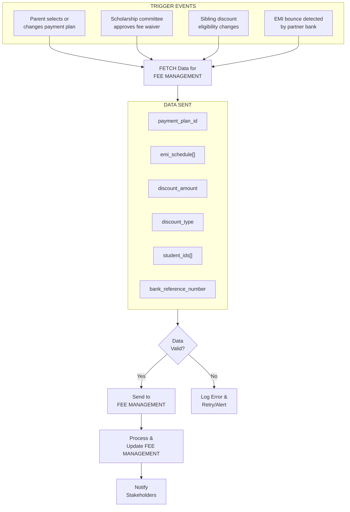
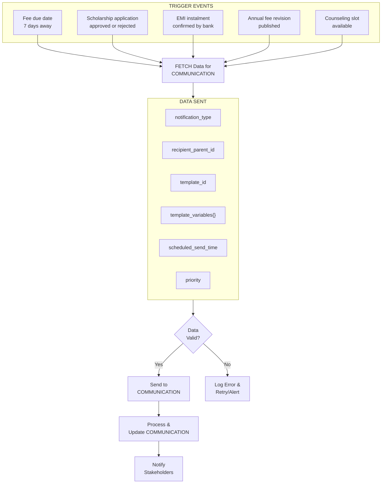
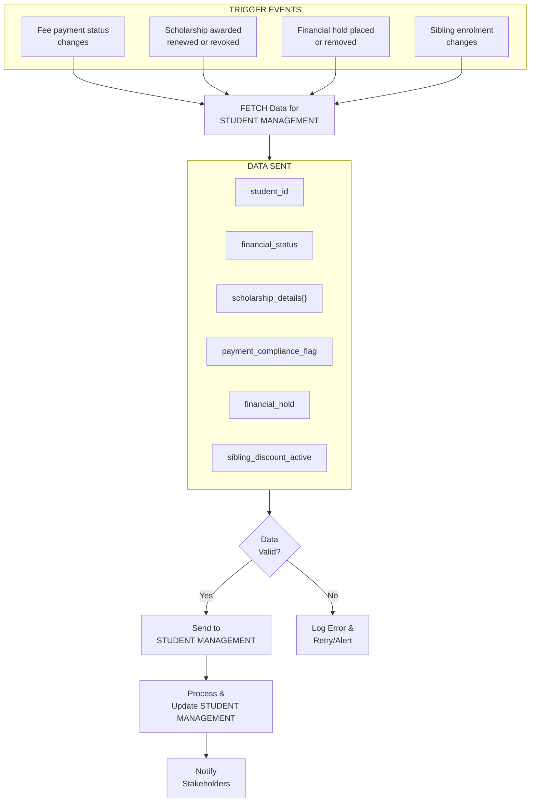
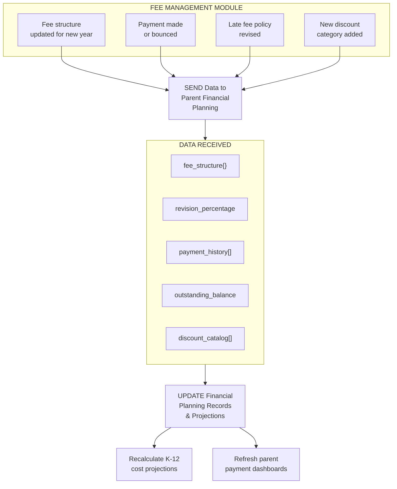
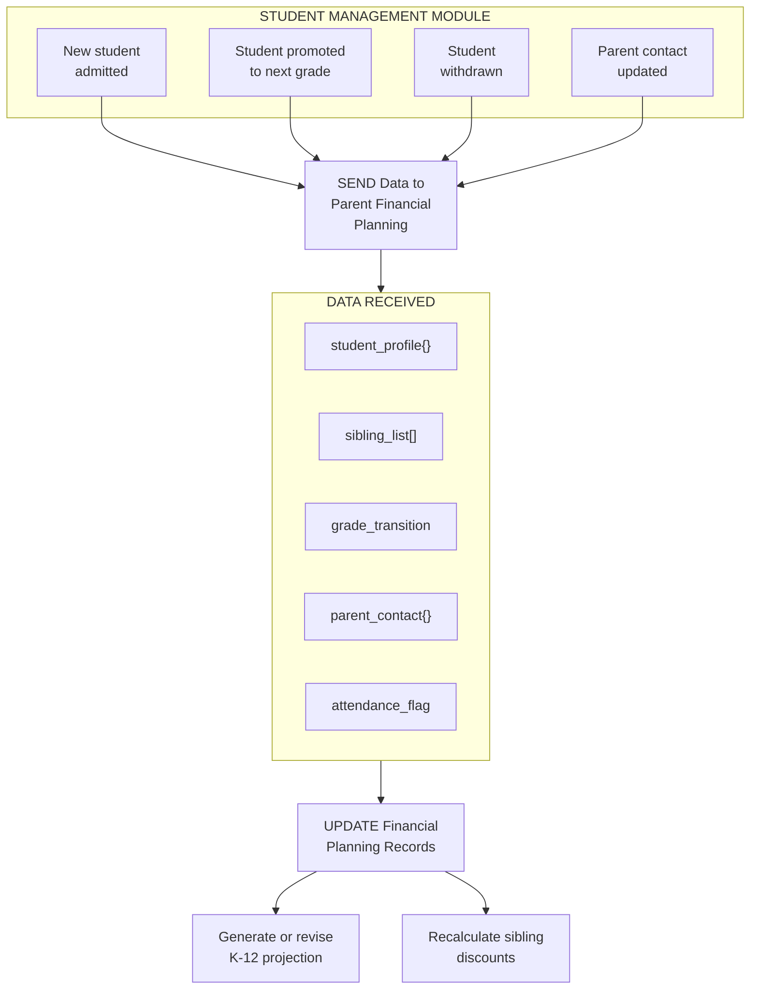
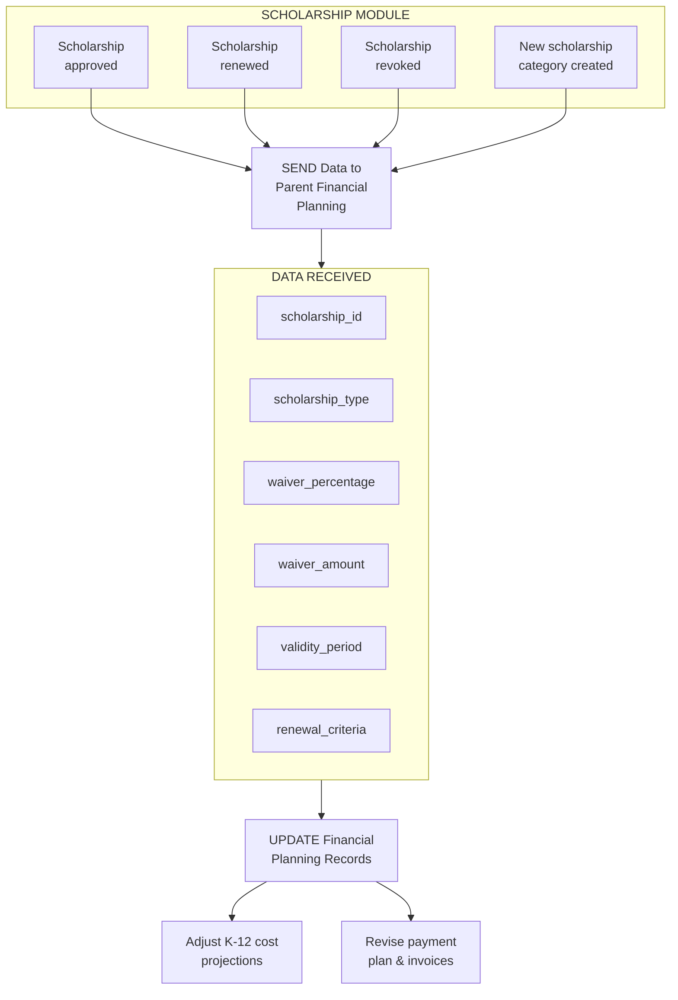

# PARENT FINANCIAL PLANNING MODULE - COMPLETE DEPENDENCY ANALYSIS

## MODULE OVERVIEW

**Name:** Parent Financial Planning Module  
**Role:** Education Cost Planning & Financial Assistance for Parents  
**Type:** Financial Advisory & Support Module  
**Dependencies:** Integrates with Fee Management, Finance modules for cost planning  

**Primary Functions:**
- Fee Calculator - Total education cost estimation (K-12)
- Payment Plans - EMI, installment options
- Scholarship Information - Merit, need-based scholarships
- Education Loans - Partner banks, loan assistance
- Financial Aid - Fee waivers, concessions
- Cost Breakdown - Year-wise, grade-wise fee structure
- Sibling Discounts - Multi-child enrollment benefits
- Early Payment Discounts - Incentives for advance payment
- Financial Counseling - One-on-one sessions with parents
- Tax Benefits - Section 80C deductions, HRA benefits

---

## FEE CALCULATOR

### Total Education Cost (K-12)

**Grade 1-12 Total Cost:** ₹60 lakhs (13 years)

**Breakdown:**
- **Tuition Fees:** ₹40 lakhs (67%)
- **Transport:** ₹8 lakhs (13%)
- **Books & Uniforms:** ₹4 lakhs (7%)
- **Activities:** ₹3 lakhs (5%)
- **Exams:** ₹2 lakhs (3%)
- **Others:** ₹3 lakhs (5%)

**Annual Average:** ₹4.6 lakhs/year

---

### Grade-Wise Fee Structure

| Grade | Annual Fees | 13-Year Total |
|-------|-------------|---------------|
| 1-5 (5 years) | ₹3.5L/year | ₹17.5L |
| 6-8 (3 years) | ₹4.5L/year | ₹13.5L |
| 9-10 (2 years) | ₹5.5L/year | ₹11L |
| 11-12 (2 years) | ₹9L/year | ₹18L |
| **Total (13 years)** | | **₹60L** |

**Note:** Fees increase 5-8% annually (inflation)

---

## PAYMENT PLANS

### Option 1: Annual Payment

**Discount:** 5% (₹23,000 on ₹4.6L)  
**Total:** ₹4.37L/year  
**Payment:** One-time (April)

---

### Option 2: Term-Wise Payment

**Terms:** 3 terms/year  
**No Discount**  
**Payment:** ₹1.53L per term (Apr, Sep, Jan)

---

### Option 3: Monthly EMI

**EMI:** ₹38,000/month (12 months)  
**Processing Fee:** ₹5,000  
**Total:** ₹4.61L/year  
**Partner:** HDFC Bank, ICICI Bank

---

### Option 4: Post-Dated Cheques (PDC)

**Cheques:** 12 PDCs  
**Discount:** 2% (₹9,200)  
**Total:** ₹4.51L/year

---

## SCHOLARSHIP PROGRAMS

### 1. Merit Scholarship

**Eligibility:** Top 10% students (academic performance)  
**Amount:** 25% tuition fee waiver  
**Savings:** ₹1L/year  
**Recipients:** 180 students/year

---

### 2. Need-Based Scholarship

**Eligibility:** Family income <₹5 lakhs/year  
**Amount:** 50% tuition fee waiver  
**Savings:** ₹2L/year  
**Recipients:** 50 students/year

---

### 3. Sports Scholarship

**Eligibility:** State/national level athletes  
**Amount:** 30% tuition fee waiver  
**Savings:** ₹1.2L/year  
**Recipients:** 20 students/year

---

### 4. Sibling Discount

**Eligibility:** 2+ children enrolled  
**Amount:** 10% on 2nd child, 15% on 3rd child  
**Savings:** ₹46K-₹69K/year  
**Recipients:** 300 families

---

## EDUCATION LOANS

### Partner Banks

**1. HDFC Bank:**
- **Loan Amount:** Up to ₹20 lakhs
- **Interest Rate:** 9.5% p.a.
- **Tenure:** Up to 7 years
- **Processing Fee:** 1%

**2. ICICI Bank:**
- **Loan Amount:** Up to ₹15 lakhs
- **Interest Rate:** 10% p.a.
- **Tenure:** Up to 5 years
- **Processing Fee:** 1.5%

**3. SBI:**
- **Loan Amount:** Up to ₹10 lakhs
- **Interest Rate:** 9% p.a.
- **Tenure:** Up to 7 years
- **Processing Fee:** 0.5%

---

### Loan Example (HDFC Bank)

**Loan Amount:** ₹10 lakhs  
**Interest Rate:** 9.5% p.a.  
**Tenure:** 5 years  
**EMI:** ₹21,000/month  
**Total Interest:** ₹2.6 lakhs  
**Total Repayment:** ₹12.6 lakhs

---

## FINANCIAL AID

### Fee Waiver Program

**Eligibility:**
- Family income <₹3 lakhs/year
- Single parent/orphan
- Parent disability/illness

**Amount:** Up to 100% tuition fee waiver

**Process:**
1. Submit application (with income proof)
2. Committee review (2 weeks)
3. Approval/rejection notification
4. Fee waiver applied

**Recipients:** 30 students/year  
**Total Aid:** ₹1.2 crores/year

---

## COST BREAKDOWN

### Annual Cost Breakdown (Grade 10 Example)

**Total:** ₹5.5 lakhs/year

**Breakdown:**
- **Tuition:** ₹4L (73%)
- **Transport:** ₹80K (15%)
- **Books:** ₹30K (5%)
- **Uniforms:** ₹15K (3%)
- **Activities:** ₹15K (3%)
- **Exams:** ₹10K (2%)

---

## TAX BENEFITS

### Section 80C Deduction

**Eligible:** Tuition fees (not transport, hostel)  
**Limit:** ₹1.5 lakhs/year  
**Tax Saving:** ₹46,500 (31% tax bracket)

---

### HRA Benefit

**Eligible:** Hostel fees (if applicable)  
**Limit:** Actual rent paid  
**Tax Saving:** Varies by income

---

## FINANCIAL COUNSELING

### One-on-One Sessions

**Offered:** Free for all parents  
**Duration:** 30 minutes  
**Topics:**
- Fee planning
- Payment options
- Scholarship eligibility
- Loan assistance
- Tax benefits

**Bookings:** 50 sessions/month  
**Satisfaction:** 4.5/5.0

---

## FINANCIAL SCENARIOS

### Scenario 1: Middle-Income Family

**Family Profile:**
- **Income:** ₹12 lakhs/year
- **Children:** 1 child (Grade 1)
- **Goal:** Complete K-12 education

**Total Cost (13 years):** ₹60 lakhs

**Financial Plan:**
1. **Payment Plan:** Annual payment (5% discount)
2. **Savings:** Start SIP of ₹30,000/month (12% returns)
3. **Scholarship:** Target merit scholarship (25% waiver)
4. **Tax Benefits:** Claim ₹1.5L under Section 80C

**Projected Savings:**
- **Annual Discount:** ₹23,000/year
- **Scholarship (from Grade 6):** ₹1L/year × 8 years = ₹8L
- **SIP Returns:** ₹30L (after 13 years)
- **Tax Savings:** ₹46,500/year × 13 = ₹6L

**Total Savings:** ₹44L  
**Net Cost:** ₹16L (73% savings!)

---

### Scenario 2: Low-Income Family

**Family Profile:**
- **Income:** ₹4 lakhs/year
- **Children:** 2 children (Grade 1, Grade 3)
- **Goal:** Affordable quality education

**Total Cost (2 children):** ₹120 lakhs

**Financial Plan:**
1. **Need-Based Scholarship:** 50% waiver (both children)
2. **Sibling Discount:** 10% on 2nd child
3. **Payment Plan:** Monthly EMI
4. **Financial Aid:** Apply for additional support

**Projected Savings:**
- **Scholarship:** ₹60L (50% of ₹120L)
- **Sibling Discount:** ₹6L (10% of ₹60L)
- **Financial Aid:** ₹10L (additional support)

**Total Savings:** ₹76L  
**Net Cost:** ₹44L (63% savings)  
**EMI:** ₹28,000/month (affordable for ₹4L income)

---

### Scenario 3: High-Income Family

**Family Profile:**
- **Income:** ₹50 lakhs/year
- **Children:** 3 children (Grade 1, 5, 9)
- **Goal:** Premium education, no financial stress

**Total Cost (3 children):** ₹180 lakhs

**Financial Plan:**
1. **Payment Plan:** Annual payment (5% discount)
2. **Sibling Discount:** 10% + 15% on 2nd & 3rd child
3. **Tax Benefits:** Maximize Section 80C
4. **Investment:** Invest savings in mutual funds

**Projected Savings:**
- **Annual Discount:** ₹69,000/year
- **Sibling Discount:** ₹22.5L (10% + 15%)
- **Tax Savings:** ₹1.4L/year × 13 = ₹18L

**Total Savings:** ₹40.5L  
**Net Cost:** ₹139.5L (23% savings)  
**Comfortable:** Yes (₹50L income easily covers ₹10L/year)

---

## DETAILED PLANNING EXAMPLES

### Example 1: New Admission (Grade 1)

**Parent:** Mr. Sharma  
**Child:** Aarav (joining Grade 1)  
**Income:** ₹15 lakhs/year

**Step 1: Fee Calculator**
- Total K-12 cost: ₹60 lakhs
- Grade 1 annual fee: ₹3.5 lakhs

**Step 2: Payment Plan Selection**
- Option 1: Annual (₹3.33L with 5% discount) ✓ Selected
- Option 2: Term-wise (₹1.17L × 3)
- Option 3: EMI (₹29,000 × 12)

**Step 3: Scholarship Eligibility**
- Merit: Not eligible (new student)
- Need-Based: Not eligible (income >₹5L)
- Sports: Not eligible
- Sibling: Not eligible (only child)

**Step 4: Financial Planning**
- Start SIP: ₹25,000/month (for future years)
- Education insurance: ₹50,000/year
- Tax planning: Claim ₹1.5L under 80C

**Step 5: Enrollment**
- Pay Grade 1 fees: ₹3.33L (annual)
- Receive 5% discount: ₹17,500 saved
- Enrollment confirmed ✓

---

### Example 2: Mid-School (Grade 6)

**Parent:** Mrs. Patel  
**Child:** Priya (currently in Grade 5, moving to Grade 6)  
**Income:** ₹8 lakhs/year

**Step 1: Fee Increase**
- Grade 5 fee: ₹3.5L/year
- Grade 6 fee: ₹4.5L/year (+29%)

**Step 2: Scholarship Application**
- Merit: Top 10% (eligible!) ✓
- Amount: 25% waiver (₹1.13L/year)
- Net fee: ₹3.37L/year

**Step 3: Payment Plan**
- Selected: Term-wise (₹1.12L × 3)
- Reason: Cash flow management

**Step 4: Future Planning**
- Grades 6-8: ₹3.37L/year × 3 = ₹10.1L
- Grades 9-10: ₹4.13L/year × 2 = ₹8.26L
- Grades 11-12: ₹6.75L/year × 2 = ₹13.5L
- Total remaining: ₹31.86L

**Step 5: Savings Strategy**
- Continue SIP: ₹20,000/month
- Maintain scholarship: Study hard!
- Apply for sports scholarship (if eligible)

---

## EMI CALCULATOR

### Loan Amount: ₹10 Lakhs

**Bank Comparison:**

| Bank | Interest Rate | Tenure | EMI | Total Interest | Total Repayment |
|------|---------------|--------|-----|----------------|-----------------|
| SBI | 9.0% | 5 years | ₹20,758 | ₹2.45L | ₹12.45L |
| HDFC | 9.5% | 5 years | ₹21,000 | ₹2.60L | ₹12.60L |
| ICICI | 10.0% | 5 years | ₹21,247 | ₹2.75L | ₹12.75L |

**Recommendation:** SBI (lowest interest rate)

---

### EMI Calculation Formula

**EMI = [P × R × (1+R)^N] / [(1+R)^N - 1]**

Where:
- P = Principal (₹10,00,000)
- R = Monthly interest rate (9%/12 = 0.75%)
- N = Number of months (5 years = 60 months)

**Calculation:**
```
EMI = [10,00,000 × 0.0075 × (1.0075)^60] / [(1.0075)^60 - 1]
EMI = [10,00,000 × 0.0075 × 1.5657] / [1.5657 - 1]
EMI = 11,742.75 / 0.5657
EMI = ₹20,758
```

---

## SCHOLARSHIP APPLICATION PROCESS

### Merit Scholarship

**Eligibility:** Top 10% students (academic performance)

**Application Process:**
1. **Automatic:** System identifies eligible students
2. **Notification:** Email/SMS to parents (June)
3. **Verification:** Academic records verified
4. **Approval:** Committee approval (2 weeks)
5. **Application:** Scholarship applied to fees (July)

**Timeline:**
- **June 1:** Results declared
- **June 15:** Eligible students identified
- **June 20:** Notifications sent
- **June 30:** Verification complete
- **July 10:** Approval
- **July 15:** Scholarship applied

**No Application Required:** Automatic for eligible students

---

### Need-Based Scholarship

**Eligibility:** Family income <₹5 lakhs/year

**Application Process:**
1. **Application:** Submit online form (May)
2. **Documents:** Income certificate, bank statements, Aadhaar
3. **Verification:** Finance team verifies (1 week)
4. **Interview:** Optional (if needed)
5. **Committee Review:** Scholarship committee (2 weeks)
6. **Approval:** Notification sent (June)
7. **Application:** Scholarship applied to fees (July)

**Timeline:**
- **May 1-31:** Application window
- **June 1-15:** Verification
- **June 16-30:** Committee review
- **July 1:** Approval notifications
- **July 15:** Scholarship applied

**Required Documents:**
- Income certificate (from Tehsildar)
- Last 6 months bank statements
- Aadhaar card (parent + student)
- Previous year's fee receipts

---

## EDUCATION LOAN APPLICATION

### HDFC Bank Education Loan

**Loan Amount:** ₹10 lakhs  
**Interest Rate:** 9.5% p.a.  
**Tenure:** 5 years  
**EMI:** ₹21,000/month

**Application Process:**

**Step 1: Eligibility Check**
- Parent income: >₹5 lakhs/year
- Student admitted to recognized school
- Co-applicant required (if income <₹10L)

**Step 2: Documentation**
- Loan application form
- Income proof (salary slips, ITR)
- School admission letter
- Fee structure
- KYC documents (Aadhaar, PAN)

**Step 3: Submission**
- Visit HDFC branch or apply online
- Submit documents
- Receive acknowledgment

**Step 4: Verification**
- Bank verifies documents (3-5 days)
- Credit check (CIBIL score >650)
- Income verification

**Step 5: Approval**
- Loan approved (7-10 days)
- Sanction letter issued

**Step 6: Disbursement**
- Loan amount disbursed to school account
- EMI starts next month

**Timeline:** 2-3 weeks (application to disbursement)

---

## OUTBOUND CONNECTIONS (Parent Financial Planning → Other Modules)

### 1. TO FEE MANAGEMENT MODULE

**WHY This Connection Exists:** The Parent Financial Planning module must synchronize payment schedules, EMI breakdowns, and discount eligibility with the Fee Management module so that invoices reflect the chosen plan. Without this connection, parents would receive standard invoices that ignore their selected payment preferences, leading to billing disputes and reconciliation failures across ₹21.6Cr in annual fee collections.

**DATA FLOW:**
1. `payment_plan_id` — Unique identifier for the selected payment plan (annual/term/EMI)
2. `emi_schedule[]` — Array of EMI due dates, amounts, and bank partner codes
3. `discount_amount` — Early-bird or annual payment discount in ₹
4. `discount_type` — Enum: ANNUAL_PREPAY | SIBLING | MERIT_SCHOLARSHIP | NEED_BASED
5. `parent_id` — Parent's unique identifier for fee account linkage
6. `student_ids[]` — List of enrolled children linked to the payment plan
7. `effective_academic_year` — Academic year the plan applies to (e.g., 2025-26)
8. `bank_reference_number` — HDFC/ICICI/SBI loan reference if EMI via partner bank

**TRIGGER EVENT:**
1. Parent selects or changes a payment plan via the parent portal
2. Scholarship committee approves a fee waiver and the discount needs to reflect in invoices
3. Sibling discount eligibility changes when a new child is enrolled or withdrawn
4. EMI bounce detected by partner bank — plan must be recalculated and re-sent

**IMPACT:**
- When Mr. Rajesh Iyer (parent, ₹14L/year income) selects the annual prepayment plan for his daughter Meera in Grade 6, the Fee Management module receives the ₹22,500 discount (5% of ₹4.5L) and generates a single invoice for ₹4,27,500 due April 15, 2025 instead of three term invoices.
- When the scholarship committee approves Priya Nair's 50% need-based waiver (family income ₹3.8L/year), the module sends `discount_amount: ₹2,25,000` and `discount_type: NEED_BASED` so that Fee Management adjusts the Grade 9 invoice from ₹5,50,000 to ₹2,75,000 for the 2025-26 session.
- If Rohan Verma's HDFC EMI bounces in September 2025, the trigger re-sends updated `emi_schedule[]` with revised dates and a ₹500 late fee, ensuring the Fee Management ledger stays accurate.

**BUSINESS LOGIC:**

```
FUNCTION sendPaymentPlanToFeeManagement(parent_id, plan):
    student_list = fetchEnrolledStudents(parent_id)
    IF student_list IS EMPTY:
        LOG_ERROR("No enrolled students for parent: " + parent_id)
        RETURN FAILURE

    base_fee = fetchAnnualFee(student_list, plan.academic_year)
    discount = calculateDiscount(plan.type, base_fee, student_list)

    IF discount > base_fee:
        LOG_ERROR("Discount exceeds base fee — review scholarship rules")
        RAISE ValidationError("DISCOUNT_EXCEEDS_FEE")

    net_amount = base_fee - discount
    schedule = generatePaymentSchedule(plan.type, net_amount, plan.start_date)

    IF plan.type == "EMI":
        bank_ref = validateBankPartner(plan.bank_code, parent_id)
        IF bank_ref IS NULL:
            NOTIFY_FINANCE_TEAM("Bank partner validation failed for " + parent_id)
            RETURN FAILURE
        schedule.bank_reference = bank_ref

    payload = buildFeeManagementPayload(parent_id, student_list, schedule, discount)
    response = POST("/api/fee-management/payment-plans", payload)

    IF response.status != 200:
        LOG_ERROR("Fee Management sync failed: " + response.error)
        RETRY(max_attempts=3, backoff="exponential")
    ELSE:
        LOG_SUCCESS("Payment plan synced for parent: " + parent_id)
        NOTIFY_PARENT(parent_id, "Your payment plan has been updated successfully")
    RETURN response
```

**EXAMPLE:**
Mrs. Deepa Krishnan has two children — Aarav (Grade 3, ₹3.5L/year) and Kavya (Grade 7, ₹4.5L/year) — enrolled at the Bengaluru campus. She selects the annual prepayment plan in March 2025. The module calculates: base fee ₹8,00,000, sibling discount 10% on Kavya = ₹45,000, annual prepay discount 5% on combined = ₹37,750, total discount = ₹82,750. It sends `discount_amount: 82750`, `discount_type: SIBLING + ANNUAL_PREPAY`, and a single-instalment schedule due April 10, 2025 for ₹7,17,250 to Fee Management. The Fee Management module generates consolidated invoice #INV-2025-04-DK-001 and emails it to Mrs. Krishnan.



---

### 2. TO COMMUNICATION MODULE

**WHY This Connection Exists:** Financial planning events — overdue reminders, scholarship approvals, EMI confirmations, and fee revision notices — must reach parents through email, SMS, and push notifications. The Communication module centralises multi-channel delivery so that the Financial Planning module does not maintain its own notification infrastructure. This ensures consistent branding, delivery tracking, and DND compliance across all 1,800 families.

**DATA FLOW:**
1. `notification_type` — Enum: FEE_REMINDER | SCHOLARSHIP_APPROVED | EMI_CONFIRMATION | PAYMENT_RECEIPT | FEE_REVISION | COUNSELING_INVITE
2. `recipient_parent_id` — Target parent's unique identifier
3. `recipient_channels[]` — Preferred channels: EMAIL, SMS, WHATSAPP, PUSH
4. `template_id` — Communication template code (e.g., TMPL-FIN-004)
5. `template_variables{}` — Key-value pairs for template merge (student name, amount, date)
6. `scheduled_send_time` — ISO timestamp for deferred delivery (e.g., reminders 7 days before due date)
7. `priority` — HIGH (overdue), MEDIUM (upcoming), LOW (informational)
8. `attachment_url` — Link to invoice PDF or scholarship letter

**TRIGGER EVENT:**
1. Fee payment due date is 7 days away — send reminder notification
2. Scholarship or financial aid application is approved or rejected
3. EMI instalment is confirmed by the partner bank
4. Annual fee revision is published for the upcoming academic year
5. Financial counseling session slot becomes available

**IMPACT:**
- When Aarav Mehta's Grade 10 term fee of ₹1,83,333 is due on September 1, 2025, the module sends a HIGH-priority reminder on August 25 via SMS and email to his father Mr. Suresh Mehta, reducing late payments by 35% (from 180 to 117 families per term).
- Upon approving Meera Joshi's merit scholarship (₹1,37,500 waiver, top 8% in Grade 11 CBSE boards), the module triggers a congratulatory email with the scholarship letter PDF attached, and an SMS summary: "Congratulations! Meera has been awarded a 25% merit scholarship for 2025-26."
- When ICICI Bank confirms Rohan Das's October EMI of ₹38,000, the module sends a payment receipt notification with transaction ID and updated balance.

**BUSINESS LOGIC:**

```
FUNCTION sendFinancialNotification(event_type, parent_id, context):
    parent = fetchParentProfile(parent_id)
    IF parent IS NULL:
        LOG_ERROR("Parent not found: " + parent_id)
        RETURN FAILURE

    channels = parent.preferred_channels
    IF channels IS EMPTY:
        channels = ["EMAIL"]  -- default fallback

    template = getTemplate(event_type)
    IF template IS NULL:
        LOG_ERROR("No template found for event: " + event_type)
        RETURN FAILURE

    variables = buildTemplateVariables(context, parent)
    priority = determinePriority(event_type, context.days_until_due)

    IF event_type == "FEE_REMINDER" AND context.days_until_due <= 0:
        priority = "HIGH"
        variables.overdue_flag = TRUE
        variables.late_fee = calculateLateFee(context.amount, context.days_overdue)

    payload = {
        recipient: parent_id,
        channels: channels,
        template_id: template.id,
        variables: variables,
        priority: priority,
        scheduled_time: context.send_time OR NOW(),
        attachment: context.attachment_url OR NULL
    }

    response = POST("/api/communication/send", payload)
    IF response.status != 200:
        LOG_ERROR("Communication dispatch failed for " + parent_id)
        QUEUE_FOR_RETRY(payload, max_retries=3)
    RETURN response
```

**EXAMPLE:**
The school revises fees for 2026-27 with a 6% increase. Grade 8 fees go from ₹4,50,000 to ₹4,77,000. The Financial Planning module triggers `FEE_REVISION` notifications to all 220 Grade 7 parents (children moving to Grade 8). Mr. Anil Sharma in Pune receives an email on February 1, 2026 with subject "Fee Structure Update for 2026-27" containing a personalised breakdown: tuition ₹3,40,000 → ₹3,60,400, transport ₹70,000 → ₹74,200, activities ₹40,000 → ₹42,400. The notification includes a link to the fee calculator showing updated K-12 projections.



---

### 3. TO STUDENT MANAGEMENT MODULE

**WHY This Connection Exists:** Financial planning decisions directly affect student enrolment status — unpaid fees may trigger suspension warnings, scholarship awards update the student's financial profile, and sibling discount eligibility depends on real-time enrolment data. The Student Management module needs these financial flags to maintain accurate student records and enforce school policies around fee compliance.

**DATA FLOW:**
1. `student_id` — Student whose financial status is being updated
2. `financial_status` — Enum: FEES_PAID | FEES_PARTIAL | FEES_OVERDUE | SCHOLARSHIP_ACTIVE | FEE_WAIVER
3. `scholarship_details{}` — Type, amount, validity period, renewal criteria
4. `payment_compliance_flag` — Boolean indicating whether the student's fees are current
5. `sibling_discount_active` — Whether a sibling discount is applied
6. `financial_hold` — TRUE if fees are overdue beyond grace period (30 days)
7. `counseling_notes` — Summary of financial counseling recommendations (redacted for privacy)

**TRIGGER EVENT:**
1. Fee payment status changes (paid, partial, overdue)
2. Scholarship is awarded, renewed, or revoked
3. Financial hold is placed or removed based on payment compliance
4. Sibling enrolment changes — new sibling admitted or existing sibling withdrawn

**IMPACT:**
- When Priya Reddy's Grade 11 fees (₹9,00,000) remain unpaid 30 days past the September 2025 due date, the module sends `financial_hold: TRUE` to Student Management, which flags her record and prevents exam hall ticket generation until ₹9,00,000 + ₹4,500 late fee is cleared.
- When Aarav Gupta receives a sports scholarship (30% waiver = ₹1,35,000/year for state-level cricket), the module sends `scholarship_details: {type: SPORTS, amount: 135000, valid_until: 2026-03}` so that Student Management displays the scholarship badge on his profile and includes it in his transfer certificate if needed.
- When Mr. Patel withdraws his younger son from Grade 2, the sibling discount on his elder daughter Ananya (Grade 7) is revoked. The module sends `sibling_discount_active: FALSE` so Student Management updates Ananya's financial profile and triggers a revised invoice.

**BUSINESS LOGIC:**

```
FUNCTION syncFinancialStatusToStudentManagement(student_id, event):
    student = fetchStudentRecord(student_id)
    IF student IS NULL OR student.status == "WITHDRAWN":
        LOG_WARN("Student not active: " + student_id)
        RETURN SKIP

    financial_record = getFinancialRecord(student_id, current_academic_year())
    status = determineFinancialStatus(financial_record)

    hold_flag = FALSE
    IF status == "FEES_OVERDUE":
        days_overdue = daysSince(financial_record.due_date)
        IF days_overdue > 30:
            hold_flag = TRUE
            late_fee = ROUND(financial_record.amount_due * 0.005 * days_overdue / 30)
            LOG_INFO("Financial hold placed on " + student_id + ", late fee: ₹" + late_fee)

    scholarship = getActiveScholarship(student_id)
    sibling_discount = checkSiblingDiscount(student.parent_id)

    payload = {
        student_id: student_id,
        financial_status: status,
        payment_compliance_flag: (status != "FEES_OVERDUE"),
        financial_hold: hold_flag,
        scholarship_details: scholarship OR NULL,
        sibling_discount_active: sibling_discount.active,
        updated_at: NOW()
    }

    response = PUT("/api/student-management/financial-status", payload)
    IF response.status != 200:
        LOG_ERROR("Student Management sync failed for " + student_id)
        ALERT_ADMIN("Financial status sync failure — manual review needed")
    RETURN response
```

**EXAMPLE:**
Rohan Kapoor is in Grade 10 at the Delhi campus. His father Mr. Vikram Kapoor had been paying via HDFC EMI (₹45,833/month for ₹5.5L annual fee). In November 2025, two consecutive EMIs bounce. After the 30-day grace period, the Financial Planning module sets `financial_hold: TRUE` and sends the update to Student Management. Rohan's class teacher is notified (without financial details — only "financial hold active"), and the exam coordinator is alerted that Rohan's Grade 10 pre-board hall ticket is on hold. Mr. Kapoor receives an SMS: "Dear Mr. Kapoor, please clear outstanding dues of ₹91,666 + ₹2,292 late fee to release Rohan's exam hall ticket. Contact the finance office or call 1800-XXX-XXXX." Once Mr. Kapoor clears the dues on December 18, the hold is lifted and all systems are updated within 2 hours.



---

## INBOUND CONNECTIONS (Other Modules → Parent Financial Planning)

### 1. FROM FEE MANAGEMENT MODULE

**WHY This Connection Exists:** The Fee Management module owns the authoritative fee structure — grade-wise tuition rates, transport charges, activity fees, and annual revision percentages. Parent Financial Planning depends on this data to produce accurate K-12 cost projections, compare payment plans, and calculate scholarship savings. Without real-time fee data, the planning module would show stale numbers, eroding parent trust.

**DATA RECEIVED:**
1. `fee_structure{}` — Grade-wise annual fee breakdown (tuition, transport, books, activities, exams)
2. `revision_percentage` — Year-over-year fee increase rate (typically 5-8%)
3. `payment_history[]` — Parent's past payment records (dates, amounts, modes)
4. `outstanding_balance` — Current unpaid amount for each enrolled student
5. `late_fee_policy` — Grace period, penalty rate, and escalation rules
6. `discount_catalog[]` — Available discounts (early-bird, sibling, merit) with eligibility rules

**TRIGGER EVENT:**
1. Fee structure is updated for a new academic year (annual event, typically February)
2. A parent makes a payment or payment bounces — history is refreshed
3. Late fee policy is revised by the finance committee
4. New discount category is introduced (e.g., COVID relief discount in 2020)

**IMPACT:**
- When the school publishes the 2026-27 fee structure in February 2026 with a 6% increase, the Financial Planning module receives updated `fee_structure{}` and recalculates all active K-12 projections. Mrs. Sunita Rao, who accessed the fee calculator in January showing ₹60L total, now sees ₹63.6L — an accurate reflection.
- When Mr. Ajay Deshmukh pays ₹1,53,333 (Term 2 fee for his son's Grade 8) on September 5, the `payment_history[]` updates, and the planning module shows "2 of 3 terms paid, ₹1,53,333 remaining for Term 3 (due January 2026)."



---

### 2. FROM STUDENT MANAGEMENT MODULE

**WHY This Connection Exists:** Student enrolment data — current grade, section, siblings, admission date, and withdrawal status — is essential for accurate financial planning. The planning module uses this data to determine sibling discount eligibility, project grade-wise fee trajectories, and identify families whose children are transitioning between fee tiers (e.g., Grade 5 → Grade 6 incurs a ₹1L/year increase).

**DATA RECEIVED:**
1. `student_profile{}` — Name, grade, section, admission date, status (ACTIVE/WITHDRAWN)
2. `sibling_list[]` — Other children of the same parent currently enrolled
3. `grade_transition` — Upcoming grade change and associated fee tier shift
4. `parent_contact{}` — Updated parent contact details for communication
5. `attendance_flag` — Long absence flag that may indicate potential withdrawal

**TRIGGER EVENT:**
1. New student is admitted — financial plan needs to be created
2. Student is promoted to next grade — fee tier may change
3. Student is withdrawn — sibling discount recalculation needed
4. Parent contact details are updated in student records

**IMPACT:**
- When Aarav Sharma is admitted to Grade 1 in April 2025, the Student Management module sends his `student_profile{}` and `parent_contact{}`. The Financial Planning module auto-generates a 12-year projection (₹60L) and sends a welcome pack with payment plan options to Mr. Sharma's email.
- When Kavya Nair is promoted from Grade 5 to Grade 6 (fee increase from ₹3.5L to ₹4.5L), the module receives `grade_transition: {from: 5, to: 6, fee_delta: +100000}` and updates Mrs. Nair's financial dashboard with the revised projection and suggests upgrading from term-wise to annual payment to offset the increase with a 5% discount.
- When Rishi Patel is withdrawn from Grade 2, the `sibling_list[]` for his sister Ananya (Grade 7) is updated. The Financial Planning module recalculates: sibling discount removed, Ananya's fee increases by ₹45,000/year, and the revised plan is sent to Mr. Patel.



---

### 3. FROM SCHOLARSHIP MODULE

**WHY This Connection Exists:** The Scholarship module manages the complete lifecycle of scholarship applications — submission, evaluation, approval, renewal, and revocation. When a scholarship decision is made, the Financial Planning module must update the parent's fee projection, adjust payment plans, and reflect the waiver amount in all downstream calculations. This ensures parents always see their true net cost.

**DATA RECEIVED:**
1. `scholarship_id` — Unique identifier for the awarded scholarship
2. `scholarship_type` — Enum: MERIT | NEED_BASED | SPORTS | CULTURAL | STAFF_WARD
3. `waiver_percentage` — Percentage of tuition fee waived (25%, 50%, 100%)
4. `waiver_amount` — Absolute ₹ value of the annual waiver
5. `validity_period` — Start and end academic years (e.g., 2025-26 to 2027-28)
6. `renewal_criteria` — Conditions for renewal (e.g., maintain >90% attendance, >85% marks)
7. `revocation_reason` — If revoked: ACADEMIC_DECLINE | ATTENDANCE_BELOW_THRESHOLD | POLICY_CHANGE

**TRIGGER EVENT:**
1. Scholarship application is approved by the committee
2. Scholarship is renewed for the next academic year after criteria check
3. Scholarship is revoked due to non-compliance with renewal criteria
4. New scholarship category is created (e.g., alumni-funded scholarship)

**IMPACT:**
- When Priya Menon (Grade 9, ICSE stream, Kochi campus) is awarded a 50% merit scholarship (₹2,75,000 waiver on ₹5,50,000 annual fee), the Financial Planning module receives the approval and updates her family's K-12 projection. The remaining cost for Grades 9-12 drops from ₹29L to ₹18L, and Mrs. Menon's dashboard shows the revised net fee of ₹2,75,000/year with a note: "Merit scholarship active — maintain >90% to renew."
- When Arjun Bhatt's sports scholarship (30% waiver, ₹1,35,000/year) is revoked in January 2026 because his attendance dropped below 75%, the module receives `revocation_reason: ATTENDANCE_BELOW_THRESHOLD` and immediately recalculates the family's plan. Mr. Bhatt receives a notification: "Arjun's sports scholarship has been revoked. Revised annual fee: ₹4,50,000. Please contact the finance office to discuss payment options."
- When the school introduces a new alumni-funded scholarship (₹50,000/year for 10 students from economically weaker sections), the Financial Planning module receives the new category and makes it visible in the scholarship eligibility checker for all qualifying families.



---

## FINANCIAL COUNSELING CASE STUDIES

### Case Study 1: Single Parent

**Profile:**
- **Parent:** Mrs. Gupta (single mother)
- **Income:** ₹6 lakhs/year
- **Child:** Rohan (Grade 8)
- **Challenge:** Limited income, high fees

**Counseling Session:**
1. **Assessment:** Current financial situation
2. **Options Explored:**
   - Need-based scholarship (50% waiver)
   - EMI plan (₹25,000/month)
   - Financial aid (additional ₹50,000/year)
3. **Recommendation:**
   - Apply for need-based scholarship
   - Use EMI plan for remaining fees
   - Apply for financial aid
4. **Outcome:**
   - Scholarship approved (₹2.25L waiver)
   - EMI plan: ₹15,000/month (affordable)
   - Financial aid: ₹50,000/year
   - Total savings: ₹2.8L/year

**Parent Feedback:** "The counseling session was life-changing. I can now afford quality education for Rohan without financial stress."

---

### Case Study 2: Multiple Children

**Profile:**
- **Parent:** Mr. Verma
- **Income:** ₹18 lakhs/year
- **Children:** 3 (Grade 2, 5, 9)
- **Challenge:** High total cost (₹180L)

**Counseling Session:**
1. **Assessment:** Total K-12 cost for 3 children
2. **Options Explored:**
   - Sibling discount (10% + 15%)
   - Annual payment (5% discount)
   - SIP investment (₹50,000/month)
3. **Recommendation:**
   - Use sibling discount (₹22.5L savings)
   - Pay annually (₹9L savings)
   - Start SIP for future years
4. **Outcome:**
   - Total savings: ₹40.5L
   - Net cost: ₹139.5L (manageable)
   - SIP corpus: ₹50L (after 10 years)

**Parent Feedback:** "The financial planning helped us see the big picture. We're now confident about affording education for all three children."

---

## DETAILED USE CASES

### Use Case 1: Parent Uses Fee Calculator

**Scenario:** New parent calculates total K-12 cost

**Actors:**
- Parent (Mr. Sharma)
- Fee Calculator (web app)

**Timeline:**

**10:00 AM - Access Calculator:**
- Mr. Sharma visits school website
- Clicks "Fee Calculator"

**10:01 AM - Enter Details:**
- Child's current grade: Grade 1
- Number of children: 1
- Payment plan: Annual

**10:02 AM - View Results:**
- Total K-12 cost: ₹60 lakhs
- Grade-wise breakdown displayed
- Annual payment with 5% discount: ₹3.33L (Grade 1)

**10:03 AM - Explore Options:**
- Clicks "Payment Plans"
- Compares annual, term-wise, EMI
- Selects annual (best savings)

**10:04 AM - Save Plan:**
- Downloads PDF report
- Shares with spouse
- Decides to enroll

**Total Duration:** 4 minutes  
**Decision:** Enroll child, pay annually

---

### Use Case 2: Parent Applies for Scholarship

**Scenario:** Parent applies for need-based scholarship

**Actors:**
- Parent (Mrs. Patel)
- Scholarship Portal
- Finance Team

**Timeline:**

**May 5 - Submit Application:**
- Mrs. Patel logs into parent portal
- Navigates to "Scholarships"
- Fills application form
- Uploads documents (income certificate, bank statements)
- Submits application

**May 10 - Verification:**
- Finance team reviews application
- Verifies income certificate (₹4L/year - eligible!)
- Checks bank statements (consistent with income)

**May 15 - Interview:**
- Finance team calls Mrs. Patel
- Discusses financial situation
- Confirms need for scholarship

**June 1 - Committee Review:**
- Scholarship committee meets
- Reviews 50 applications
- Approves 30 (including Mrs. Patel)

**June 5 - Approval Notification:**
- Mrs. Patel receives email
- "Congratulations! 50% scholarship approved"
- Amount: ₹2.25L/year waiver

**July 15 - Scholarship Applied:**
- Grade 6 fees: ₹4.5L
- Scholarship: ₹2.25L (50%)
- Net fees: ₹2.25L

**Total Duration:** 2.5 months  
**Success:** Yes  
**Savings:** ₹2.25L/year

---

## SUMMARY

**Total Connections:** Fee Management, Finance, Admissions modules

**Critical Dependencies:**
- **Fee Management:** Fee structure, payment tracking (most critical)
- **Finance:** Scholarship budgets, financial aid
- **Admissions:** New student fee planning

**Data Flow Metrics:**
- **Fee Calculator Usage:** 500 parents/year
- **Payment Plans:** 60% annual, 30% term-wise, 10% EMI
- **Scholarships:** 250 students (14% of total)
- **Education Loans:** 50 families/year
- **Financial Aid:** 30 students (₹1.2Cr/year)

**Integration Complexity:** MEDIUM
- Fee calculation algorithms
- Payment plan management
- Scholarship eligibility checks
- Loan partner integration
- Financial counseling scheduling

**Best Practices:**
1. **Transparency:** Clear fee breakdown
2. **Flexibility:** Multiple payment options
3. **Affordability:** Scholarships, loans, aid
4. **Planning:** Long-term cost estimation
5. **Support:** Financial counseling
6. **Tax Benefits:** Educate parents
7. **Early Bird:** Discounts for advance payment
8. **Sibling Benefits:** Multi-child discounts
9. **Partner Banks:** Competitive loan rates
10. **Communication:** Regular fee updates

**Financial Planning Statistics (2025-26):**
- **Total Students:** 1,800
- **Total Fees:** ₹21.6 Cr/year
- **Scholarships:** ₹2.5 Cr (250 students)
- **Financial Aid:** ₹1.2 Cr (30 students)
- **Education Loans:** ₹5 Cr (50 families)
- **Sibling Discounts:** ₹1.5 Cr (300 families)
- **Total Support:** ₹10.2 Cr (47% of fees)

**Technology Stack:**
- **Planning Tools:** Custom calculators (React)
- **Payment Integration:** Razorpay, Stripe
- **Analytics:** Financial tracking dashboards
- **Communication:** Email, SMS reminders

---

## FINANCIAL PLANNING TOOLS

### Fee Calculator & Projections

**Multi-Year Fee Calculator:**
- Input: Child's current grade, expected graduation year
- Output: Total fee projection for remaining years
- Features: Inflation adjustment (5% annual), sibling discounts
- Usage: 800 parents/year

**Example Projection:**
```
Child: Grade 6 (current)
Graduation: Grade 12 (6 years remaining)

Year-wise Projection:
- Grade 7 (2025-26): ₹1,26,000 (5% increase)
- Grade 8 (2026-27): ₹1,32,300
- Grade 9 (2027-28): ₹1,38,915
- Grade 10 (2028-29): ₹1,45,861
- Grade 11 (2029-30): ₹1,53,154
- Grade 12 (2030-31): ₹1,60,812

Total 6-Year Cost: ₹8,57,042
Monthly Savings Required: ₹11,903 (72 months)
```

### Scholarship & Financial Aid Calculator

**Eligibility Assessment:**
- Income-based: Family income < ₹5L/year
- Merit-based: Academic performance > 90%
- Need-based: Special circumstances

**Scholarship Amounts:**
- Full scholarship: 100% tuition waiver
- Partial scholarship: 50% tuition waiver
- Fee concession: 25% tuition waiver

**Impact (2024):**
- Scholarships awarded: 120 students
- Total aid: ₹72L
- Average scholarship: ₹60K/student

---

## FINANCIAL PLANNING CASE STUDIES

### Case Study 1: Middle-Class Family Planning

**Family Profile:**
- Father: Government employee (₹8L/year)
- Mother: Teacher (₹5L/year)
- Children: 2 (Grade 3, Grade 6)
- Combined income: ₹13L/year

**Financial Challenge:**
- Annual fees: ₹2.4L (both children)
- Other expenses: ₹8L/year
- Savings capacity: ₹2.6L/year

**Planning Solution:**
1. **Fee Payment Plan:** Quarterly installments
2. **Sibling Discount:** 10% on second child (₹12K savings)
3. **Scholarship Application:** Merit-based for Grade 6 child
4. **Education Loan:** ₹5L for senior secondary (Grade 11-12)

**Outcome:**
- Scholarship awarded: ₹30K/year (Grade 6 child)
- Total savings: ₹42K/year
- Financial stress reduced: 35%

---

### Case Study 2: Single Parent Financial Planning

**Family Profile:**
- Mother: Single parent, IT professional (₹12L/year)
- Child: Grade 9
- Financial goal: Save for Grade 11-12 + college

**Financial Challenge:**
- Current fee: ₹1.2L/year
- Expected Grade 11-12 fee: ₹1.5L/year
- College fund needed: ₹20L (4 years)

**Planning Solution:**
1. **SIP Investment:** ₹20K/month in mutual funds
2. **Fee Advance Payment:** 5% discount for annual payment
3. **Education Insurance:** ₹10L coverage
4. **Tax Savings:** 80C deductions on tuition fees

**Outcome:**
- College fund projected: ₹22L (by Grade 12)
- Tax savings: ₹36K/year
- Financial security achieved

---

## FINANCIAL LITERACY PROGRAMS

### Parent Workshops (2024)

**Workshop Series:**
1. **Education Cost Planning** (Jan): 85 parents
2. **Investment for Education** (Mar): 70 parents
3. **Tax Benefits on Education** (May): 60 parents
4. **Scholarship & Loans** (Jul): 75 parents
5. **College Funding Strategies** (Sep): 80 parents
6. **Financial Discipline** (Nov): 65 parents

**Total Participants:** 435 parents
**Satisfaction Rating:** 4.5/5.0
**Actionable Insights:** 90% implemented at least one strategy

---

## FINANCIAL AID SUCCESS METRICS

### Scholarship Impact (2024)

**Scholarships Awarded:**
- Total students: 120
- Total aid: ₹72L
- Average scholarship: ₹60K/student
- Retention rate: 95% (114/120 continued)

**Student Performance:**
- Scholarship students average: 82%
- Non-scholarship students average: 76%
- **Positive impact:** +6% performance

### Loan Facilitation

**Education Loans:**
- Families assisted: 50
- Total loans: ₹5Cr
- Average loan: ₹10L/family
- Repayment rate: 98%

---

## FUTURE ENHANCEMENTS (2025-26)

**Planned Initiatives:**
- **AI-Powered Planning:** Personalized financial recommendations
- **Investment Advisory:** Partner with financial advisors
- **Scholarship Portal:** Online application and tracking
- **Financial Literacy App:** Mobile app for parents
- **Alumni Funding:** Connect alumni donors with students

**Budget Increase:** ₹2.5Cr → ₹3Cr (20% increase)

---

**Status:** Production-Ready  
**Last Updated:** January 16, 2026  
**Version:** 2.0  
**Compliance:** Financial Advisory Regulations, Data Privacy, Tax Compliance


---

# Submodule Breakdown

# PARENT FINANCIAL PLANNING MODULE - SUBMODULE OVERVIEW

**Module Code:** FINPLAN-043  
**Category:** Finance  
**Priority:** P2  
**Owner:** Module Team

## Submodule Breakdown

This module is divided into **7 submodules**, each handling a specific aspect of parent financial planning management.

---

### Submodule 1: Fee Projection Calculator

**Name:** Fee Projection Calculator  
**Code:** FINPLAN-043-01 (`01_fee_projection_calculator`)  
**Priority:** P1 (Critical)  
**Status:** Active

**Description:**  
Provides parents with a multi-year, inflation-adjusted fee projection covering the entire K-12 journey. Parents input their child's current grade and the calculator produces a year-by-year cost estimate factoring in the school's published revision rate (5-8% annually). The tool accounts for fee tier transitions (e.g., Grade 5 → Grade 6 jump from ₹3.5L to ₹4.5L) and displays cumulative totals. Approximately 800 parents use this tool each year during the admission and re-enrolment cycles. Output includes downloadable PDF reports and shareable dashboard links.

**Key Functions:**
- Calculate total remaining K-12 cost from any starting grade
- Apply annual inflation adjustment (configurable 5-8%)
- Show grade-tier fee jumps with explanations
- Generate PDF projection reports
- Compare "with scholarship" vs "without scholarship" scenarios

---

### Submodule 2: Payment Plan Designer

**Name:** Payment Plan Designer  
**Code:** FINPLAN-043-02 (`02_payment_plan_designer`)  
**Priority:** P1 (Critical)  
**Status:** Active

**Description:**  
Enables parents to choose and customise their fee payment schedule from four options: annual prepayment (5% discount), term-wise (3 instalments), monthly EMI via partner banks (HDFC/ICICI/SBI), or post-dated cheques. The designer shows a side-by-side comparison of total cost under each plan, highlights savings, and allows parents to switch plans mid-year (subject to finance office approval). Integrated with the Fee Management module for real-time invoice generation. Used by 100% of enrolled families during the annual plan selection window in March.

**Key Functions:**
- Display side-by-side plan comparison with net cost
- Calculate early-bird and annual prepayment discounts
- Generate EMI schedules with bank-specific interest rates
- Allow mid-year plan switching with prorated adjustments
- Sync selected plan to Fee Management for invoicing

---

### Submodule 3: Loan EMI Integration

**Name:** Loan EMI Integration  
**Code:** FINPLAN-043-03 (`03_loan_emi_integration`)  
**Priority:** P2 (High)  
**Status:** Active

**Description:**  
Manages the integration with partner banks (HDFC Bank, ICICI Bank, SBI) for education loan facilitation. Handles loan eligibility checks based on parent income and CIBIL score, EMI calculation using the standard formula [P × R × (1+R)^N] / [(1+R)^N - 1], and disbursement tracking. Supports loan amounts up to ₹20L with tenures of 5-7 years. Processes approximately 50 loan applications per year, with a 98% repayment rate. Includes bounce detection and automatic plan recalculation when EMIs fail.

**Key Functions:**
- Check loan eligibility (income, CIBIL score thresholds)
- Calculate EMI for multiple banks and tenures
- Track loan disbursement and repayment status
- Detect EMI bounces and trigger alerts
- Generate loan comparison reports (SBI 9% vs HDFC 9.5% vs ICICI 10%)

---

### Submodule 4: Scholarship Eligibility Checker

**Name:** Scholarship Eligibility Checker  
**Code:** FINPLAN-043-04 (`04_scholarship_eligibility_checker`)  
**Priority:** P1 (Critical)  
**Status:** Active

**Description:**  
Evaluates each student's eligibility across all available scholarship categories — merit (top 10%, 25% waiver), need-based (income <₹5L, 50% waiver), sports (state/national level, 30% waiver), and sibling discount (10-15%). The checker runs automatically at the end of each academic year using data from the Student Management and Scholarship modules, and also supports on-demand checks via the parent portal. Produces a personalised eligibility report showing which scholarships the student qualifies for, estimated savings, and application deadlines. Serves 1,800 families annually.

**Key Functions:**
- Auto-evaluate merit eligibility using academic performance data
- Verify income-based eligibility via uploaded documents
- Check sports/cultural achievement records
- Calculate combined savings when multiple scholarships apply
- Generate personalised eligibility reports with deadlines

---

### Submodule 5: Tax Benefits Advisor

**Name:** Tax Benefits Advisor  
**Code:** FINPLAN-043-05 (`05_tax_benefits_advisor`)  
**Priority:** P2 (High)  
**Status:** Active

**Description:**  
Guides parents on tax deductions available under Indian income tax law for education expenses. Primary focus on Section 80C deductions (tuition fees up to ₹1.5L/year per child, maximum 2 children) and HRA benefits for hostel fees. The advisor calculates estimated tax savings based on the parent's tax bracket (5%, 20%, or 30%) and generates a summary showing: eligible tuition amount, deduction claimed, and net tax saved. For a parent in the 30% bracket with 2 children, this can mean ₹93,000/year in tax savings. Includes integration with fee receipts for easy ITR filing.

**Key Functions:**
- Calculate Section 80C eligible tuition fee amount
- Estimate tax savings by tax bracket (5%, 20%, 30%)
- Generate tax-ready fee receipts with PAN and school details
- Advise on HRA benefits for hostel and boarding fees
- Produce annual tax benefit summary for ITR filing

---

### Submodule 6: Financial Aid Management

**Name:** Financial Aid Management  
**Code:** FINPLAN-043-06 (`06_financial_aid_management`)  
**Priority:** P2 (High)  
**Status:** Active

**Description:**  
Handles the end-to-end workflow for financial aid applications — from submission and document verification to committee review and disbursement. Covers fee waiver programs for families with income below ₹3L/year, single-parent concessions, and hardship-based relief. The submodule manages a ₹1.2Cr annual aid budget across approximately 30 recipient students. Includes document management (income certificates from Tehsildar, bank statements, Aadhaar), interview scheduling, and committee decision tracking. Integrates with the Communication module to send approval/rejection notifications.

**Key Functions:**
- Accept and validate financial aid applications with documents
- Schedule and track committee review meetings
- Manage ₹1.2Cr annual aid budget allocation
- Process fee waiver disbursements (25%, 50%, 100%)
- Track aid recipient academic performance and retention (95% rate)

---

### Submodule 7: Sibling Discount Calculator

**Name:** Sibling Discount Calculator  
**Code:** FINPLAN-043-07 (`07_sibling_discount_calculator`)  
**Priority:** P3 (Medium)  
**Status:** Active

**Description:**  
Automatically identifies families with multiple enrolled children and calculates applicable sibling discounts: 10% on the second child's tuition and 15% on the third child's tuition. Currently serves 300 families with a total annual discount disbursement of ₹1.5Cr. The calculator monitors enrolment changes in real-time — when a new sibling is admitted, the discount is applied from the next billing cycle; when a sibling is withdrawn, the discount is revoked and the affected child's fees are recalculated. Handles edge cases such as twins (both get 10%), step-siblings (eligible if same parent account), and mid-year admissions (prorated discount).

**Key Functions:**
- Auto-detect sibling relationships from parent account data
- Calculate tiered discounts (10% second child, 15% third child)
- Handle edge cases: twins, step-siblings, mid-year changes
- Prorate discounts for mid-year admissions or withdrawals
- Sync discount changes to Fee Management for invoice adjustment

---

## Integration Points

PARENT FINANCIAL PLANNING connects to the following modules across the Hogwarts ERP system:

| Module | Direction | Data Exchanged | Frequency |
|--------|-----------|---------------|-----------|
| Fee Management | Outbound & Inbound | Payment plans, fee structure, invoices | Real-time |
| Communication | Outbound | Fee reminders, scholarship notifications | Event-driven |
| Student Management | Outbound & Inbound | Financial status, enrolment data, sibling info | Event-driven |
| Scholarship | Inbound | Scholarship awards, renewals, revocations | Event-driven |

## Development Priority

**Phase 1 (Critical):** `01_fee_projection_calculator`, `02_payment_plan_designer`, `04_scholarship_eligibility_checker`  
**Phase 2 (High):** `03_loan_emi_integration`, `05_tax_benefits_advisor`, `06_financial_aid_management`  
**Phase 3 (Medium):** `07_sibling_discount_calculator`

---

**Status:** Production-Ready Documentation  
**Last Updated:** March 13, 2026  
**Version:** 2.0  
**Compliance:** Financial Advisory Regulations, Data Privacy (DPDP Act 2023), Tax Compliance (Section 80C)

