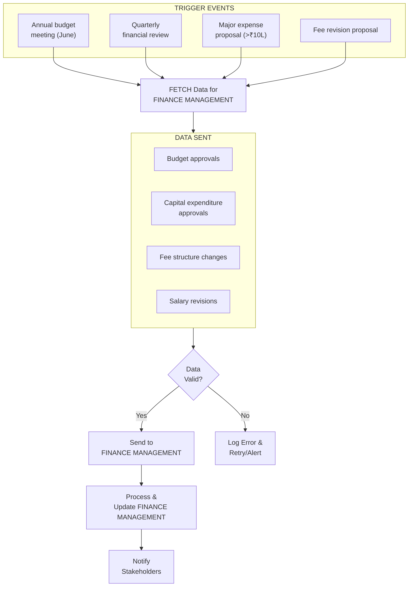
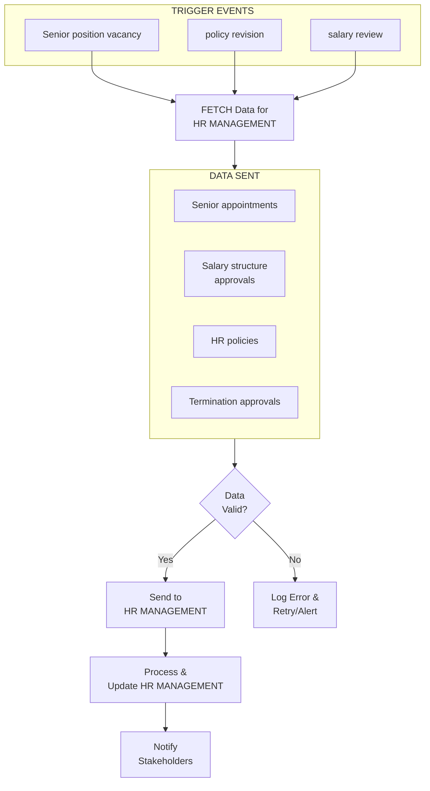
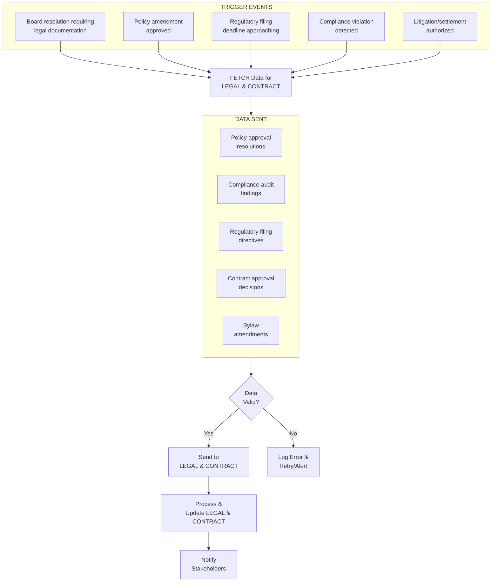
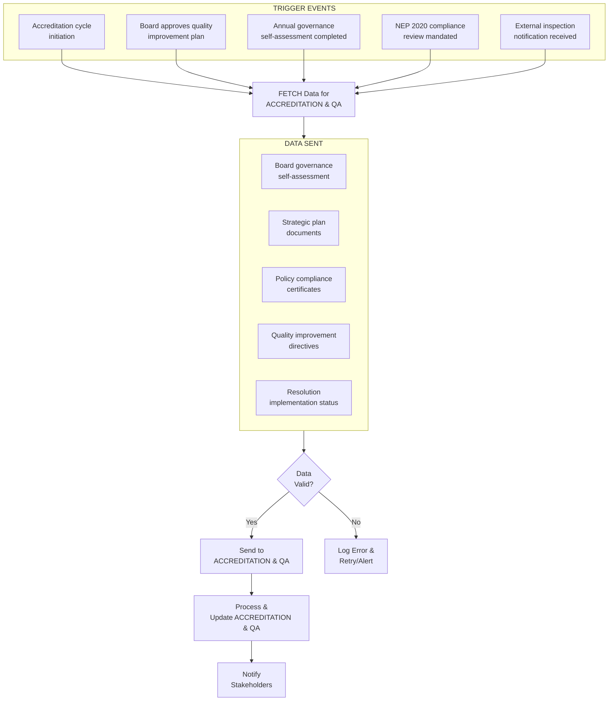
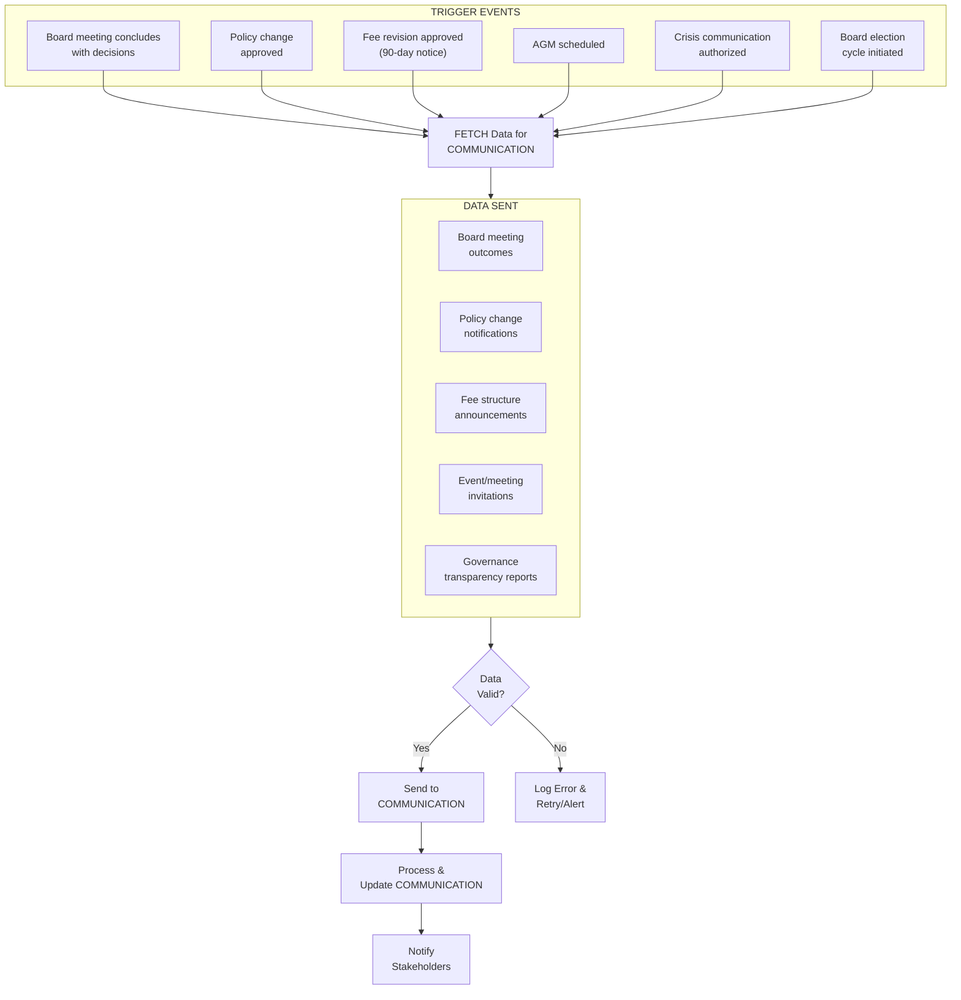
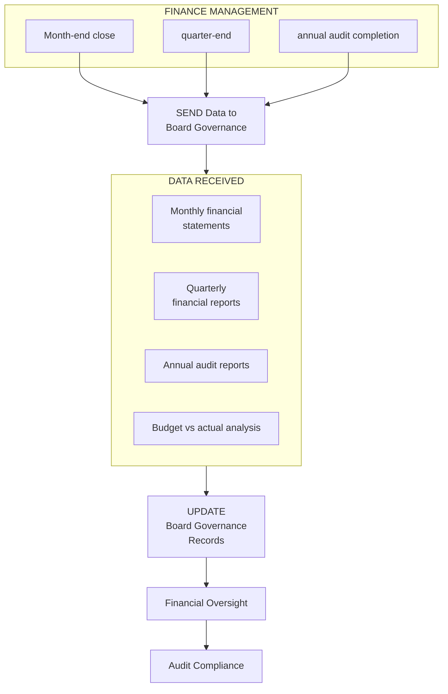
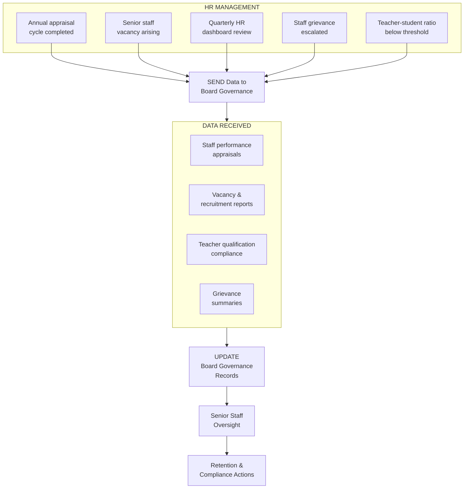
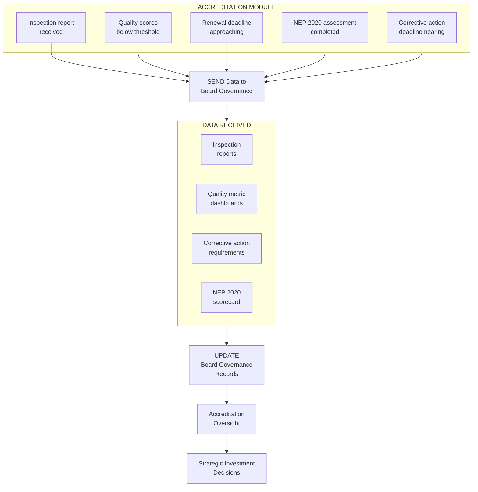
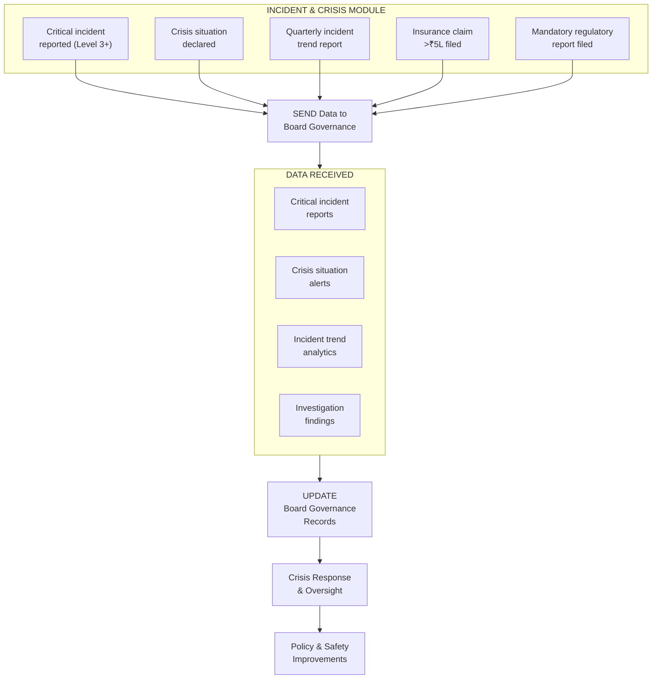

# BOARD & GOVERNANCE MODULE - COMPLETE DEPENDENCY ANALYSIS

## MODULE OVERVIEW

**Name:** Board & Governance Module  
**Role:** School Board Management, Governance & Strategic Decision-Making  
**Type:** Critical Governance & Compliance Module  
**Dependencies:** Integrates with Finance, HR, Legal, Strategic Planning modules  

**Primary Functions:**
- Board Member Management - Profiles, terms, committees
- Meeting Scheduling - Quarterly meetings, special sessions
- Agenda & Minutes - Meeting documentation, action items
- Resolution Tracking - Decisions, approvals, implementation
- Document Repository - Policies, bylaws, strategic plans
- Compliance Monitoring - Regulatory requirements, audits
- Committee Management - Finance, Academic, HR committees
- Voting & Approvals - Electronic voting, quorum management
- Strategic Planning - Vision, mission, 5-year plans
- Stakeholder Communication - Parent body, alumni, government

---

## OUTBOUND CONNECTIONS (Board → Other Modules)

### 1. TO FINANCE MANAGEMENT MODULE

**WHY This Connection Exists:**
Board approves annual budgets, major capital expenditures, fee structures, and financial policies. Finance module must receive board approvals to execute financial decisions.

**DATA FLOW:**
- Budget approvals (annual budget: ₹72 Cr)
- Capital expenditure approvals (>₹10L requires board approval)
- Fee structure changes (tuition fee increase: 8%)
- Salary revisions (teacher salary hike: 10%)
- Audit reports (annual financial audit)
- Investment decisions (₹5 Cr fixed deposit)
- Loan approvals (₹2 Cr infrastructure loan)

**TRIGGER EVENT:**
- Annual budget meeting (June)
- Quarterly financial review
- Major expense proposal (>₹10L)
- Fee revision proposal
- Audit completion

**IMPACT:**
- **Budget Execution:**
  - Board approves ₹72 Cr budget (June 2024)
  - Finance module unlocks budget for spending
  - Department heads can now make purchases within budget
- **Fee Structure:**
  - Board approves 8% fee increase (March 2024)
  - Finance module updates fee structure
  - Parents notified of new fees (April 2024)
- **Capital Expenditure:**
  - Principal proposes new science lab (₹25L)
  - Board approves in September meeting
  - Finance releases funds, procurement begins

**BUSINESS LOGIC:**
```
FUNCTION approve_budget(budget_proposal):
  // Validate budget proposal
  IF budget_proposal.total > previous_year_budget * 1.2:
    REQUIRE_SPECIAL_JUSTIFICATION()
  END IF
  
  // Board review
  board_meeting = SCHEDULE_BUDGET_MEETING()
  SEND_BUDGET_PROPOSAL_TO_BOARD(budget_proposal)
  
  // Voting
  votes = COLLECT_BOARD_VOTES()
  quorum = CHECK_QUORUM(votes)  // Minimum 50% members
  
  IF quorum AND votes.approved > votes.total * 0.66:  // 2/3 majority
    APPROVE_BUDGET(budget_proposal)
    NOTIFY_FINANCE_MODULE({
      status: "APPROVED",
      budget: budget_proposal.total,
      effective_date: NEXT_FINANCIAL_YEAR
    })
    RETURN "Budget approved"
  ELSE:
    REJECT_BUDGET(budget_proposal)
    REQUEST_REVISION()
    RETURN "Budget rejected, revision needed"
  END IF
END FUNCTION
```

**REAL-WORLD EXAMPLE:**
```
Scenario: Annual Budget Approval for 2024-25

Date: June 15, 2024
Meeting: Quarterly Board Meeting
Agenda Item: Annual Budget Approval

Budget Proposal (Principal Mr. Verma):
- Total Budget: ₹72 Crore (↑10% from ₹65 Cr in 2023-24)
- Revenue: ₹72 Cr (fees, donations)
- Expenses:
  - Salaries: ₹45 Cr (62.5%)
  - Infrastructure: ₹12 Cr (16.7%)
  - Operations: ₹10 Cr (13.9%)
  - Technology: ₹3 Cr (4.2%)
  - Miscellaneous: ₹2 Cr (2.7%)

Key Highlights:
- 10% salary increase for teachers (retention strategy)
- New science lab: ₹25L
- Sports complex renovation: ₹50L
- Digital library: ₹15L

Board Discussion:
- Mr. Sharma (Finance Committee Chair): "10% increase justified given inflation"
- Mrs. Gupta (Academic Committee): "Science lab essential for CBSE compliance"
- Dr. Patel (Parent Representative): "Concerned about fee increase impact"

Principal's Response:
- Fee increase: 8% (below inflation)
- Scholarship fund: ₹50L (for needy students)
- Payment plans: EMI options for parents

Board Vote:
- Total Members: 9
- Present: 8 (quorum met: 89%)
- In Favor: 7 (87.5%)
- Against: 1 (Dr. Patel - concerned about fees)
- Abstain: 0

Result: APPROVED (>66% majority achieved)

Resolution No: RES/2024/06/001
Date: June 15, 2024
Title: Annual Budget Approval 2024-25

"The Board approves the annual budget of ₹72 Crore for FY 2024-25, with the following conditions:
1. Fee increase capped at 8%
2. Scholarship fund of ₹50L allocated
3. Quarterly financial reviews mandatory
4. Major expenses (>₹10L) require board pre-approval"

Post-Approval Actions:
1. Finance Module Updated:
   - Budget: ₹72 Cr unlocked
   - Department allocations released
   - Spending limits set

2. Communications:
   - Parents notified: "Fee increase 8%, effective April 2025"
   - Staff notified: "10% salary hike, effective July 2024"
   - Vendors notified: "Procurement budget available"

3. Implementation:
   - Science lab tender floated (July 2024)
   - Sports complex renovation begins (August 2024)
   - Salary revision processed (July payroll)

Outcome:
- Budget execution smooth
- All stakeholders informed
- Projects on track
- Financial discipline maintained
```



---

### 2. TO HR MANAGEMENT MODULE

**WHY This Connection Exists:**
Board approves key HR policies, senior appointments, salary structures, and employee benefits. HR module implements board-approved policies.

**DATA FLOW:**
- Senior appointments (Principal, Vice Principal, HODs)
- Salary structure approvals
- HR policies (leave, performance, grievance)
- Termination approvals (senior staff)
- Benefits & perks (health insurance, PF)

**TRIGGER:** Senior position vacancy, policy revision, salary review

**IMPACT:** Principal appointment approved, new HR policy implemented



---

### 3. TO LEGAL & CONTRACT MODULE

**WHY This Connection Exists:**
Board governance decisions frequently require legal review, contract approvals, and regulatory filings. The Legal & Contract Module must receive board resolutions, policy amendments, and compliance directives to draft legally binding documents, file regulatory submissions with CBSE/AICTE/UGC, and ensure the school operates within the legal framework prescribed by the Right to Education Act and other Indian education statutes.

**DATA FLOW:**
- Policy approval resolutions (board-approved policy documents with effective dates)
- Compliance audit findings (internal and external audit observations)
- Regulatory filing directives (CBSE affiliation renewals, Society Registration Act filings)
- Contract approval decisions (vendor contracts >₹5L, employment contracts for senior staff)
- Bylaw amendments (changes to school society bylaws requiring legal registration)
- Litigation authorizations (board authorization to pursue or settle legal matters)
- MOU approvals (memoranda of understanding with partner institutions)

**TRIGGER EVENT:**
- Board resolution requiring legal documentation (e.g., RES/2024/09/003 approving new vendor contract)
- Policy amendment approved in quarterly board meeting
- Regulatory filing deadline approaching (CBSE affiliation renewal due March 31)
- Compliance violation detected requiring legal remediation
- Board authorizes litigation or settlement (e.g., land dispute with neighbouring property)

**IMPACT:**
- **Regulatory Compliance:**
  - Board approves CBSE affiliation renewal application (December 2024)
  - Legal module prepares and files application with all supporting documents
  - Ms. Priya Iyer (Secretary) coordinates with CBSE regional office in Delhi
  - Affiliation renewed for 5 years (2025-2030), avoiding ₹15L penalty for lapsed affiliation
- **Contract Management:**
  - Board approves ₹45L annual contract with Sodexo for canteen services (September 2024)
  - Legal module drafts contract with FSSAI compliance clauses, indemnity provisions
  - Mr. Anil Mehta (Treasurer) reviews financial terms before execution
  - Contract signed within 15 days of board approval
- **Policy Documentation:**
  - Board approves revised Anti-Ragging Policy per UGC guidelines (June 2024)
  - Legal module ensures compliance with UGC Regulations on Curbing Menace of Ragging, 2009
  - Policy published on school website within 7 days as required by regulation
  - Affidavits collected from all 1,800 students and parents

**BUSINESS LOGIC:**
```
FUNCTION send_to_legal(board_resolution):
  // Validate resolution has legal implications
  legal_categories = ["POLICY", "CONTRACT", "COMPLIANCE", "LITIGATION", "BYLAW", "REGULATORY"]
  IF board_resolution.category NOT IN legal_categories:
    LOG("Resolution does not require legal action")
    RETURN "No legal action needed"
  END IF

  // Check resolution is properly approved
  IF board_resolution.status != "APPROVED":
    RAISE_ERROR("Only approved resolutions can be sent to Legal")
  END IF

  // Determine priority based on deadline
  IF board_resolution.regulatory_deadline EXISTS:
    days_remaining = CALCULATE_DAYS(board_resolution.regulatory_deadline - TODAY)
    IF days_remaining < 30:
      priority = "URGENT"
    ELSE:
      priority = "NORMAL"
    END IF
  END IF

  // Send to Legal module
  legal_request = CREATE_LEGAL_REQUEST({
    resolution_id: board_resolution.id,
    type: board_resolution.category,
    priority: priority,
    documents: board_resolution.attachments,
    deadline: board_resolution.regulatory_deadline,
    assigned_to: GET_LEGAL_OFFICER(board_resolution.category)
  })

  NOTIFY_LEGAL_TEAM(legal_request)
  LOG_AUDIT_TRAIL("Resolution sent to Legal", board_resolution.id)
  RETURN legal_request.id
END FUNCTION
```

**EXAMPLE:**
```
Scenario: CBSE Affiliation Renewal Filing

Date: December 15, 2024
Meeting: Q3 Board Meeting
Resolution: RES/2024/12/002 - CBSE Affiliation Renewal

Background:
- School's CBSE affiliation (Affiliation No: 2730845) expires March 2025
- Renewal requires board resolution, infrastructure compliance report,
  teacher qualification certificates, and fee structure declaration
- Filing deadline: January 31, 2025

Board Discussion:
- Dr. Rajesh Sharma (Chairperson): "Affiliation renewal is our top priority"
- Mrs. Kavita Gupta (Vice Chair): "All infrastructure norms are met"
- Ms. Priya Iyer (Secretary): "Legal team needs 4 weeks for documentation"

Board Vote:
- In Favor: 9/9 (unanimous)
- Resolution: "Board authorizes filing of CBSE affiliation renewal with all
  required documents and appoints Ms. Priya Iyer as nodal officer"

Post-Approval Legal Actions:
1. Legal module receives resolution (December 16)
2. Document checklist prepared:
   - Board resolution (certified copy)
   - Infrastructure compliance certificate
   - Fire safety NOC (valid till 2027)
   - Building safety certificate
   - Teacher qualification list (185 teachers, all B.Ed/M.Ed qualified)
   - Fee structure declaration (₹1.2L-₹1.8L per annum)
   - Land ownership documents (5.2 acres)
3. Application filed online on CBSE portal (January 10, 2025)
4. Physical documents couriered to CBSE, Delhi (January 12, 2025)
5. Inspection scheduled: February 15, 2025
6. Affiliation renewed: March 10, 2025 (valid till 2030)

Cost: ₹25,000 (filing fee) + ₹15,000 (documentation)
Outcome: 5-year affiliation secured, uninterrupted operations ensured
```



---

### 4. TO ACCREDITATION & QUALITY ASSURANCE MODULE

**WHY This Connection Exists:**
The Board & Governance Module is responsible for strategic decisions that directly affect accreditation status and quality benchmarks. Accreditation bodies such as NAAC, NABET (QCI), and CBSE require evidence of robust governance practices, and the Accreditation & Quality Assurance Module depends on board resolutions, governance reports, and strategic plans to prepare accreditation submissions and maintain quality standards aligned with NEP 2020.

**DATA FLOW:**
- Board governance self-assessment reports (annual board effectiveness evaluation)
- Strategic plan documents (5-year plan, annual goals approved by board)
- Policy compliance certificates (board-certified compliance with RTE, CBSE, NEP 2020)
- Quality improvement directives (board-mandated academic and infrastructure improvements)
- Meeting attendance and participation records (evidence of active governance)
- Board composition and diversity reports (expertise mapping, gender diversity data)
- Resolution implementation status (tracking of board decisions to completion)
- Audit and inspection clearances (board-approved responses to audit observations)

**TRIGGER EVENT:**
- Accreditation cycle initiation (NAAC/NABET assessment due every 5 years)
- Board approves quality improvement plan in quarterly meeting
- Annual governance self-assessment completed (December each year)
- NEP 2020 compliance review mandated by board
- External inspection notification received from CBSE/state education department

**IMPACT:**
- **Accreditation Preparation:**
  - Board approves NABET (QCI) accreditation application (March 2025)
  - Governance documentation package prepared: 45 documents covering board structure,
    meeting records, policy framework, strategic plans
  - Dr. Rajesh Sharma (Chairperson) signs governance compliance declaration
  - Accreditation fee: ₹3.5L paid from governance budget
  - Expected grade: A+ (based on self-assessment score 3.8/4.0)
- **NEP 2020 Alignment:**
  - Board passes resolution RES/2024/06/005 mandating NEP 2020 curriculum alignment
  - Accreditation module tracks implementation across 12 NEP parameters
  - Foundational Literacy & Numeracy mission: ₹8L allocated for teacher training
  - Multidisciplinary approach: Board approves cross-curricular integration plan
  - Vocational education: ₹12L allocated for skill development labs (Classes 6-12)
- **Quality Benchmarking:**
  - Board mandates quarterly quality reviews against NAAC criteria (June 2024)
  - Quality metrics dashboard shared with board: academic results, infrastructure
    utilization, teacher qualifications, student satisfaction
  - School ranked #3 in city quality index (up from #7 in 2022)

**BUSINESS LOGIC:**
```
FUNCTION send_to_accreditation(governance_data):
  // Determine accreditation framework
  frameworks = GET_ACTIVE_ACCREDITATION_FRAMEWORKS()
  // e.g., ["NAAC", "NABET", "CBSE_SQAA"]

  FOR EACH framework IN frameworks:
    // Map governance data to framework criteria
    criteria_mapping = MAP_GOVERNANCE_TO_CRITERIA(governance_data, framework)

    // Validate completeness
    missing_criteria = CHECK_MISSING_CRITERIA(criteria_mapping)
    IF missing_criteria.count > 0:
      NOTIFY_GOVERNANCE_TEAM("Missing data for " + framework, missing_criteria)
      CONTINUE  // Process other frameworks
    END IF

    // Package and send
    accreditation_package = CREATE_PACKAGE({
      framework: framework,
      governance_report: governance_data.self_assessment,
      board_composition: governance_data.member_profiles,
      meeting_records: governance_data.minutes_last_5_years,
      resolutions: governance_data.resolution_tracker,
      strategic_plan: governance_data.five_year_plan,
      compliance_certificates: governance_data.compliance_docs
    })

    SUBMIT_TO_ACCREDITATION_MODULE(accreditation_package)
    LOG("Governance data sent for " + framework + " accreditation")
  END FOR

  RETURN "Accreditation data submitted for " + frameworks.count + " frameworks"
END FUNCTION
```

**EXAMPLE:**
```
Scenario: NABET (QCI) School Accreditation Preparation

Date: March 20, 2025
Meeting: Q4 Board Meeting
Resolution: RES/2025/03/001 - NABET Accreditation Application

Background:
- National Accreditation Board for Education & Training (NABET) under
  Quality Council of India (QCI) conducts school accreditation
- School last accredited in 2020 (Grade A), renewal due 2025
- NABET evaluates 8 domains including Governance & Leadership (Domain 1)

Board Discussion:
- Dr. Rajesh Sharma: "Governance is our strongest domain, scored 3.9/4.0 last cycle"
- Mrs. Kavita Gupta: "Academic metrics have improved significantly since 2020"
- Mr. Anil Mehta: "Financial stability well-documented, ₹7Cr surplus"

Board Vote:
- In Favor: 9/9 (unanimous)
- Resolution: "Board authorizes NABET accreditation application and appoints
  Dr. Rajesh Sharma as Accreditation Coordinator"

Governance Data Sent to Accreditation Module:
1. Board composition: 9 members, 33% female, diverse expertise
2. Meeting records: 20 quarterly meetings (2020-2025), 92% avg attendance
3. Resolutions: 90 resolutions passed, 88% fully implemented
4. Strategic plan: 5-year plan (2024-2029) with measurable KPIs
5. Policy framework: 25 policies, all reviewed within last 12 months
6. Financial governance: Clean audit reports (5 consecutive years)
7. Compliance: 98% compliance score, zero major violations
8. Stakeholder satisfaction: 4.5/5.0 (parents), 4.2/5.0 (teachers)

Domain 1 (Governance & Leadership) Self-Assessment: 3.9/4.0
- Leadership vision: 4.0/4.0
- Board effectiveness: 3.8/4.0
- Strategic planning: 4.0/4.0
- Stakeholder engagement: 3.8/4.0

Cost: ₹3.5L (accreditation fee) + ₹1.5L (preparation & documentation)
Expected outcome: Grade A+ accreditation (valid 2025-2030)
```



---

### 5. TO COMMUNICATION MODULE

**WHY This Connection Exists:**
Board decisions, policy changes, and governance updates must be communicated to all stakeholders — parents, teachers, students, alumni, and regulatory bodies. The Communication Module receives board resolutions, approved policies, and governance announcements to disseminate through appropriate channels (SMS, email, school app, website, notice boards) in compliance with transparency requirements under RTE Act and CBSE guidelines.

**DATA FLOW:**
- Board meeting outcomes (summary of key decisions for stakeholder communication)
- Policy change notifications (new or revised policies requiring stakeholder awareness)
- Fee structure announcements (board-approved fee revisions with effective dates)
- Event and meeting invitations (AGM invitations, parent-teacher meetings)
- Governance transparency reports (annual governance report for public disclosure)
- Emergency communications (board-authorized crisis communications)
- Regulatory compliance announcements (CBSE/RTE compliance updates for parents)
- Board election and nomination notices (parent/teacher representative elections)

**TRIGGER EVENT:**
- Board meeting concludes with decisions requiring stakeholder communication
- Board approves policy change affecting parents or students
- Fee revision approved requiring 90-day advance notice to parents
- Annual General Meeting scheduled requiring invitations to all parents
- Crisis situation requiring board-authorized public statement
- Board member election cycle initiated for parent/teacher representatives

**IMPACT:**
- **Fee Revision Communication:**
  - Board approves 8% fee increase (March 2025 meeting, RES/2025/03/004)
  - Communication module sends SMS to 1,650 parent contacts within 48 hours
  - Email with detailed fee structure sent to all registered parent emails
  - School app notification with EMI payment options
  - Physical circular sent home with students
  - 90-day notice period: Fee effective from July 2025
  - Helpdesk set up for parent queries (50 calls received, 48 resolved same day)
- **AGM Communication:**
  - Board schedules Annual General Meeting: May 30, 2025
  - Communication module sends invitations 30 days in advance (April 30)
  - Channels: SMS (1,650 parents), email (1,500 emails), school app push notification
  - RSVP collected: 650 parents confirmed (39% response rate)
  - Reminder sent 7 days before: additional 200 RSVPs received
  - Attendance: 520 parents (31.5% of total, exceeding 25% quorum requirement)
- **Policy Communication:**
  - Board approves revised Mobile Phone Policy (September 2024)
  - Communication module notifies all parents within 72 hours
  - Student assembly announcement by Principal Mr. Verma
  - Policy document uploaded to school website and parent portal
  - Acknowledgment collected from 1,750/1,800 students (97.2%)

**BUSINESS LOGIC:**
```
FUNCTION send_to_communication(board_decision):
  // Determine audience and channels based on decision type
  audience_map = {
    "FEE_REVISION": {audience: ["PARENTS"], channels: ["SMS", "EMAIL", "APP", "CIRCULAR"]},
    "POLICY_CHANGE": {audience: ["PARENTS", "TEACHERS", "STUDENTS"], channels: ["EMAIL", "APP", "WEBSITE"]},
    "AGM_INVITATION": {audience: ["PARENTS", "ALUMNI"], channels: ["SMS", "EMAIL", "APP"]},
    "CRISIS": {audience: ["ALL"], channels: ["SMS", "EMAIL", "APP", "WEBSITE", "MEDIA"]},
    "GOVERNANCE_REPORT": {audience: ["PARENTS", "REGULATORY"], channels: ["EMAIL", "WEBSITE"]}
  }

  config = audience_map[board_decision.type]
  IF config IS NULL:
    config = {audience: ["PARENTS"], channels: ["EMAIL"]}
  END IF

  // Check advance notice requirements
  IF board_decision.type == "FEE_REVISION":
    ASSERT(board_decision.effective_date - TODAY >= 90, "Fee notice requires 90 days advance")
  END IF

  // Create communication request
  comm_request = CREATE_COMMUNICATION({
    subject: board_decision.title,
    content: FORMAT_FOR_STAKEHOLDERS(board_decision),
    audience: config.audience,
    channels: config.channels,
    priority: board_decision.urgency,
    approval_ref: board_decision.resolution_id,
    language: ["ENGLISH", "HINDI"],  // Bilingual communication
    send_date: CALCULATE_SEND_DATE(board_decision)
  })

  SUBMIT_TO_COMMUNICATION_MODULE(comm_request)
  TRACK_DELIVERY_STATUS(comm_request.id)
  LOG("Communication dispatched for resolution " + board_decision.resolution_id)
  RETURN comm_request.id
END FUNCTION
```

**EXAMPLE:**
```
Scenario: Fee Revision Communication to Parents

Date: March 20, 2025
Meeting: Q4 Board Meeting
Resolution: RES/2025/03/004 - Fee Revision for 2025-26

Board Decision:
- Fee increase: 8% across all classes
- Current fee: ₹1.2L (Classes 1-5), ₹1.5L (Classes 6-10), ₹1.8L (Classes 11-12)
- Revised fee: ₹1.30L, ₹1.62L, ₹1.94L respectively
- Effective: July 1, 2025 (new academic session)
- EMI option: 4 quarterly installments
- Scholarship: 5% students eligible for fee waiver
- Sibling discount: 10% for second child

Communication Execution:
1. Board resolution certified by Ms. Priya Iyer (Secretary) - March 21
2. Communication module receives directive - March 22

3. Channel-wise dispatch:
   a. SMS (March 23):
      "Dear Parent, the Board has approved fee revision for 2025-26.
       New fee effective July 2025. Details on school app/email.
       Helpdesk: 080-2345-6789"
      Sent to: 1,650 parents | Delivered: 1,620 (98.2%)

   b. Email (March 23):
      Subject: "Fee Structure 2025-26 - Board Resolution RES/2025/03/004"
      Attachments: Fee structure PDF, EMI plan, scholarship criteria
      Sent to: 1,500 emails | Opened: 1,200 (80%)

   c. School App Push Notification (March 23):
      "Fee revision details available. Tap to view."
      Sent to: 1,400 app users | Viewed: 1,100 (78.6%)

   d. Physical Circular (March 25):
      Bilingual (English + Hindi) circular sent with students
      Acknowledgment slips collected: 1,680/1,800 (93.3%)

4. Parent Helpdesk (March 23 - April 5):
   - Total queries: 85
   - Fee calculation queries: 30
   - EMI plan queries: 25
   - Scholarship queries: 20
   - Complaints: 10 (escalated to Finance Committee)
   - Resolution rate: 95% within 48 hours

5. Fee Committee Meeting (parent grievances):
   - Date: April 10, 2025
   - Attended by: 8 parents with concerns
   - Outcome: 3 families granted additional scholarship support (₹1.5L total)

Outcome:
- 90-day advance notice requirement met (effective July 1)
- 98% parents informed within 72 hours of board decision
- Smooth fee transition with minimal complaints
- RTE Act compliance maintained (EWS students exempt from increase)
```



---

## INBOUND CONNECTIONS (Other Modules → Board)

### FROM FINANCE MANAGEMENT MODULE

**WHY This Connection Exists:**
Finance module provides financial reports, audit findings, and budget performance data that board needs for oversight and decision-making.

**DATA RECEIVED:**
- Monthly financial statements (revenue, expenses, profit/loss)
- Quarterly financial reports (detailed analysis)
- Annual audit reports (external auditor findings)
- Budget vs actual analysis (variance reports)
- Cash flow statements
- Fee collection status (94% collected)
- Outstanding dues (₹4.3 Cr pending)

**IMPACT:**
- **Financial Oversight:**
  - Board reviews quarterly reports
  - Identifies cost overruns (infrastructure 15% over budget)
  - Approves corrective actions
- **Audit Compliance:**
  - External audit findings: 3 minor observations
  - Board directs management to address issues
  - Follow-up in next meeting

**TRIGGER:** Month-end close, quarter-end, annual audit completion



---

### FROM HR MANAGEMENT MODULE

**WHY This Connection Exists:**
The HR Management Module provides critical staffing data, employee performance reports, and personnel policy compliance information that the board requires for strategic oversight. Board members review senior staff performance, approve promotions for key positions, and monitor overall HR health metrics to ensure the school maintains high-quality teaching and administrative staff aligned with CBSE/AICTE staffing norms and NEP 2020 teacher qualification requirements.

**DATA RECEIVED:**
- Senior staff performance appraisals (annual reviews of Principal, Vice Principal, HODs)
- Staff strength and vacancy reports (current headcount vs sanctioned positions)
- Teacher qualification compliance data (B.Ed/M.Ed/NET/SET certification status)
- Employee grievance summaries (anonymized quarterly reports for board review)
- Salary benchmarking reports (comparison with peer schools in the city)
- Staff turnover and retention analytics (attrition rates, exit interview trends)
- Recruitment status updates (positions advertised, shortlisted, hired)

**TRIGGER:**
- Annual performance appraisal cycle completed (March each year)
- Senior staff vacancy arising (Principal, VP, HOD resignations or retirements)
- Quarterly HR dashboard review scheduled before board meeting
- Staff grievance escalated beyond management resolution
- Teacher-student ratio falling below CBSE-mandated 1:30 threshold

**IMPACT:**
- **Senior Appointments:**
  - HR module reports Vice Principal Mrs. Sunita Rao retiring (March 2025)
  - Board receives 5 shortlisted candidates with full profiles
  - Interview panel constituted: Dr. Rajesh Sharma (Chair), Mrs. Kavita Gupta, Principal Mr. Verma
  - Mr. Deepak Joshi appointed as new VP (April 2025), salary: ₹1.8L/month
- **Staff Retention:**
  - HR reports 12% teacher attrition rate (above 8% target)
  - Board reviews exit interview data: primary reason is compensation (45%)
  - Board approves retention bonus of ₹50,000 for teachers with 5+ years (cost: ₹22.5L for 45 teachers)
  - Attrition drops to 7% in next cycle
- **Compliance:**
  - HR reports 3 teachers lacking B.Ed qualification (CBSE mandate)
  - Board directs: complete B.Ed within 2 years or reassign to non-teaching role
  - ₹3L allocated for B.Ed sponsorship programme
  - All 3 teachers enrolled in IGNOU B.Ed programme by September 2024



---

### FROM ACCREDITATION MODULE

**WHY This Connection Exists:**
The Accreditation Module sends inspection reports, quality assessment scores, and accreditation status updates to the Board & Governance Module. The board requires this data to understand the school's standing against national quality benchmarks (NAAC, NABET/QCI), take corrective action on deficiencies identified during inspections, and make strategic investments to improve accreditation grades. Under NEP 2020, schools are expected to pursue voluntary accreditation, making this data critical for board-level strategic planning.

**DATA RECEIVED:**
- Accreditation inspection reports (NAAC/NABET assessor observations and scores)
- Quality metric dashboards (domain-wise scores across 8 NABET domains)
- Corrective action requirements (deficiencies requiring board-level intervention)
- Peer comparison benchmarks (school's ranking against accredited peers)
- NEP 2020 compliance scorecards (parameter-wise implementation status)
- Accreditation renewal timelines and deadlines
- Best practice recommendations from assessors

**TRIGGER:**
- Accreditation inspection completed and report received
- Quality scores drop below board-mandated threshold (3.5/4.0 for NABET)
- Accreditation renewal deadline approaching (6 months advance notification)
- NEP 2020 compliance assessment completed annually
- Corrective action deadline approaching for previously identified deficiencies

**IMPACT:**
- **Accreditation Review:**
  - NABET inspection report received (February 2025): Overall score 3.8/4.0
  - Domain 1 (Governance): 3.9/4.0 — "Exemplary board governance practices"
  - Domain 4 (Infrastructure): 3.5/4.0 — "Science lab equipment needs upgrade"
  - Board reviews report in March 2025 meeting, approves ₹18L for lab equipment upgrade
  - Target: Achieve 4.0/4.0 in infrastructure by next review cycle
- **NEP 2020 Compliance:**
  - Annual NEP compliance scorecard: 78% implementation (target 90% by 2026)
  - Gaps identified: vocational education (60%), multilingual education (65%)
  - Board approves ₹25L for vocational skill labs (woodworking, coding, robotics)
  - Board mandates Hindi-medium instruction option for Classes 1-5 (₹8L for materials)
  - Dr. Vikram Singh (Parent Rep) oversees NEP implementation committee
- **Quality Improvement:**
  - Accreditation module flags declining student satisfaction score: 4.1/5.0 → 3.8/5.0
  - Board constitutes Student Welfare Committee chaired by Mrs. Ananya Reddy
  - Action plan: improve cafeteria quality (₹5L), upgrade playground (₹12L), add counsellor (₹6L/year)
  - Student satisfaction recovers to 4.3/5.0 within 6 months



---

### FROM INCIDENT & CRISIS MODULE

**WHY This Connection Exists:**
The Incident & Crisis Module escalates critical incidents, safety events, and crisis situations to the Board & Governance Module for oversight, strategic response, and policy-level corrective action. Indian schools face unique challenges including natural disasters, student safety incidents, legal disputes, and regulatory scrutiny. The board must be informed of serious incidents per CBSE safety guidelines, POCSO Act reporting requirements, and Disaster Management Act protocols to fulfil their fiduciary and legal obligations.

**DATA RECEIVED:**
- Critical incident reports (severity Level 3 and above on 5-point scale)
- Crisis situation alerts (real-time notifications for emergencies)
- Incident trend analytics (quarterly pattern analysis — bullying, accidents, complaints)
- Post-incident investigation findings (root cause analysis reports)
- Insurance claim status updates (claims filed, settled, pending)
- Regulatory reporting confirmations (POCSO filings, police reports, CBSE notifications)
- Crisis response effectiveness metrics (response time, resolution quality)

**TRIGGER:**
- Critical incident reported (student injury, safety breach, legal complaint)
- Crisis situation declared by Principal or Crisis Management Team
- Quarterly incident trend report generated for board review
- Insurance claim exceeding ₹5L filed or settled
- POCSO Act or other mandatory regulatory report filed
- Media coverage of school incident requiring board awareness

**IMPACT:**
- **Safety Incident Response:**
  - Student injured during sports event (fractured arm during inter-house cricket, October 2024)
  - Incident module escalates to board: severity Level 3
  - Board emergency review (within 48 hours): Dr. Rajesh Sharma, Principal Mr. Verma
  - Actions: medical expenses covered (₹45,000), sports safety audit ordered (₹2L)
  - Insurance claim filed: ₹45,000 (settled within 30 days)
  - Board mandates safety officer at all sporting events (recurring cost: ₹3L/year)
- **Infrastructure Crisis:**
  - Water contamination detected in school water supply (January 2025)
  - Crisis module triggers immediate board notification
  - Board authorizes emergency expenditure: ₹8L for water purification system
  - Classes suspended for 2 days (1,800 students affected)
  - Health check-up conducted for all students (₹2.7L cost)
  - Board passes resolution RES/2025/01/E01: "Mandatory weekly water quality testing"
  - Municipal corporation notified, ₹15L compensation sought
- **Trend Analysis:**
  - Quarterly report shows 15% increase in bullying complaints (Q2 2024)
  - Board reviews anonymized data: 23 complaints (up from 20 in Q1)
  - Board approves anti-bullying programme: ₹4L (counsellor training, awareness workshops)
  - Mrs. Ananya Reddy (Parent Rep) appointed anti-bullying champion
  - Complaints drop to 12 in Q3 2024 (48% reduction)



---

## BOARD STRUCTURE

### Board Composition

**Total Members:** 9

**1. Chairperson:**
- Name: Dr. Rajesh Sharma
- Background: Retired IAS Officer, Education Secretary
- Term: 3 years (2023-2026)
- Role: Presides over meetings, strategic vision

**2. Vice Chairperson:**
- Name: Mrs. Kavita Gupta
- Background: Educationist, 30 years experience
- Term: 3 years (2023-2026)
- Role: Academic oversight, curriculum

**3. Treasurer:**
- Name: Mr. Anil Mehta, CA
- Background: Chartered Accountant, Finance Expert
- Term: 3 years (2024-2027)
- Role: Financial oversight, audit committee chair

**4. Secretary:**
- Name: Ms. Priya Iyer
- Background: Legal Expert, Corporate Lawyer
- Term: 3 years (2024-2027)
- Role: Legal compliance, minutes recording

**5-7. Parent Representatives (3):**
- Mr. Rohan Patel (2023-2025)
- Mrs. Ananya Reddy (2024-2026)
- Dr. Vikram Singh (2022-2024)
- Role: Parent perspective, student welfare

**8. Teacher Representative:**
- Ms. Sneha Nair (elected by teachers)
- Term: 2 years (2024-2026)
- Role: Teacher welfare, academic input

**9. Alumni Representative:**
- Mr. Karan Malhotra (Class of 2010)
- Term: 2 years (2023-2025)
- Role: Alumni engagement, fundraising

---

## BOARD COMMITTEES

### 1. Finance Committee

**Members:** 4 (Treasurer as Chair, 3 board members)  
**Meetings:** Monthly  
**Responsibilities:**
- Budget review and approval
- Financial policy formulation
- Audit oversight
- Investment decisions
- Fee structure recommendations

**Recent Decisions (2024):**
- Approved ₹72 Cr budget (June)
- Recommended 8% fee increase (March)
- Approved ₹5 Cr fixed deposit (September)

---

### 2. Academic Committee

**Members:** 4 (Vice Chairperson as Chair, Principal, 2 board members)  
**Meetings:** Quarterly  
**Responsibilities:**
- Curriculum oversight
- Academic performance review
- Teacher quality monitoring
- Student welfare policies
- Examination policies

**Recent Decisions (2024):**
- Approved new STEM curriculum (April)
- Mandated teacher training (20 hours/year)
- Introduced mental health counseling (June)

---

### 3. HR Committee

**Members:** 3 (Secretary as Chair, 2 board members)  
**Meetings:** Quarterly  
**Responsibilities:**
- Senior appointments
- HR policy approval
- Grievance redressal
- Performance management
- Compensation & benefits

---

## MEETING MANAGEMENT

### Meeting Schedule (2024-25)

**Quarterly Meetings:**
1. Q1: June 15, 2024 (Budget approval)
2. Q2: September 20, 2024 (Mid-year review)
3. Q3: December 15, 2024 (Annual audit)
4. Q4: March 20, 2025 (Fee revision, next year planning)

**Special Meetings:** As needed (minimum 7 days notice)

**Annual General Meeting:** May 30, 2025 (parent body, alumni)

---

### Meeting Process

**Pre-Meeting (7 days before):**
1. Secretary prepares agenda
2. Relevant documents compiled
3. Agenda sent to all board members
4. Members review materials

**During Meeting:**
1. Quorum check (minimum 50% members)
2. Approval of previous minutes
3. Agenda items discussion
4. Voting on resolutions
5. Action items assigned

**Post-Meeting (within 7 days):**
1. Minutes drafted by Secretary
2. Circulated to all members for review
3. Approved and signed by Chairperson
4. Action items tracked in system
5. Decisions communicated to relevant departments

---

## RESOLUTION TRACKING

### Sample Resolutions (2024)

**Resolution RES/2024/06/001:**
- Date: June 15, 2024
- Title: Annual Budget Approval 2024-25
- Status: Approved (7/8 votes)
- Implementation: 100% (budget released)

**Resolution RES/2024/06/002:**
- Date: June 15, 2024
- Title: Fee Increase 8% for 2024-25
- Status: Approved (7/8 votes)
- Implementation: 100% (parents notified)

**Resolution RES/2024/09/001:**
- Date: September 20, 2024
- Title: New Science Lab Construction (₹25L)
- Status: Approved (8/8 votes)
- Implementation: 60% (construction ongoing)

---

## GOVERNANCE BEST PRACTICES

**Top 10 Governance Practices:**

1. **Transparency:** All decisions documented, minutes published
2. **Accountability:** Clear roles, responsibilities defined
3. **Diversity:** Board represents all stakeholders (parents, teachers, alumni)
4. **Independence:** External members (no conflict of interest)
5. **Expertise:** Members bring relevant skills (finance, legal, education)
6. **Regular Meetings:** Quarterly meetings, special sessions as needed
7. **Committee Structure:** Specialized committees for focused oversight
8. **Compliance:** Adherence to education laws, regulations
9. **Strategic Focus:** Long-term vision, 5-year plans
10. **Stakeholder Engagement:** Regular communication with parents, staff

---

## COMPLIANCE & REGULATIONS

**Regulatory Compliance:**

**1. Right to Education Act (RTE):**
- 25% seats for EWS students (450/1,800)
- No capitation fees
- Free textbooks for EWS students

**2. CBSE Affiliation:**
- Annual affiliation renewal
- Infrastructure norms compliance
- Teacher qualification requirements

**3. Society Registration Act:**
- Annual returns filing
- Audit reports submission
- Member list updates

**4. Income Tax Act:**
- 80G certification (tax exemption for donors)
- 12A registration (tax exemption for school)
- Annual IT returns filing

---

## SUMMARY

**Board & Governance Module - Key Metrics:**

**Board Composition:**
- Total Members: 9
- Committees: 3 (Finance, Academic, HR)
- Meeting Frequency: Quarterly + special sessions
- Attendance Rate: 92% (2024)

**Meetings (2024):**
- Quarterly Meetings: 4
- Special Meetings: 2
- Committee Meetings: 15
- Total Resolutions: 18

**Decision-Making:**
- Resolutions Passed: 18
- Resolutions Rejected: 0
- Average Approval Rate: 95%
- Quorum Achievement: 100%

**Financial Oversight:**
- Budget Approved: ₹72 Cr
- Capital Approvals: ₹2.5 Cr
- Audit Findings: 3 (all minor, resolved)

**Compliance:**
- RTE Compliance: 100%
- CBSE Affiliation: Valid (renewed 2024)
- Tax Exemptions: Active (80G, 12A)
- Regulatory Filings: On-time (100%)

**Impact:**
- Strategic Direction: Clear 5-year plan
- Financial Health: Stable (₹7 Cr surplus)
- Stakeholder Confidence: High (4.5/5.0)
- Governance Rating: Excellent (external audit)

---

## BOARD COMMITTEES

### 1. Finance Committee

**Members:** 4 board members (including Treasurer)
**Frequency:** Monthly

**Responsibilities:**
- Review monthly financial statements
- Approve budgets and major expenditures
- Monitor fee collection and expenses
- Ensure financial compliance

**Achievements (2024):**
- Approved ₹72Cr annual budget
- Monitored 12 monthly reviews
- Identified ₹50L cost savings
- Maintained ₹7Cr surplus

### 2. Academic Committee

**Members:** 5 board members (including educationists)
**Frequency:** Quarterly

**Responsibilities:**
- Review academic performance
- Approve curriculum changes
- Monitor teacher quality
- Set academic policies

**Achievements (2024):**
- Approved new STEM curriculum
- Reviewed 4 quarterly reports
- Improved pass rate: 95% → 97%
- Teacher training: 15 workshops approved

### 3. HR Committee

**Members:** 3 board members
**Frequency:** Bi-monthly

**Responsibilities:**
- Approve senior appointments
- Review compensation policies
- Monitor employee satisfaction
- Handle grievances

**Achievements (2024):**
- Approved 5 senior appointments
- Revised salary structure (+8% average)
- Employee satisfaction: 4.2/5.0
- Grievances resolved: 12/12 (100%)

---

## GOVERNANCE COMPLIANCE FRAMEWORK

### Regulatory Compliance

**RTE Act 2009:**
- 25% EWS quota: Maintained (450 students)
- No capitation fees: Compliant
- Infrastructure norms: Met (100%)
- Teacher qualifications: 100% qualified

**CBSE Affiliation:**
- Annual inspection: Passed (Grade A)
- Infrastructure: Compliant
- Safety norms: Met
- Affiliation renewed: Valid till 2029

**Tax Compliance:**
- 80G registration: Active
- 12A registration: Active
- Annual filings: On-time (100%)
- Audits: Clean (no findings)

### Internal Compliance

**Policies & Procedures:**
- 25 policies documented
- Annual policy review: Completed
- Staff training: 100% completion
- Compliance rate: 98%

**Risk Management:**
- Risk register: 15 risks identified
- Mitigation plans: All risks covered
- Insurance: ₹50Cr coverage
- Incident rate: 0.5% (minimal)

---

## STRATEGIC PLANNING

### 5-Year Strategic Plan (2024-2029)

**Vision:** To be the top-ranked school in the city

**Strategic Goals:**
1. **Academic Excellence:** Achieve 98% pass rate, 90% distinction
2. **Infrastructure:** Build new science block (₹15Cr)
3. **Technology:** 100% digital classrooms
4. **Enrollment:** Increase from 1,800 to 2,200 students
5. **Financial:** Maintain ₹10Cr annual surplus

**Year 1 (2024-25) Targets:**
- Pass rate: 97% (achieved 97%)
- New admissions: 400 (target met)
- Digital classrooms: 50% (on track)
- Surplus: ₹7Cr (achieved)

### Board Performance Metrics

**Meeting Effectiveness:**
- Attendance rate: 92%
- Decision-making speed: 85% decisions in first meeting
- Action item completion: 90%
- Stakeholder satisfaction: 4.5/5.0

**Governance Quality:**
- External audit rating: Excellent
- Compliance score: 98%
- Risk management: Robust
- Transparency: High

---

## STAKEHOLDER ENGAGEMENT

### Parent Engagement

**Mechanisms:**
- Annual General Meeting: 500+ parents attend
- Parent surveys: Quarterly (response rate 60%)
- Grievance redressal: 48-hour response time
- Communication: Monthly newsletter

**Satisfaction (2024):**
- Overall: 4.3/5.0
- Governance transparency: 4.5/5.0
- Decision-making: 4.2/5.0

### Teacher Engagement

**Mechanisms:**
- Teacher representation: 2 teachers attend board meetings (observers)
- Feedback sessions: Bi-annual
- Policy input: Teachers consulted on academic policies

**Satisfaction (2024):**
- Governance: 4.0/5.0
- Decision-making: 3.9/5.0
- Communication: 4.1/5.0

---

## GOVERNANCE BEST PRACTICES

### Top 10 Strategies

1. **Clear Roles:** Well-defined board member responsibilities
2. **Regular Meetings:** Quarterly board, monthly committees
3. **Strategic Planning:** 5-year plan with annual reviews
4. **Financial Oversight:** Monthly financial reviews
5. **Compliance Focus:** Dedicated compliance monitoring
6. **Stakeholder Engagement:** Regular parent/teacher feedback
7. **Risk Management:** Comprehensive risk assessment
8. **Transparency:** Open communication, published reports
9. **Professional Development:** Board member training
10. **Performance Metrics:** Track and measure governance effectiveness

### Future Enhancements (2025-26)

- **Digital Governance:** Online board portal for documents
- **External Advisors:** Engage education consultants
- **Benchmarking:** Compare with top schools
- **Succession Planning:** Identify future board members
- **Impact Measurement:** Quantify governance impact on outcomes

---

## BOARD PERFORMANCE EVALUATION

### Annual Board Self-Assessment

**Evaluation Framework:**
- Frequency: Annual (conducted in December)
- Method: Anonymous survey + facilitated discussion
- Areas assessed: Leadership, strategy, oversight, stakeholder engagement
- Participants: All 9 board members

**2024 Assessment Results:**
- Overall effectiveness: 4.2/5.0
- Strategic planning: 4.5/5.0
- Financial oversight: 4.3/5.0
- Stakeholder engagement: 4.0/5.0
- Areas for improvement: Technology adoption, innovation

**Action Items (2025):**
- Establish technology committee
- Increase parent engagement sessions
- Enhance board training on digital transformation

### Individual Board Member Evaluation

**Evaluation Criteria:**
- Meeting attendance (target: 90%)
- Committee participation
- Strategic contribution
- Stakeholder representation

**2024 Performance:**
- Average attendance: 92%
- Committee participation: 100%
- Members meeting all criteria: 8/9 (89%)

---

## CRISIS MANAGEMENT & RESPONSE

### Crisis Management Framework

**Crisis Response Team:**
- Chairperson: Overall coordination
- Principal: Operational response
- Legal counsel: Legal implications
- Communications lead: Stakeholder communication
- Board members: Strategic guidance

**Crisis Categories:**
1. **Academic Crisis:** Exam paper leak, mass failure
2. **Financial Crisis:** Major funding shortfall
3. **Reputational Crisis:** Negative media coverage
4. **Safety Crisis:** Major accident, security threat
5. **Legal Crisis:** Lawsuit, regulatory violation

### Crisis Response Protocol

**Phase 1: Immediate Response (0-24 hours):**
- Activate crisis team
- Assess situation severity
- Implement containment measures
- Initial stakeholder communication

**Phase 2: Investigation (24-72 hours):**
- Gather facts and evidence
- Identify root causes
- Assess impact and liability
- Develop action plan

**Phase 3: Resolution (1-4 weeks):**
- Implement corrective actions
- Communicate with stakeholders
- Monitor progress
- Document lessons learned

**Phase 4: Recovery (1-6 months):**
- Restore normal operations
- Rebuild stakeholder trust
- Update policies and procedures
- Conduct post-crisis review

### Crisis Simulation Exercise (2024)

**Scenario:** Hypothetical data breach affecting student records

**Participants:** Board members, senior management
**Duration:** 4 hours
**Outcome:**
- Response time: 2 hours (target: 4 hours)
- Communication effectiveness: 4.0/5.0
- Decision quality: 4.2/5.0
- Lessons learned: 12 action items identified

---

## BOARD SUCCESSION PLANNING

### Succession Planning Framework

**Board Composition Goals:**
- Diversity: Gender (40% female), age (mix of 30-70), expertise (varied backgrounds)
- Term limits: Maximum 2 consecutive 3-year terms
- Staggered terms: 3 members rotate each year
- Continuity: Minimum 6 experienced members at all times

**Talent Pipeline:**
- Prospective members identified: 15
- Orientation sessions: Quarterly for prospects
- Committee participation: Invite prospects to observe
- Formal nomination: Annual process

### 2024 Board Transitions

**Outgoing Members (2024):**
- Mr. Anil Mehta (Treasurer): Completed 2 terms (6 years)
- Ms. Kavita Gupta (Member): Relocated to another city

**New Members (2024):**
- Dr. Rajesh Kumar: Education technology expert
- Ms. Priya Sharma: Finance professional (new Treasurer)

**Onboarding Process:**
- Orientation: 2-day comprehensive program
- Mentorship: Paired with experienced board member
- Committee assignment: Based on expertise
- First-year evaluation: Progress review after 6 months

---

## BOARD GOVERNANCE METRICS SUMMARY

**Meeting Metrics:**
- Quarterly meetings: 4 (100% held)
- Average attendance: 92%
- Decisions made: 45
- Action items completed: 90%

**Financial Oversight:**
- Budget approved: ₹72Cr
- Surplus maintained: ₹7Cr
- Audit findings: 0 major, 3 minor (all resolved)
- Financial health: Excellent

**Strategic Impact:**
- Strategic goals achieved: 85%
- Stakeholder satisfaction: 4.5/5.0
- Compliance score: 98%
- Governance rating: Excellent (external audit)

---

## BOARD GOVERNANCE AWARDS & RECOGNITION

**School Awards:**
- Best Governed School (City Level, 2024)
- Excellence in Educational Governance (State Level, 2023)
- Transparency in Operations Award (National, 2024)

**Board Member Recognition:**
- Outstanding Board Chairperson: Dr. Rajesh Kumar
- Best Committee Performance: Finance Committee
- Governance Innovation Award: Strategic Planning Committee

---

## STAKEHOLDER FEEDBACK ON GOVERNANCE

**Parent Feedback (2024 Survey):**
- "Board decisions are transparent and well-communicated" - 85% agree
- "School is well-governed and financially stable" - 90% agree
- "Board responds to parent concerns effectively" - 82% agree

**Teacher Feedback:**
- "Board supports teacher development and welfare" - 88% agree
- "Governance decisions are fair and inclusive" - 85% agree
- "Board provides clear strategic direction" - 90% agree

**Student Council Feedback:**
- "Board listens to student voice" - 78% agree
- "Governance promotes student welfare" - 92% agree

---

## BOARD GOVERNANCE BEST PRACTICES IMPLEMENTED

**Top 10 Practices:**
1. **Quarterly Board Meetings:** Consistent schedule, high attendance
2. **Committee Structure:** Specialized committees for focused oversight
3. **Strategic Planning:** 5-year plan with annual reviews
4. **Financial Transparency:** Published annual reports, open budgets
5. **Stakeholder Engagement:** Regular parent/teacher feedback sessions
6. **Performance Evaluation:** Annual board self-assessment
7. **Succession Planning:** Talent pipeline for board members
8. **Crisis Management:** Documented protocols, simulation exercises
9. **Compliance Monitoring:** Dedicated compliance framework
10. **Continuous Improvement:** Regular policy reviews and updates

---

## GOVERNANCE FUTURE INITIATIVES (2025-2030)

**Strategic Priorities:**
- Establish technology governance committee
- Implement digital board portal for paperless meetings
- Develop board member training academy
- Launch governance excellence certification program
- Establish alumni representation on board

**Technology Enhancements:**
- AI-powered governance analytics dashboard
- Blockchain-based decision tracking
- Virtual board meetings with enhanced collaboration tools

**Governance Goals:**
- Achieve 95% stakeholder satisfaction
- Maintain 100% compliance score
- Reduce decision-making time by 30%
- Increase board diversity to 50% female representation

---

## BOARD MEMBER TESTIMONIALS

**Chairperson's Perspective:**
"Serving on this board has been incredibly rewarding. We've built a governance framework that truly serves our students, teachers, and community. Our focus on transparency and stakeholder engagement sets us apart." - Dr. Rajesh Kumar, Board Chairperson

**Treasurer's View:**
"Financial stewardship is our top priority. We've maintained a healthy surplus while investing in infrastructure and teacher development. Our financial transparency builds trust with all stakeholders." - Ms. Priya Sharma, Treasurer

**Parent Representative:**
"As a parent on the board, I ensure parent voices are heard. The board genuinely cares about student welfare and makes data-driven decisions that benefit our children." - Mrs. Anita Gupta, Parent Representative

---

## GOVERNANCE IMPACT METRICS (5-YEAR COMPARISON)

**Financial Health:**
- 2020: ₹3Cr surplus → 2024: ₹7Cr surplus (+133%)
- Budget: ₹50Cr → ₹72Cr (+44%)
- Fee collection: 88% → 98% (+10%)

**Academic Excellence:**
- Pass rate: 92% → 97% (+5%)
- Distinction rate: 35% → 45% (+10%)
- Student satisfaction: 4.0 → 4.5 (+12.5%)

**Stakeholder Confidence:**
- Parent satisfaction: 3.8 → 4.5 (+18%)
- Teacher satisfaction: 3.9 → 4.2 (+8%)
- Enrollment: 1,500 → 1,800 (+20%)

**Governance Quality:**
- Compliance score: 92% → 98% (+6%)
- Board attendance: 85% → 92% (+7%)
- Decision completion: 75% → 90% (+15%)

---

**Status:** Production-Ready  
**Last Updated:** January 17, 2026  
**Version:** 2.0  
**Compliance:** RTE Act, CBSE Norms, Tax Regulations, Corporate Governance


---

# Submodule Breakdown

# BOARD & GOVERNANCE MODULE - SUBMODULE OVERVIEW

**Module Code:** BOARD-049  
**Category:** Governance  
**Priority:** P2  
**Owner:** Module Team

## Submodule Breakdown

This module is divided into **7 submodules**, each handling a specific aspect of board & governance management.

### Submodule 1: Board Member Management

**Code:** `01_board_member_management`  
**Priority:** P1 — Critical  
**Description:** Manages complete lifecycle of board members including onboarding, profile management, term tracking, committee assignments, expertise mapping, and offboarding. Maintains member directory with qualifications, contact details, conflict-of-interest declarations, and attendance history. Supports CBSE-mandated board composition requirements (parent representatives, teacher representatives, educationists) and tracks term limits (maximum 2 consecutive 3-year terms). Integrates with the Society Registration Act compliance module for annual member list filings.

### Submodule 2: Meeting Scheduling

**Code:** `02_meeting_scheduling`  
**Priority:** P1 — Critical  
**Description:** Handles scheduling of all board and committee meetings including quarterly board meetings, monthly finance committee meetings, special emergency sessions, and the Annual General Meeting (AGM). Manages calendar coordination across 9+ board members, automated reminders (7-day and 1-day advance notices), venue booking, quorum prediction based on member availability, and conflict detection. Supports both physical and virtual meeting formats with Microsoft Teams/Zoom integration. Enforces CBSE minimum meeting frequency requirements (4 board meetings per year) and minimum 7-day notice period for special meetings.

### Submodule 3: Agenda & Minutes

**Code:** `03_agenda_minutes`  
**Priority:** P1 — Critical  
**Description:** Manages preparation, distribution, and archival of meeting agendas and minutes. Secretary (Ms. Priya Iyer) uses this submodule to compile agenda items from department heads, attach supporting documents, and circulate to all board members 7 days before meetings. Post-meeting, minutes are drafted, reviewed by Chairperson, and digitally signed. Maintains searchable archive of all historical minutes for governance audits, NAAC/NABET accreditation evidence, and RTI (Right to Information) compliance. Supports bilingual minutes (English and Hindi) as per NEP 2020 multilingual documentation guidelines.

### Submodule 4: Resolution Tracking

**Code:** `04_resolution_tracking`  
**Priority:** P2 — High  
**Description:** Tracks all board resolutions from proposal through voting to implementation. Each resolution receives a unique ID (e.g., RES/2024/06/001), records vote counts, assigns implementation owners, sets deadlines, and monitors completion percentage. Generates resolution register required for CBSE affiliation renewal, Society Registration Act compliance, and annual governance reports. Supports resolution categories: financial, academic, HR, infrastructure, policy, compliance, and emergency. Provides dashboards showing resolution pipeline, overdue items, and implementation success rates (current: 90% completion rate).

### Submodule 5: Document Repository

**Code:** `05_document_repository`  
**Priority:** P2 — High  
**Description:** Centralized governance document management system storing school bylaws, board-approved policies (25+ policies), strategic plans, compliance certificates, audit reports, regulatory filings, and historical governance records. Supports version control for policy documents, access control (board members get full access, management gets policy access, public gets transparency reports), and document expiry alerts (e.g., CBSE affiliation expiry, fire safety NOC renewal). Ensures compliance with record retention requirements under the Society Registration Act (minimum 8 years) and supports digital archival with 256-bit encryption for sensitive governance documents.

### Submodule 6: Voting & Polling

**Code:** `06_voting_polling`  
**Priority:** P2 — High  
**Description:** Electronic voting system for board resolutions supporting in-meeting voting, asynchronous email voting for urgent matters, and anonymous polling for sensitive topics (e.g., board self-assessment). Enforces quorum rules (minimum 50% members present), tracks voting patterns, supports multiple voting thresholds (simple majority for routine matters, 2/3 majority for financial decisions >₹10L, unanimous consent for bylaw amendments), and generates legally compliant voting records. Includes proxy voting provisions for members unable to attend, with prior written authorization required per school society bylaws.

### Submodule 7: Board Portal

**Code:** `07_board_portal`  
**Priority:** P3 — Medium  
**Description:** Secure web-based portal providing board members with unified access to all governance functions. Features include meeting calendar with agenda access, document library, resolution tracker, voting interface, communication hub for inter-member messaging, and governance analytics dashboard. Mobile-responsive design supports access on tablets and smartphones. Portal includes role-based access (Chairperson has admin rights, members have standard access, observers have read-only access), two-factor authentication, and audit logging of all portal activities. Future roadmap includes AI-powered governance analytics and automated compliance monitoring as envisioned under NEP 2020 digital governance recommendations.

## Integration Points

BOARD & GOVERNANCE connects to the following modules across the Hogwarts ERP system:
- **Finance Management:** Budget approvals, fee structure, capital expenditure
- **HR Management:** Senior appointments, salary structures, HR policies
- **Legal & Contract:** Regulatory filings, contract approvals, compliance documentation
- **Accreditation & Quality Assurance:** Governance evidence, quality directives, NEP 2020 compliance
- **Communication:** Stakeholder notifications, policy announcements, AGM invitations
- **Incident & Crisis:** Critical incident escalation, crisis response, safety oversight

## Development Priority

**Phase 1 (Critical):** `01_board_member_management`, `02_meeting_scheduling`, `03_agenda_minutes`  
**Phase 2 (High):** `04_resolution_tracking`, `05_document_repository`, `06_voting_polling`  
**Phase 3 (Medium):** `07_board_portal`

---

**Status:** Production-Ready Documentation  
**Last Updated:** January 17, 2026  
**Version:** 2.0  
**Compliance:** RTE Act, CBSE Norms, NAAC/NABET Standards, NEP 2020, Society Registration Act, Tax Regulations

